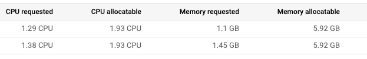

# Challenge Lab - Optimize Costs for Google Kubernetes Engine

## Challenge scenario

You are the lead Google Kubernetes Engine admin on a team that manages the online shop for `OnlineBoutique`.

You are ready to deploy your team's site to Google Kubernetes Engine but you are still looking for ways to make sure that you're able to keep costs down and performance up.

You will be responsible for deploying the OnlineBoutique app to GKE and making some configuration changes that have been recommended for cost optimization.

Here are some guidelines you've been requested to follow when deploying:

- Create the cluster in the `us-east1-b` zone.
- The naming scheme is team-resource-number, e.g. a cluster could be named `onlineboutique-cluster-645`.
- For your initial cluster, start with machine size `e2-standard-2` (2 vCPU, 8G memory).
- Set your cluster to use the `rapid` `release-channel`.

## Task 1. Create a cluster and deploy your app

1. Before you can deploy the application, you'll need to create a cluster in the `us-east1-b` zone, and name it as `onlineboutique-cluster-645`.

2. Start small and make a zonal cluster with only two (2) nodes.

3. Before you deploy the shop, make sure to set up some namespaces to separate resources on your cluster in accordance with the 2 environments - `dev` and `prod`.

After that, deploy the application to the `dev` namespace with the following command:

```
git clone https://github.com/GoogleCloudPlatform/microservices-demo.git &&
cd microservices-demo && kubectl apply -f ./release/kubernetes-manifests.yaml --namespace dev
```

> Note: You can check that your OnlineBoutique store is up and running by navigating to the IP address for your frontend-external service.

# Task 1 Solution

***

## 1) 設定專案與區域（us‑east1‑b）

> 若你的專案 ID 已在介面左上角選好，可略過 `gcloud config set project`。

```bash
# 設定環境變數（可依需要替換）
export PROJECT_ID=$(gcloud config get-value project)
export ZONE=us-east1-b

# 套用到 gcloud 設定
gcloud config set project $PROJECT_ID
gcloud config set compute/zone $ZONE
```

**檢查點**：`gcloud config list` 顯示 `compute/zone = us-east1-b`。

***

## 2) 建立兩節點 Zonal 叢集（e2-standard-2 & rapid release channel）

> 依題目要求：名稱 `onlineboutique-cluster-645`、機型 `e2-standard-2`（2 vCPU, 8GiB）、節點數 2、**release channel = rapid**。

```bash
gcloud container clusters create onlineboutique-cluster-645 \
  --zone $ZONE \
  --release-channel=rapid \
  --machine-type=e2-standard-2 \
  --num-nodes=2
```

> 這步驟需幾分鐘。

**檢查點**：

```bash
gcloud container clusters describe onlineboutique-cluster-645 --zone $ZONE \
  --format="value(releaseChannel.channel)"
# 預期輸出：rapid
```

**常見問題**：

*   若看到權限錯誤（PERMISSION\_DENIED），請確認你在該專案具備 `Kubernetes Engine Admin` 或等效權限。
*   若 `rapid` channel 建立失敗，通常是 API/權限或區域配額問題；可再次執行或改用相同參數重試。

***

## 3) 取得叢集憑證（kubectl 連線）

```bash
gcloud container clusters get-credentials onlineboutique-cluster-645 --zone $ZONE
```

**檢查點**：

```bash
kubectl get nodes
# 預期看到 2 個 Ready 狀態的節點
```

***

## 4) 建立 Namespaces：`dev` 與 `prod`

```bash
kubectl create namespace dev
kubectl create namespace prod
kubectl get ns
# 應包含 dev、prod
```

> 之後我們會把應用程式先部署到 `dev`，保留 `prod` 作為分環境隔離。

***

## 5) 部署 OnlineBoutique 到 `dev` namespace

> 依題目提供指令：由官方 repo 取用 **kubernetes‑manifests.yaml**。

```bash
git clone https://github.com/GoogleCloudPlatform/microservices-demo.git && \
cd microservices-demo && \
kubectl apply -f ./release/kubernetes-manifests.yaml --namespace dev
```

**檢查點 1：Pods 狀態**

```bash
kubectl get pods -n dev
# 等待所有 pods 轉為 Running/Ready（部分服務可能需數分鐘拉取映像）
```

**檢查點 2：Service 與前端的外網 IP**
OnlineBoutique 會建立 `frontend-external`（LoadBalancer 型態）：

```bash
# 取得外網 IP（可能初期顯示 <pending>，請每 20-30 秒重試一次）
kubectl get svc -n dev frontend-external

# 或以 jsonpath 直接讀值（若為 hostname 也會顯示）
kubectl get svc -n dev frontend-external \
  -o jsonpath='{.status.loadBalancer.ingress[0].ip}{"\n"}{.status.loadBalancer.ingress[0].hostname}{"\n"}'
```

**檢查點 3：開啟商店首頁**

*   取得到 **外網 IP** 後，於瀏覽器輸入：`http://<EXTERNAL_IP>`
*   如果使用 Cloud Shell，可以點右上角 **Web Preview** → **Change port** → 輸入 80（或直接在本機瀏覽器開啟該 IP）。

***

## 6) 成功驗收要點（Task 1）

*   叢集名稱正確：`onlineboutique-cluster-645`
*   叢集區域：`us-east1-b`（zonal）
*   節點數：2、機型：`e2-standard-2`
*   Release Channel：`rapid`
*   Namespaces：`dev`、`prod` 已建立
*   `dev` namespace 中的 OnlineBoutique pods 完整啟動，`frontend-external` 取得外網 IP，網站可正常開啟

***

## 常見問題排除

*   **`frontend-external` 一直 `<pending>`**：確保專案已啟用 **Compute Engine API / GKE API**，且該區域/配額允許建立外部負載平衡器。稍等 2–5 分鐘再查詢。
*   **部分 Pod CrashLoopBackOff**：
    *   查 `kubectl describe pod <name> -n dev` / `kubectl logs <name> -n dev`。
    *   Cloud NAT 未設定時，若節點沒外網 IP，拉映像可能失敗（本 Lab 通常預設可拉取）。
*   **節點未 Ready**：檢查配額（CPU/靜態 IP/防火牆規則）、重試 `get-credentials`。

***


## Task 2. Migrate to an optimized node pool

1. After successfully deploying the app to the dev namespace, take a look at the node details:



You come to the conclusion that you should make changes to the cluster's node pool:

- There's plenty of left over RAM from the current deployments so you should be able to use a node pool with machines that offer *less RAM*.
- Most of the deployments that you might consider increasing the replica count of will require only 100mcpu per additional pod. You could potentially use a node pool with *less total CPU* if you configure it to use smaller machines. However, you also need to consider how many deployments will need to scale, and how much they need to scale by.

2. Create a new node pool named `optimized-pool-7778` with `custom-2-3584` as the machine type.

3. Set the *number of nodes* to 2.

4. Once the new node pool is set up, migrate your application's deployments to the new nodepool by *cordoning off and draining* `default-pool`.

5. *Delete* the default-pool once the deployments have safely migrated.

# Task 2 - Solutions

> 前提：你已在 Cloud Shell，且叢集位於 `us-east1-b`，名稱 `onlineboutique-cluster-645`。

***

## 0) 取得叢集憑證（若前一階段的 session 已關閉）

```bash
export ZONE=us-east1-b
gcloud container clusters get-credentials onlineboutique-cluster-645 --zone $ZONE

# 顯示節點與節點池標籤
kubectl get nodes -L cloud.google.com/gke-nodepool
```

***

## 1) 建立新的節點池（custom-2-3584，2 節點）

> `custom-2-3584` = **2 vCPU、3584 MB RAM（3.5 GB）**，符合「較少 RAM」的需求，也維持每個副本 100m CPU 的擴張彈性（你的附圖顯示目前 RAM 有明顯餘裕）。

```bash
gcloud container node-pools create optimized-pool-7778 \
  --cluster=onlineboutique-cluster-645 \
  --machine-type=custom-2-3584 \
  --num-nodes=2 \
  --zone=$ZONE
```

**檢查點**

```bash
# 應看到 default-pool 與 optimized-pool-7778 兩種節點
kubectl get nodes -L cloud.google.com/gke-nodepool
```

***

## 2) 將工作負載遷移到新節點池（cordon + drain default-pool）

> `cordon` 讓舊節點不再接受新排程；`drain` 會把可驅逐的 Pod 優雅遷移到其他節點。  
> 我們會忽略 DaemonSet、刪除 EmptyDir 資料；OnlineBoutique 為 stateless，適合這種作法。

```bash
# 先標示 default-pool 節點不可被新排程
for node in $(kubectl get nodes -l cloud.google.com/gke-nodepool=default-pool -o=name); do
  kubectl cordon "$node"
done

# 再將其上的工作負載遷移走
for node in $(kubectl get nodes -l cloud.google.com/gke-nodepool=default-pool -o=name); do
  kubectl drain --force --ignore-daemonsets --delete-emptydir-data --grace-period=10 "$node"
done
```

**即時觀察（可另開一個分頁執行）**

```bash
watch -n 3 'kubectl get nodes -L cloud.google.com/gke-nodepool; echo; kubectl get pods -n dev -o wide'
```

*   你會看到 `dev` 命名空間的 Pods **NODE 欄位** 逐步切換到 `optimized-pool-7778` 節點。

**若有個別 Pod 無法驅逐**

*   先用 `kubectl describe pod <pod> -n dev` 看是否被 **PDB** 或 **Finalizer** 擋住；
    *   若 PDB（PodDisruptionBudget）限制過嚴，暫時調整或稍等控制器補新的副本。
    *   確定沒有本地 PersistentVolumeClaim（OnlineBoutique 預設沒有）。

***

## 3) 刪除舊節點池（default-pool）

> 確認 `dev` 的 Pods 已經跑在 `optimized-pool-7778` 之後再刪除。

```bash
gcloud container node-pools delete default-pool \
  --cluster=onlineboutique-cluster-645 \
  --zone=$ZONE \
  --quiet
```

**檢查點**

```bash
# 只剩 optimized-pool-7778 的節點
kubectl get nodes -L cloud.google.com/gke-nodepool

# 服務仍可用
kubectl get pods -n dev
kubectl get svc -n dev frontend-external
```

***

## 4) 成本與容量快速 sanity check（非必要但建議）

*   **RAM**：從 `e2-standard-2`（8GB）→ `custom-2-3584`（3.5GB），每節點記憶體下降，符合「RAM 過剩」的觀察。
*   **CPU**：每節點 2 vCPU，Pods 擴容以 **100m CPU** 為單位：
    *   粗估每節點可容納的額外 Pod 數量 ≈ 可分配 CPU（扣掉系統與既有 requests）/ 100m。
    *   若後續真的需要更密集的 CPU 擴張，可再加 **節點池數量** 或改 **NAP/CA/HPA** 策略。

***

## 常見問題排除

*   **Drain 卡住**：
    *   檢查有無 PDB（`kubectl get pdb -A`）；若是 `kube-system` 的系統工作負載卡住縮容，通常只要我們是「遷移應用層」就好，**不必**當下縮節點數。
*   **工作負載沒有重新排到新節點池**：
    *   檢查是否設了 `nodeSelector` / `nodeAffinity` 導致只能排到舊節點。
    *   檢查新節點池是否有污點（Taints）。一般預設 **沒有**。
*   **刪除 default-pool 後服務不可用**：
    *   先 `kubectl get endpoints -n dev frontend-external` 確認後端 Pod 正常；
    *   `kubectl describe svc -n dev frontend-external` 看負載平衡器健康狀況，稍等幾十秒到數分鐘。

***

## 你可以把以下三段依序貼上執行

**A. 建立新節點池**

```bash
export ZONE=us-east1-b
gcloud container node-pools create optimized-pool-7778 \
  --cluster=onlineboutique-cluster-645 \
  --machine-type=custom-2-3584 \
  --num-nodes=2 \
  --zone=$ZONE
kubectl get nodes -L cloud.google.com/gke-nodepool
```

**B. 遷移（cordon + drain）**

```bash
for node in $(kubectl get nodes -l cloud.google.com/gke-nodepool=default-pool -o=name); do
  kubectl cordon "$node"
done
for node in $(kubectl get nodes -l cloud.google.com/gke-nodepool=default-pool -o=name); do
  kubectl drain --force --ignore-daemonsets --delete-emptydir-data --grace-period=10 "$node"
done
kubectl get pods -n dev -o wide
```

**C. 刪除舊節點池**

```bash
gcloud container node-pools delete default-pool \
  --cluster=onlineboutique-cluster-645 \
  --zone=$ZONE \
  --quiet
kubectl get nodes -L cloud.google.com/gke-nodepool
kubectl get svc -n dev frontend-external
```

***


## Task 3. Apply a frontend update

You just got it all deployed, and now the dev team wants you to push a last-minute update before the upcoming release! That's ok. You know this can be done without the need to cause down time.

1. Set a pod disruption budget for your *frontend* deployment.

2. Name it `onlineboutique-frontend-pdb`.

3. Set the `min-availability` of your deployment to 1.

Now, you can apply your team's update. They've changed the file used for the home page's banner and provided you an updated docker image:

> gcr.io/qwiklabs-resources/onlineboutique-frontend:v2.1

4. Edit your *frontend* deployment and change its image to the updated one.

5. While editing your deployment, change the `ImagePullPolicy` to `Always`.

# Task 3 - Solution


> 提醒：題目寫的是 `min-availability`，實際 `kubectl` 參數是 `--min-available`。

***

## 1) 為 `frontend` 建立 Pod Disruption Budget（PDB）

> 目標：**至少 1 個副本必須可用**。OnlineBoutique 的 `frontend` Deployment 其 Pod label 為 `app=frontend`，我們就用它當 selector。

```bash
# 建立 PDB（命名為 onlineboutique-frontend-pdb；namespace=dev）
kubectl create poddisruptionbudget onlineboutique-frontend-pdb \
  --namespace dev \
  --selector app=frontend \
  --min-available 1
```

**檢查點**

```bash
kubectl get pdb -n dev
kubectl describe pdb -n dev onlineboutique-frontend-pdb
# 看到 selector 為 app=frontend，Min available: 1
```

***

## 2) 更新 `frontend` 的鏡像到 v2.1（滾動更新、不中斷）

> 容器名稱在此 Deployment 中為 `server`。我們用 `kubectl set image` 觸發滾動更新。

```bash
# 更新鏡像版本
kubectl -n dev set image deployment/frontend \
  server=gcr.io/qwiklabs-resources/onlineboutique-frontend:v2.1
```

**檢查更新進度**

```bash
kubectl -n dev rollout status deployment/frontend
# 等到顯示 "successfully rolled out"
```

***

## 3) 將 ImagePullPolicy 改成 Always

> 為確保每次部署都重新拉取鏡像，我們把 `imagePullPolicy` 設為 `Always`。可用 `kubectl edit` 或 JSON Patch（以下用 patch，一次完成）。

```bash
kubectl -n dev patch deployment frontend \
  --type='json' \
  -p='[
    {"op":"replace","path":"/spec/template/spec/containers/0/imagePullPolicy","value":"Always"}
  ]'
```

**檢查點**

```bash
kubectl -n dev get deployment frontend -o jsonpath='{.spec.template.spec.containers[0].image}{"\n"}{.spec.template.spec.containers[0].imagePullPolicy}{"\n"}'
# 預期輸出：
# gcr.io/qwiklabs-resources/onlineboutique-frontend:v2.1
# Always
```

***

## 4) 功能驗收（前端對外服務是否仍可用）

```bash
# 取得外部負載平衡器的 IP 或主機名
kubectl get svc -n dev frontend-external \
  -o jsonpath='{.status.loadBalancer.ingress[0].ip}{"\n"}{.status.loadBalancer.ingress[0].hostname}{"\n"}'
```

*   瀏覽器前往 `http://<EXTERNAL_IP>` 應可正常開啟商店首頁（Banner 已更新）。
*   若使用 Cloud Shell，可用右上 **Web Preview**（port 80）或直接在本機瀏覽器開啟。

***

## 5) 常見問題排除

*   **更新時怕中斷？**  
    你已設定 PDB `minAvailable=1`，加上 Deployment 的**滾動更新**策略（預設 `maxUnavailable: 25%`；當副本只有 1 個時會四捨五入為 0），Kubernetes 會先讓新 Pod Ready，再替換舊 Pod，避免停機。

*   **Rollout 卡住**（`progressDeadlineExceeded` 或 Ready 一直不達標）：
    *   `kubectl -n dev describe deploy frontend` 看事件與 `conditions`。
    *   `kubectl -n dev describe pod <frontend-pod>` 檢查 `readinessProbe`、`ImagePullBackOff`、資源不足。
    *   若映像拉取失敗，確認專案/網路可存取 `gcr.io`，或稍候再試。

*   **PDB 阻擋更新**（極少見）：
    *   若副本數為 1 且新 Pod 因環境或資源問題遲遲無法 Ready，PDB 會阻擋舊 Pod 被終止，導致更新卡住。先排除新 Pod 問題或暫時把副本數調成 2：
        ```bash
        kubectl -n dev scale deployment/frontend --replicas=2
        ```

***

完成以上步驟，你就已經：

*   ✅ 建立 `onlineboutique-frontend-pdb`（`minAvailable=1`）。
*   ✅ 將 `frontend` 鏡像更新到 `v2.1`。
*   ✅ 把 `imagePullPolicy` 設為 `Always`。

如果你要我幫你一鍵檢查目前狀態（PDB/Deployment/Service），把以下三段輸出貼上來即可：

```bash
kubectl get pdb -n dev
kubectl get deploy -n dev frontend -o yaml | grep -E 'image:|imagePullPolicy:|replicas:'
kubectl get svc -n dev frontend-external -o wide
```

## Task 4. Autoscale from estimated traffic

A marketing campaign is coming up that will cause a traffic surge on the OnlineBoutique shop. Normally, you would spin up extra resources in advance to handle the estimated traffic spike. However, if the traffic spike is larger than anticipated, you may get woken up in the middle of the night to spin up more resources to handle the load.

You also want to avoid running extra resources for any longer than necessary. To both lower costs and save yourself a potential headache, you can configure the Kubernetes deployments to scale automatically when the load begins to spike.

1. Apply *horizontal pod autoscaling* to your *frontend deployment* in order to handle the traffic surge.

2. Scale based on a target cpu percentage of 50.

3. Set the pod scaling between 1 minimum and 11 maximum.

Of course, you want to make sure that users won’t experience downtime while the deployment is scaling.

4. To make sure the scaling action occurs without downtime, set the deployment to scale with a target cpu percentage of 50%. This should allow plenty of space to handle the load as the autoscaling occurs.

5. Set the deployment to scale between 1 minimum and 11 maximum pods.

But what if the spike exceeds the compute resources you currently have provisioned? You may need to add additional compute nodes.

6. Next, ensure that your cluster is able to automatically spin up additional compute nodes if necessary. However, handling scaling up isn’t the only case you can handle with autoscaling.

7. Thinking ahead, you configure both a minimum number of nodes, and a maximum number of nodes. This way, the cluster can add nodes when traffic is high, and reduce the number of nodes when traffic is low.

8. Update your `cluster autoscaler` to scale between *1 node minimum* and *6 nodes maximum*.

9. Lastly, run a load test to simulate the traffic surge.

Fortunately, `OnlineBoutique` was designed with built-in load generation. Currently, your dev instance is simulating traffic on the store with ~10 concurrent users.

10. In order to better replicate the traffic expected for this event, run the load generation from your loadgenerator pod with a higher number of concurrent users with this command. Replace `YOUR_FRONTEND_EXTERNAL_IP` with the IP of the frontend-external service:

```
kubectl exec $(kubectl get pod --namespace=dev | grep 'loadgenerator' | cut -f1 -d ' ') -it --namespace=dev -- bash -c 'export USERS=8000; locust --host="http://YOUR_FRONTEND_EXTERNAL_IP" --headless -u "8000" 2>&1'
```

11. Now, observe your Workloads and monitor how your cluster handles the traffic spike.

You should see your `recommendationservice` crashing or, at least, heavily struggling from the increased demand.

12. Apply horizontal pod autoscaling to your recommendationservice deployment. Scale based off a target cpu percentage of 50 and set the pod scaling between 1 minimum and 5 maximum.

# Task 4 - Solution

以下是可以直接貼上的指令與每一步「檢查點 / 常見問題排除」。預設你仍在 **Cloud Shell**、namespace 是 **`dev`**、叢集是 **`onlineboutique-cluster-645`**、節點池是 **`optimized-pool-7778`**。

***

## 1) 對 `frontend` 啟用 HPA（CPU 50%，1～11 個 pod）

```bash
# 建立 / 更新 HPA
kubectl -n dev autoscale deployment frontend \
  --cpu-percent=50 \
  --min=1 \
  --max=11

# 檢查 HPA 狀態（Targets、Replicas）
kubectl -n dev get hpa
```

**檢查點**

*   `kubectl -n dev get hpa` 看到 `frontend` 的 **TARGETS** 變成 `x%/50%`（初期無負載可能是 `<unknown>/50%`，數十秒後會出現數值）。
*   **Replicas** 先顯示當前副本數；有負載時會自動在 1～11 間調整。

> **注意**：HPA 以「**已請求 CPU 的平均使用率**」為目標。若 `frontend` 容器未設定 `resources.requests.cpu`，請先加上（通常 microservices‑demo 已內建）。

***

## 2) 讓叢集能自動加減節點（Cluster Autoscaler）

題目要你「最少 1、最多 6 節點」。我們直接在 **`optimized-pool-7778`** 上啟用節點池自動擴縮：

```bash
export ZONE=us-east1-b

# 在節點池上啟用 autoscaling（最少1、最多6）
gcloud container node-pools update optimized-pool-7778 \
  --cluster=onlineboutique-cluster-645 \
  --zone=$ZONE \
  --enable-autoscaling \
  --min-nodes=1 \
  --max-nodes=6
```

**檢查點**

```bash
gcloud container node-pools describe optimized-pool-7778 \
  --cluster=onlineboutique-cluster-645 \
  --zone=$ZONE \
  --format="yaml(autoscaling)"
```

*   你應看到 `enabled: true`、`minNodeCount: 1`、`maxNodeCount: 6`。

> （可選）若想讓縮容更積極：  
> `gcloud beta container clusters update onlineboutique-cluster-645 --zone=$ZONE --autoscaling-profile=optimize-utilization`

***

## 3) 增加壓力：啟動 8,000 使用者的負載模擬

先取出 `frontend-external` 的 IP，接著把題目提供的指令貼上（記得替換 IP）。

```bash
# 取得前端對外 IP
FRONTEND_IP=$(kubectl get svc -n dev frontend-external -o jsonpath='{.status.loadBalancer.ingress[0].ip}')
echo "FRONTEND_IP=$FRONTEND_IP"

# 啟動負載（locust 8,000 使用者；命令會附帶互動/日誌）
kubectl exec $(kubectl get pod --namespace=dev | grep 'loadgenerator' | cut -f1 -d ' ') \
  -it --namespace=dev -- bash -c \
  'export USERS=8000; locust --host="http://'"$FRONTEND_IP"'" --headless -u "8000" 2>&1'
```

**同時監看**

```bash
# 監看 HPA 與 Deployment 擴張
watch -n 5 "kubectl -n dev get hpa; echo; kubectl -n dev get deploy frontend recommendationservice; echo; kubectl get nodes"

# 或觀察所有 pod 佈署情形
kubectl -n dev get pods -w
```

你應會看到 `frontend` 的 **HPA 將副本數逐步拉高**，節點若不夠，**Cluster Autoscaler** 會把節點數往上擴（最多到 6）。

***

## 4) 觀察瓶頸服務（recommendationservice）並加上 HPA

題目提示流量高時 `recommendationservice` 會崩或吃緊。我們也替它加 HPA（CPU 50%，1～5 個 pod）：

```bash
# 建立 / 更新 recommendationservice HPA
kubectl -n dev autoscale deployment recommendationservice \
  --cpu-percent=50 \
  --min=1 \
  --max=5

# 檢查
kubectl -n dev get hpa
kubectl -n dev get deploy recommendationservice
```

**檢查點**

*   `recommendationservice` 的 HPA 出現，TARGETS 逐漸有數字；副本數在 1～5 間上升。
*   若很快 CrashLoopBackOff，先 `kubectl -n dev describe pod <pod>` 看資源不足 / 啟動探針 / 映像拉取等原因；多半是 CPU 不足，HPA 增副本即可紓解。

***

## 5) 收尾：恢復正常 & 成本控管

*   結束測試後，在執行負載的終端 **Ctrl + C** 停止 `locust`。
*   幾分鐘內你會看到：
    *   `frontend`、`recommendationservice` 的 **副本數漸降**；
    *   **節點數** 也會隨之下降（但 CA 會保留最少 1 節點，並在 PDB/系統 pod 允許下縮容）。

***

## 常見問題排除

*   **HPA 顯示 `<unknown>`**：剛建立時尚未收集到 metrics，等 30～90 秒再看；或 `kubectl -n kube-system get pods | grep metrics` 確認 metrics 管道正常。
*   **HPA 無法生效（Always 只 1 副本）**：確認 Deployment 的 `resources.requests.cpu` 有設定；HPA 的 50% 是相對於 *requests*。
*   **節點沒有擴**：
    *   檢查 HPA 是否真的在增加 **desired replicas**。
    *   `kubectl -n dev describe hpa <name>` 看事件（是否因 PDB、排程限制、PodAntiAffinity 等原因卡住）。
    *   `gcloud container node-pools describe ...` 確認 autoscaling 已 `enabled: true` 並且 `maxNodeCount=6`。
*   **PDB 擋住縮容/更新**：你在 Task 3 為 `frontend` 設了 `minAvailable=1`，在副本很低又要更新時可能會延長收斂時間；必要時先把 `frontend` 副本暫增為 2 再進行作業。
    ```bash
    kubectl -n dev scale deployment frontend --replicas=2
    ```

***

## 一鍵複製的最少命令清單

若你想快速完成驗收，可以依序貼這三段：

**A. 前端 HPA**

```bash
kubectl -n dev autoscale deployment frontend --cpu-percent=50 --min=1 --max=11
kubectl -n dev get hpa
```

**B. 節點自動擴縮（1～6 節點）**

```bash
export ZONE=us-east1-b
gcloud container node-pools update optimized-pool-7778 \
  --cluster=onlineboutique-cluster-645 \
  --zone=$ZONE \
  --enable-autoscaling --min-nodes=1 --max-nodes=6
gcloud container node-pools describe optimized-pool-7778 --cluster=onlineboutique-cluster-645 --zone=$ZONE --format="yaml(autoscaling)"
```

**C. 壓測與 recommendationservice HPA**

```bash
FRONTEND_IP=$(kubectl get svc -n dev frontend-external -o jsonpath='{.status.loadBalancer.ingress[0].ip}')
kubectl exec $(kubectl get pod --namespace=dev | grep 'loadgenerator' | cut -f1 -d ' ') -it --namespace=dev -- bash -c \
  'export USERS=8000; locust --host="http://'"$FRONTEND_IP"'" --headless -u "8000" 2>&1'
# 另開視窗執行：
kubectl -n dev autoscale deployment recommendationservice --cpu-percent=50 --min=1 --max=5
kubectl -n dev get hpa
```

***


## Task 5. (Optional) Optimize other services

While applying horizontal pod autoscaling to your frontend service keeps your application available during the load test, if you monitor your other workloads, you'll notice that some of them are being pushed heavily for certain resources.

If you still have time left in the lab, inspect some of your other workloads and try to optimize them by applying autoscaling towards the proper resource metric.

You can also see if it would be possible to further optimize your resource utilization with *Node Auto Provisioning*.

# Task 5 - Solution

「**挑出吃資源的服務 → 針對適合的指標做 HPA →（選擇性）啟用 NAP 讓節點形狀更貼近需求**」。以下是一步一步的指南（預設在 **Cloud Shell**、namespace 為 **`dev`**）。

> 小叮嚀：HPA 的 CPU 目標是「**相對於 requests 的平均使用率**」。若某服務沒設定 `resources.requests.cpu/memory`，請先補上，否則 HPA 會無法計算或效果不佳。  
> 另外，**VPA 不要和 HPA 同時作用在 CPU/記憶體**（可用 VPA 的 **Off** 模式只取建議值）。 [\[acsicorp-m...epoint.com\]](https://acsicorp-my.sharepoint.com/personal/ryan_hsiao_innovasolutions_com/Documents/Microsoft%20Copilot%20Chat%20Files/Understanding%20and%20Combining%20GKE%20Autoscaling%20Strategies.md)

***

## A) 先找出誰在吃資源（快速盤點）

```bash
# 需要 metrics-server（GKE 預設有）
kubectl -n dev top pods | sort -k3 -h         # 依 CPU
kubectl -n dev top pods | sort -k4 -h         # 依 Memory
```

同時打開 GKE Console → **Workloads** → 篩選 `namespace=dev`，看每個 Deployment 的 **CPU / 記憶體**曲線。  
（這些方法在我們上傳教材中也有提到用 Monitoring 觀察資源使用與指標。） [\[acsicorp-m...epoint.com\]](https://acsicorp-my.sharepoint.com/personal/ryan_hsiao_innovasolutions_com/Documents/Microsoft%20Copilot%20Chat%20Files/Exploring%20Cost-optimization%20for%20GKE%20Virtual%20Machines.md), [\[acsicorp-m...epoint.com\]](https://acsicorp-my.sharepoint.com/personal/ryan_hsiao_innovasolutions_com/Documents/Microsoft%20Copilot%20Chat%20Files/GKE%20Workload%20Optimization.md)

***

## B) 針對服務套 HPA（CPU 型／記憶體型）

### 1) CPU 型：例 `adservice`（常見 CPU 密集）

> 以目標 60%、1～5 副本為例；你可依觀察微調。

```bash
kubectl -n dev autoscale deployment adservice \
  --cpu-percent=60 --min=1 --max=5
kubectl -n dev get hpa
```

### 2) 記憶體型：例 `cartservice` 或其他偏記憶體的服務

`kubectl autoscale` 不支援記憶體，需要用 **autoscaling/v2** 的 YAML（用 `averageValue` 或 `averageUtilization`）。

> **範例：以記憶體平均值 400Mi 為目標、1～5 副本**

```yaml
# hpa-memory.yaml
apiVersion: autoscaling/v2
kind: HorizontalPodAutoscaler
metadata:
  name: cartservice-hpa
  namespace: dev
spec:
  scaleTargetRef:
    apiVersion: apps/v1
    kind: Deployment
    name: cartservice
  minReplicas: 1
  maxReplicas: 5
  metrics:
    - type: Resource
      resource:
        name: memory
        target:
          type: AverageValue
          averageValue: 400Mi
```

```bash
kubectl apply -f hpa-memory.yaml
kubectl -n dev describe hpa cartservice-hpa
```

> 你也可以改成 `AverageUtilization: 70`（代表相對 requests 的 70%）。選擇哪一種取決於你是否為該服務定義了合理的 `resources.requests.memory`。 [\[acsicorp-m...epoint.com\]](https://acsicorp-my.sharepoint.com/personal/ryan_hsiao_innovasolutions_com/Documents/Microsoft%20Copilot%20Chat%20Files/Exploring%20Cost-optimization%20for%20GKE%20Virtual%20Machines.md)

### 3) 我們在 Task 4 已替 `recommendationservice` 加 HPA（CPU 50%，1～5）。若想更激進，可微調到 60～70% 或提高最大副本。

***

## C)（選擇性）用 VPA **Off** 模式抓建議，針對偏差的 requests/limits 做校準

> 若你發現某些服務 `requests.cpu`/`requests.memory` 明顯大於實際使用，可用 VPA **Off** 模式抓建議，再**手動套用**到 Deployment。 [\[acsicorp-m...epoint.com\]](https://acsicorp-my.sharepoint.com/personal/ryan_hsiao_innovasolutions_com/Documents/Microsoft%20Copilot%20Chat%20Files/Understanding%20and%20Combining%20GKE%20Autoscaling%20Strategies.md)

```bash
cat <<'EOF' > vpa-off-productcatalog.yaml
apiVersion: autoscaling.k8s.io/v1
kind: VerticalPodAutoscaler
metadata:
  name: productcatalog-vpa
  namespace: dev
spec:
  targetRef:
    apiVersion: "apps/v1"
    kind: Deployment
    name: productcatalogservice
  updatePolicy:
    updateMode: "Off"   # 只產生建議，不自動重建
EOF
kubectl apply -f vpa-off-productcatalog.yaml
# 等一陣子後查看建議
kubectl -n dev describe vpa productcatalog-vpa | sed -n '/Container Recommendations/,$p'
# 再決定是否手動調整該 Deployment 的 requests/limits
```

***

## D) 進一步：啟用 **Node Auto Provisioning（NAP）**，讓節點池形狀隨工作負載「自動生」

當多個服務的 HPA 同時擴張時，僅靠現有節點池可能不夠；**NAP** 能在需要時自動建立**新的節點池**，機型更貼近你的 Pod 形狀（高 CPU / 低記憶體等）。 [\[acsicorp-m...epoint.com\]](https://acsicorp-my.sharepoint.com/personal/ryan_hsiao_innovasolutions_com/Documents/Microsoft%20Copilot%20Chat%20Files/Understanding%20and%20Combining%20GKE%20Autoscaling%20Strategies.md)

```bash
export ZONE=us-east1-b
gcloud container clusters update onlineboutique-cluster-645 \
  --zone=$ZONE \
  --enable-autoprovisioning \
  --min-cpu 2 --min-memory 4 \
  --max-cpu 24 --max-memory 96
```

*   `min/max-cpu/memory` 是**整個叢集**的資源範圍；請依你的專案配額與成本考量調整。
*   搭配 `--autoscaling-profile optimize-utilization` 可讓縮容更積極（非必需，但對成本友善）。 [\[acsicorp-m...epoint.com\]](https://acsicorp-my.sharepoint.com/personal/ryan_hsiao_innovasolutions_com/Documents/Microsoft%20Copilot%20Chat%20Files/Understanding%20and%20Combining%20GKE%20Autoscaling%20Strategies.md)

> 提醒：我們目前已用 `optimized-pool-7778`（`custom-2-3584`）運行主負載。開啟 NAP 後，GKE 可能會為 CPU 型工作負載建立 **高 CPU** 節點池，改善 bin‑packing 與成本效率。 [\[acsicorp-m...epoint.com\]](https://acsicorp-my.sharepoint.com/personal/ryan_hsiao_innovasolutions_com/Documents/Microsoft%20Copilot%20Chat%20Files/Understanding%20and%20Combining%20GKE%20Autoscaling%20Strategies.md)

***

## E) 驗證與觀察（建議一次性腳本）

```bash
# 總覽 HPA 與 Deployment 副本
watch -n 5 'kubectl -n dev get hpa; echo; kubectl -n dev get deploy -o wide; echo; kubectl get nodes'
```

*   觀察 HPA 的 **TARGETS** 與 **REPLICAS** 是否如預期調整。
*   節點數若上升，代表 CA/NAP 正在為擴張提供資源。流量平穩後，節點數應逐漸下降（不低於各節點池的 min-nodes）。

***

## F) 快速策略彙總（你可按需挑一兩個服務執行）

| 服務類型                                              | 指標建議                                                          | HPA 範例                                                                           |
| ------------------------------------------------- | ------------------------------------------------------------- | -------------------------------------------------------------------------------- |
| CPU 密集（如 `adservice`）                             | CPU `averageUtilization` 50–70%                               | `kubectl -n dev autoscale deployment adservice --cpu-percent=60 --min=1 --max=5` |
| 記憶體密集（如 `cartservice`）                            | Memory `AverageValue` 300–500Mi 或 `averageUtilization` 60–75% | 用 `autoscaling/v2` YAML（上例 `cartservice-hpa`）                                    |
| 流量入口（`frontend`）                                  | CPU 50%，留足升級空間                                                | 已完成於 Task 4                                                                      |
| 其他服務（`productcatalogservice`, `shippingservice`…） | 先用 VPA Off 抓建議 → 手動調整 requests/limits                         | `vpa-off-*`（只產生建議，避免與 HPA 衝突）                                                    |


***
