# Exploring Cost-optimization for GKE Virtual Machines

https://www.skills.google/course_templates/655/labs/598638

## Task 1. Understanding Node machine types

### General overview

A machine type is a set of virtualized hardware resources available to a virtual machine (VM) instance, including the system memory size, virtual CPU (vCPU) count, and persistent disk limits. Machine types are grouped and curated by families for different workloads.

When choosing a machine type for your node pool, the general purpose machine type family typically offers the best price-performance ratio for a variety of workloads. The general purpose machine types consist of the N-series and E2-series:

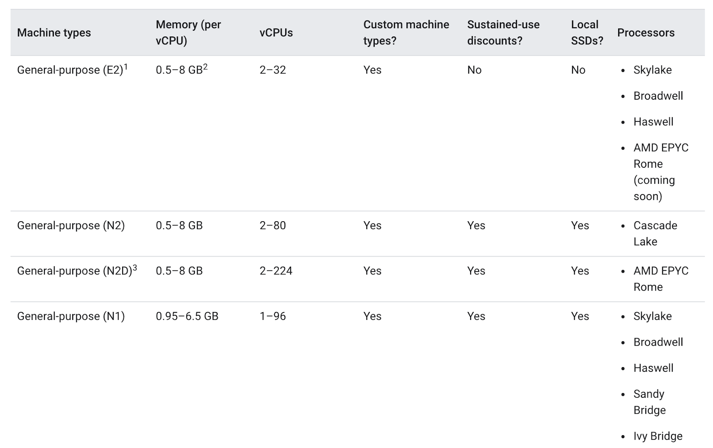

The differences between the machine types might help your app and they might not. In general, E2s have similar performance to N1s but are optimized for cost. Usually, utilizing the E2 machine type alone can help save on costs.

However, with a cluster, it's most important that the resources utilized are optimized based on your application’s needs. For bigger applications or deployments that need to scale heavily, it can be cheaper to stack your workloads on a few optimized machines rather than spreading them across many general purpose ones.

Understanding the details of your app is important for this decision making progress. If your app has specific requirements, you can make sure the machine type is shaped to fit the app.

In the following section, you will take a look at a demo app and migrate it to a node pool with a well-shaped machine type.

## Task 2. Choosing the right machine type for the Hello app

### Inspect the Hello demo cluster's requirements

On startup, your lab generated a [Hello Demo Cluster] with two E2 medium (2vCPU, 4GB memory) nodes. This cluster is deploying one replica of a simple web application called [Hello App], a web server written in Go that responds to all requests with the message "Hello, World!".

1. Once your lab has finished provisioning, in the Cloud Console, click on your Navigation Menu and then click on `Kubernetes Engine`.

2. In the Kubernetes Clusters window, select your `hello-demo-cluster`.

3. In the following window, select the `Nodes` tab:

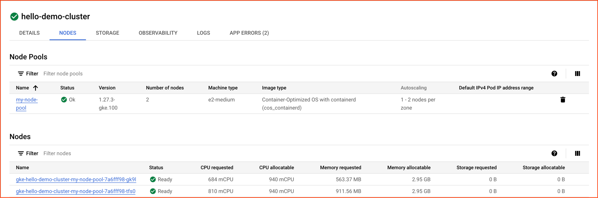

You should now see a list of your cluster's nodes:

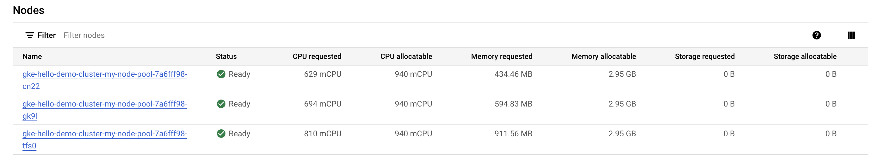

Observe how GKE has utilized the resources of your cluster. You can see how much cpu and memory is being requested by each node as well as how much your nodes could potentially allocate.

4. Click on the first node of your cluster.

Look at the `Pods` section. You should see your `hello-server` pod in the `default` namespace. If you don't see a hello-server pod, go back and select the second node of your cluster instead.

You'll notice the `hello-server` pod is requesting 400 mcpu. You should also see a handful of other `kube-system` pods running. These are loaded to help enable GKE's cluster services, like monitoring.

5. Press the Back button to return to the previous Nodes page.

Already, you'll notice that it takes two E2-medium nodes to run one replica of your `Hello-App` along with the essential kube-system services. Also, while you're using most of the cluster's cpu resources, you're only using about 1/3rd of its allocatable memory.

If the workload for this app were completely static, you could create a machine type with a custom fitted shape that has the exact amount of cpu and memory needed. By doing this, you would consequently save costs on your overall cluster infrastructure.

However, GKE clusters often run multiple workloads and those workloads will typically need to be scaled up and down.

What would happen if the Hello App were to be scaled up?

## Activate Cloud Shell

When you are connected, you are already authenticated, and the project is set to your Project_ID, `qwiklabs-gcp-02-04757421c5e7`. 

## Scale up Hello app

1. Access your cluster's credentials:

> gcloud container clusters get-credentials hello-demo-cluster --zone us-central1-a

2. Scale up your Hello-Server:

> kubectl scale deployment hello-server --replicas=2

3. Back in the *Console*, select *Workloads* from the Kubernetes Engine menu on the left.

You might see your hello-server with the *Does not have minimum availability* error status.

4. Click on the error message to get status details. You will see that the reason is `Insufficient cpu`.

This is to be expected. If you remember, the cluster barely had any more cpu resources and you requested another 400m with another replica of the `hello-server`.

5. Increase your node pool to handle your new request:

```
gcloud container clusters resize hello-demo-cluster --node-pool my-node-pool \
    --num-nodes 3 --zone us-central1-a
```

6. When asked to continue, type `y` and press enter.

7. In the Console, refresh the Workloads page until you see the status of your hello-server workload turn to OK:

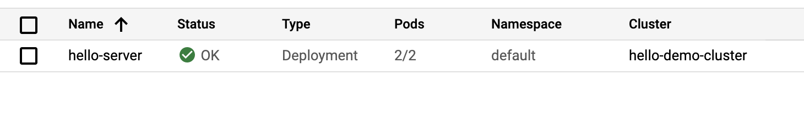

## Examine your cluster

With the workload successfully scaled up, navigate back to the nodes tab of your cluster.

1. Click on *hello-demo-cluster*:

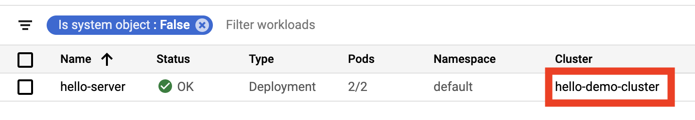

2. Then, click on the `Nodes` tab.

The larger node pool is able to handle the heavier workload, but look at how your infrastructure's resources are being utilized.


Although GKE uses a cluster's resources to the best of its ability, there is room for some optimization here. You can see that one of your nodes is using most of its memory, but two of your nodes have a considerable amount of unused memory.

At this point, if you continued to scale up the app, you would start to see a similar pattern. Kubernetes would attempt to find a node for each new replica of the `hello-server` deployment, fail, and then create a new node with roughly 600m of cpu.

## A binpacking problem

A binpacking problem is one in which you must fit items of various volumes/shapes into a finite number of regularly shaped “bins” or containers. Essentially, the challenge is to fit the items into the fewest number of bins, “packing” them as efficiently as possible.

This is similar to the challenge faced when trying to optimize Kubernetes clusters for the applications they run. You have a number of applications, likely with various resource requirements (i.e. memory and cpu). You must try to fit these applications into the infrastructure resources Kubernetes manages for you (where most of your cluster’s cost likely lies) as efficiently as possible.

Your *Hello Demo Cluster* does not employ very efficient binpacking. It would be more cost-efficient to configure Kubernetes to use a machine type more fitted to this workload.

> Note: For simplicity, this lab focuses on optimizing one application. In reality, your Kubernetes cluster will likely be running many applications with varying requirements. Kubernetes has tools to help you match your application workloads to various machines Kubernetes has access to. You can use multiple GKE Node Pools to have one Kubernetes cluster manage multiple machine types.

## Migrate to optimized node pool

- Create a new node pool with a larger machine type:

```
gcloud container node-pools create larger-pool \
  --cluster=hello-demo-cluster \
  --machine-type=e2-standard-2 \
  --num-nodes=1 \
  --zone=us-central1-a
```

Now, you can migrate pods to the new node pool by following these steps:

1. *Cordon the existing node pool*: This operation marks the nodes in the existing node pool (node) as unschedulable. Kubernetes stops scheduling new Pods to these nodes once you mark them as unschedulable.

2. *Drain the existing node pool*: This operation evicts the workloads running on the nodes of the existing node pool (node) gracefully.

- First, cordon the original node pool:

```
for node in $(kubectl get nodes -l cloud.google.com/gke-nodepool=my-node-pool -o=name); do
  kubectl cordon "$node";
done
```

- Next, drain the pool:

```
for node in $(kubectl get nodes -l cloud.google.com/gke-nodepool=my-node-pool -o=name); do
  kubectl drain --force --ignore-daemonsets --delete-emptydir-data --grace-period=10 "$node";
done
```

At this point, you should see that your pods are running on the new, `larger-pool`, node pool:

> kubectl get pods -o=wide

3. With the pods migrated, it's safe to delete the old node pool:

> gcloud container node-pools delete my-node-pool --cluster hello-demo-cluster --zone us-central1-a

4. When asked to continue, type y and enter.

Deletion can take about 2 minutes. Read the next section while you wait.

## Cost analysis

You're now running the same workload which required three e2-medium machines on one e2-standard-2 machine.

Take a look at the hourly cost for having an e2 standard and shared core machine types up:

Standard:
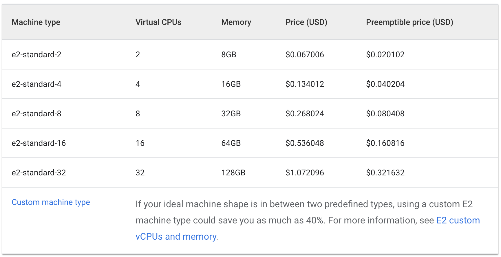

Shared Core:
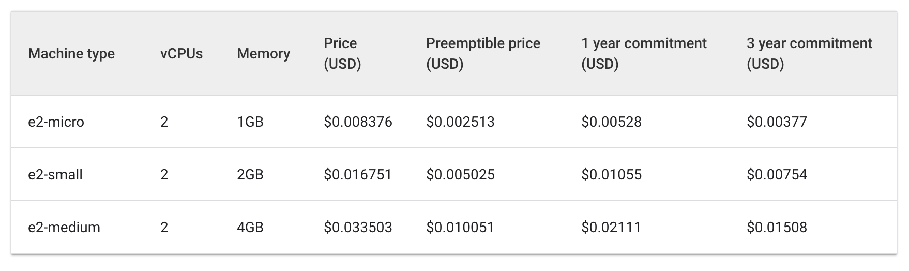

The cost of three e2-medium machines would be about $0.1 an hour while one e2-standard-2 is listed at about $0.067 an hour.

Saving $.04 an hour may seem small, but this cost can add up over the lifetime of a running application. It would be even more noticeable at a larger scale too. Because the e2-standard-2 machine can pack your workload more efficiently and there's less unused space, the cost of scaling up would grow less quickly.

This is interesting because E2-medium is a shared cored machine type which is designed to be cost effective for small, non resource intensive applications. But, for the Hello-App's current workload, you see that using a node pool with a larger machine type ends up being a more cost effective strategy.

In the Cloud Console, you should still be on the Nodes tab of your hello-demo cluster. Refresh this tab and examine the CPU Requested and CPU Allocatable fields for your larger-pool node.

Notice there's room for further optimization. The new node could fit another replica of your workload without needing to provision another node. Or again, you could potentially choose a custom sized machine type that fits the CPU and memory needs of the application saving even more resources.

It should be noted that these prices will vary depending on the location of your cluster. The next part of this lab will deal with selecting the best region and managing a regional cluster.

## Selecting the appropriate location for a cluster

### Regions and zones overview

Compute Engine resources, used for your cluster's nodes, are hosted in multiple locations worldwide. These locations are composed of regions and zones. A region is a specific geographical location where you can host your resources. Regions have three or more zones.

Resources that live in a zone, such as virtual machine instances or zonal persistent disks, are referred to as zonal resources. Other resources, like static external IP addresses, are regional. Regional resources can be used by any resource in that region, regardless of zone, while zonal resources can only be used by other resources in the same zone.

When choosing a region or zone, it's important to think about:

1. *Handling failures* - If your resources for your app are only distributed in one zone and that zone becomes unavailable, your app will also become unavailable. For larger scale, high demand apps it's often best practice to distribute resources across multiple zones or regions in order to handle failures.

2. *Decreased network latency* - To decrease network latency, you might want to choose a region or zone that is close to your point of service. For example, if you mostly have customers on the East Coast of the US, then you might want to choose a primary region and zone that is close to that area.

### Best practices for clusters

Costs vary between regions based on a variety of factors. For example, resources in the us-west2 region tend to be more expensive than those in us-central1.

When selecting a region or zone for your cluster, examine what your app is doing. For a latency-sensitive production environment, placing your app in a region/zone with decreased network latency and increased efficiency would likely give you the best performance-to-cost ratio.

However, a non-latency-sensitive dev environment could be placed in a less expensive region to reduce costs.

### Handling cluster availability

The types of available clusters in GKE include zonal (single-zone or multi-zonal) and regional. At face value, a single-zone cluster will be the least expensive option. However, for high-availability of your applications, it is best to distribute your cluster’s infrastructure resources across zones.

For many cases, prioritizing availability in your cluster through a multi-zonal or regional cluster results in the best cost-to-performance architecture.

> Note: A multi-zonal cluster has at least one additional zone defined but only has a single replica of the control plane running in a single zone. Workloads can still run during an outage of the control plane's zone, but no configurations can be made to the cluster until the control plane is available.
A regional cluster has multiple replicas of the control plane, running in multiple zones within a given region. Nodes also run in each zone where a replica of the control plane runs. Regional clusters consume the most resources but offer the best availability.

## Task 3. Managing a regional cluster

### Setup

Managing your cluster's resources across multiple zones becomes a little more complex. If not careful, it's possible to accumulate extra costs from unnecessary inter-zonal communication between your pods.

In this section, you'll observe the network traffic of your cluster and move two chatty pods, pods which are generating a lot of traffic to one another, to be in the same zone.

1. In your Cloud Shell tab, create a new regional cluster (this command will take a few minutes to complete):

> gcloud container clusters create regional-demo --region=us-central1 --num-nodes=1

In order to demonstrate traffic between your pods and nodes, you will create two pods on separate nodes in your regional cluster. We will use ping to generate traffic from one pod to the other to generate traffic which we can then monitor.

2. Run this command to create a manifest for your first pod:

```
cat << EOF > pod-1.yaml
apiVersion: v1
kind: Pod
metadata:
  name: pod-1
  labels:
    security: demo
spec:
  containers:
  - name: container-1
    image: wbitt/network-multitool
EOF
```

3. Create the first pod in Kubernetes by using this command:

> kubectl apply -f pod-1.yaml

4. Next, run this command to create a manifest for your second pod:

```
cat << EOF > pod-2.yaml
apiVersion: v1
kind: Pod
metadata:
  name: pod-2
spec:
  affinity:
    podAntiAffinity:
      requiredDuringSchedulingIgnoredDuringExecution:
      - labelSelector:
          matchExpressions:
          - key: security
            operator: In
            values:
            - demo
        topologyKey: "kubernetes.io/hostname"
  containers:
  - name: container-2
    image: us-docker.pkg.dev/google-samples/containers/gke/hello-app:1.0
EOF
```

5. Create the second pod in Kubernetes:

> kubectl apply -f pod-2.yaml

The pods you created use the `node-hello` container and output a `Hello Kubernetes` message when requested.

If you look back at the `pod-2.yaml` file you created, you can see that *Pod Anti Affinity* is a defined rule. This enables you to ensure that the pod is not scheduled on the same node as `pod-1`. This is done by matching an expression based on pod-1’s security: demo label. *Pod Affinity* is used to ensure pods are scheduled on the same node, while *Pod Anti Affinity* is used to ensure pods are not scheduled on the same node.

> Note: Kubernetes also has a concept of [Node Affinity](https://kubernetes.io/docs/tasks/configure-pod-container/assign-pods-nodes-using-node-affinity/), which can help you optimize which applications are run on what machine types.

In this case, Pod Anti Affinity is being used to help illustrate traffic between nodes, but smart use of Pod Anti Affinity and Pod Affinity can help you utilize your regional cluster's resources even better.

6. View the pods you created:

> kubectl get pod pod-1 pod-2 --output wide

You will see both pods returned with a `Running` status and internal IPs.

Sample output:

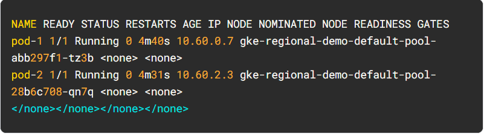

Take note of the IP address of `pod-2`. You will use it in the following command.

### Simulate traffic

1. Get a shell to your `pod-1` container:

> kubectl exec -it pod-1 -- sh

2. In your shell, send a request to pod-2 replacing [POD-2-IP] with the internal IP displayed for pod-2:

> ping [POD-2-IP]

Take note of the average latency it takes to ping pod-2 from pod-1.

### Examine flow logs

With `pod-1` pinging `pod-2`, you can enable flow logs on the subnet of the VPC the cluster was created to observe traffic.

1. Click `Enable the Network Management API` under VPC Network > `VPC Flow Logs` console.

2. Click the `Add VPC flow logs configuration` button, then under Subnets click `Add a configuration for subnets`.

3. On the `Subnets in current project` tab, in VPC networks, check `default` then OK.

4. Now select the subnet in `us-central1` region and click on `Manage flow logs` and then click `Add new configuration`.

5. Click `Add a configuration` under Configurations - Subnets (Compute Engine API), then click Done.

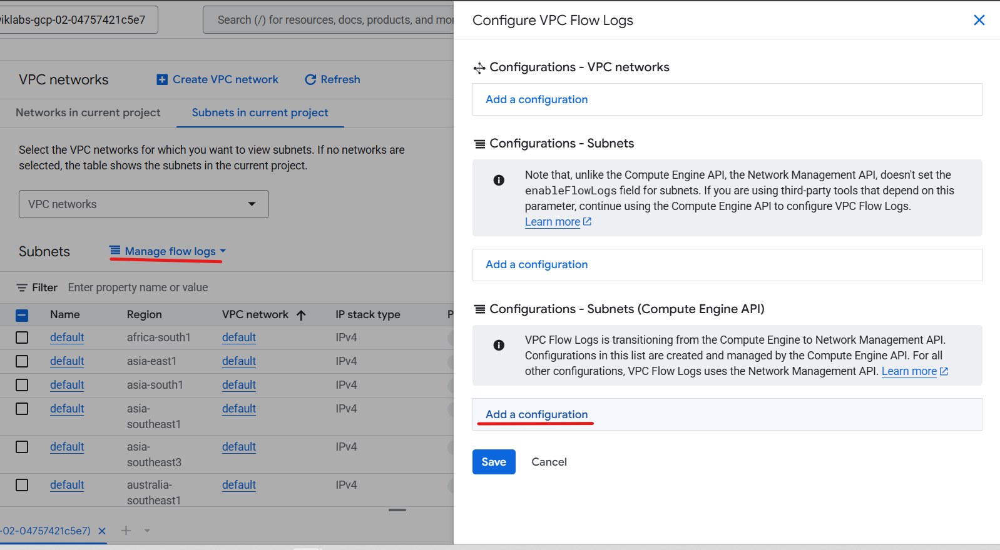

6. Then, click Save.

7. Next, go to cloud `Logs Explorer`. Click on `All log names`, then select `vpc_flows`. Click Apply.

You'll now see a list of logs that display a large amount of information any time something was sent or received from one of your instances.

> Note: If you do not see the vpc_flows logs name immediately, please wait for a minute and then refresh the console.

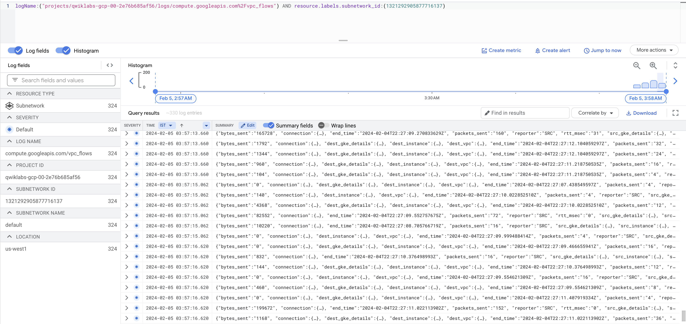

If the logs are not generated then replace / before vpc_flows with %2F as given in the above screenshot.

This can be a little difficult to read. Next, export it to a BigQuery table so you can query the relevant information.

8. Click on `Actions` > `Create Sink`.

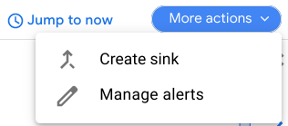

9. Name your sink `FlowLogsSample`.

10. Click Next.

### Sink destination

- For your `Sink Service`, select `BigQuery Dataset`.
- For your `BigQuery Dataset`, select `Create new BigQuery dataset`.
- Name your dataset as 'us_flow_logs', and click `Create dataset`.

Everything else can be left as-is.

1. Click `Create Sink`.

2. Now, inspect your newly created dataset. In the Cloud Console, from the Navigation Menu in the Analytics section, click `BigQuery`.

3. Click Done.

4. Select your project name, and then select the `us_flow_logs` to see the newly created table. If no table is there, you may need to refresh until it has been created.

5. Click on the `compute_googleapis_com_vpc_flows_xxx` table under your `us_flow_logs` dataset.

6. Click on `Query`.

7. In the BigQuery Editor, paste this in between `SELECT` and `FROM`:

```
jsonPayload.src_instance.zone AS src_zone,
jsonPayload.src_instance.vm_name AS src_vm,
jsonPayload.dest_instance.zone AS dest_zone,
jsonPayload.dest_instance.vm_name
```

8. Click Run.

You'll see the flow logs from before but filtered by source zone, source vm, destination zone, and destination vm.

Locate a few rows where there are calls being made between two different zones in your regional-demo cluster.

Observing the flow logs, you can see that there is frequent traffic between different zones.

Next, you will move the pods into the same zone and observe the benefits.

### Move a chatty pod to minimize cross-zonal traffic costs

1. Back in Cloud Shell, press Ctrl + C to cancel the ping command.

2. Type the exit command to exit pod-1's shell:

> exit

3. Run this command to edit the pod-2 manifest:

> sed -i 's/podAntiAffinity/podAffinity/g' pod-2.yaml

This changes your Pod Anti Affinity rule into a Pod Affinity rule while still using the same logic. Now pod-2 will be scheduled on the same node as pod-1.

4. Delete the current running pod-2:

> kubectl delete pod pod-2

5. With pod-2 deleted, recreate it using the newly edited manifest:

> kubectl create -f pod-2.yaml

6. View the pods you created and ensure they are both Running:

> kubectl get pod pod-1 pod-2 --output wide

From the output, you can see that Pod-1 and Pod-2 are now running on the same node.

Take note of the IP address of pod-2. You will use it in the following command.

7. Get a shell to your pod-1 container:

> kubectl exec -it pod-1 -- sh

8. In your shell, send a request to pod-2 replacing [POD-2-IP] with the internal IP for pod-2 from the earlier command:

> ping [POD-2-IP]

You'll notice the average ping time between these pods is much faster now.

At this point, you can go back to your flow logs BigQuery dataset and check recent logs to verify there are no more undesired inter-zonal communications.

### Cost analysis

Take a look at the `VM-VM egress pricing within Google Cloud`:

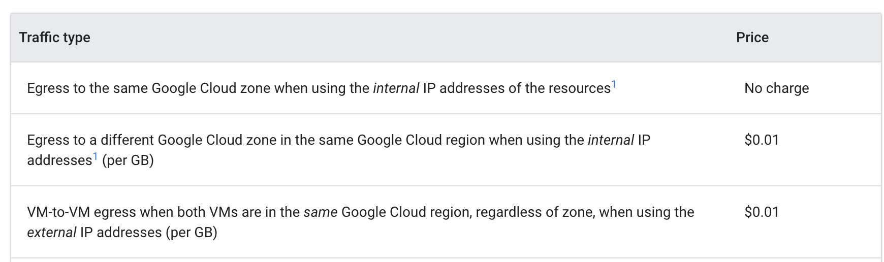

When the pods were pinging each other from different zones, it was costing $0.01 per GB. While that may seem small, it could add up very quickly in a large scale cluster with multiple services making frequent calls between zones.

When you moved the pods into the same zone, the pinging became free of charge.