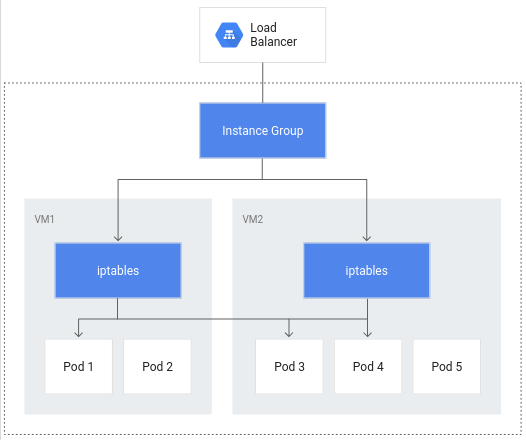
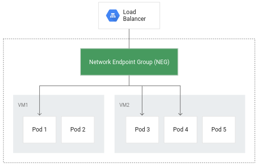
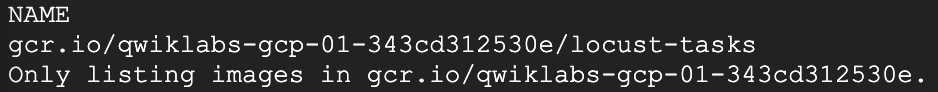
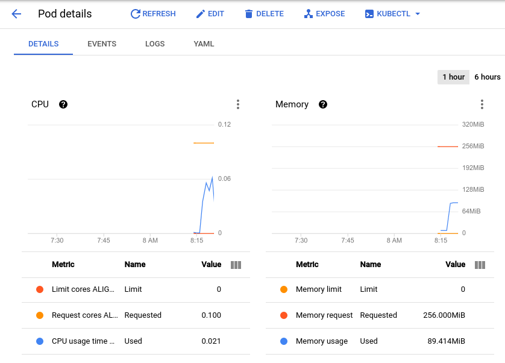
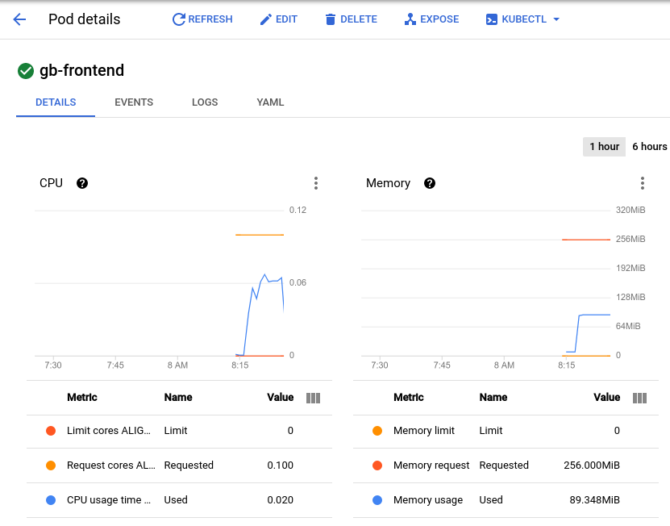

# GKE Workload Optimization（GKE 工作負載最佳化）
https://www.skills.google/course_templates/655/labs/598644

## Overview（總覽）
One of the many benefits of using Google Cloud is its billing model that bills you for only the resources you use. With that in mind, it's imperative that you not only allocate a reasonable amount of resources for your apps and infrastructure, but that you make the most efficient use of them. With GKE there are a number of tools and strategies available to you that can reduce the use of different resources and services while also improving your application's availability.（使用 Google Cloud 的眾多好處之一，是其僅依實際使用計費的模式。基於此，你不僅需要為應用與基礎架構配置合理資源，還要盡可能有效率地使用它們。透過 GKE，你能運用多種工具與策略，在提升應用可用性的同時，降低各類資源與服務的使用量。）
This lab will walk through a few concepts that will help increase the resource efficiency and availability of your workloads. By understanding and fine-tuning your cluster's workload, you can better ensure you are only using the resources you need and optimizing your cluster's costs.（本實作將帶你了解數個概念，協助提升工作負載的資源效率與可用性。藉由掌握並微調叢集的工作負載，你能更確保只使用所需資源，並優化叢集成本。）

## Objectives（目標）
In this lab, you will learn how to:（在本實作中，你將學會：）
- Create a container-native load balancer through ingress（透過 Ingress 建立容器原生負載平衡器）
- Load test an application（對應用進行負載測試）
- Configure liveness and readiness probes（設定 Liveness 與 Readiness 探針）
- Create a pod disruption budget（建立 Pod Disruption Budget（PDB））

## Provision lab environment（佈建實作環境）
1. Set your default zone to "us-east1-b":（將預設區域設為「us-east1-b」：）
> gcloud config set compute/zone us-east1-b
2. Create a three node cluster:（建立一個三節點叢集：）
> gcloud container clusters create test-cluster --num-nodes=3 --enable-ip-alias
The `--enable-ip-alias` flag is included in order to enable the use of alias IPs for pods which will be required for container-native load balancing through an ingress.（加入 `--enable-ip-alias` 旗標以啟用 Pod 的別名 IP；這是透過 Ingress 使用容器原生負載平衡所必須的。）
For this lab, you'll use a simple HTTP web app that you will first deploy as a single pod.（本實作將使用一個簡單的 HTTP Web 應用，並先以單一 Pod 部署。）
3. Create a manifest for the gb-frontend pod:（為 gb-frontend Pod 建立 manifest：）
```
cat << EOF > gb_frontend_pod.yaml
apiVersion: v1
kind: Pod
metadata:
  labels:
    app: gb-frontend
  name: gb-frontend
spec:
  containers:
  - name: gb-frontend
    image: gcr.io/google-samples/gb-frontend-amd64:v5
    resources:
      requests:
        cpu: 100m
        memory: 256Mi
    ports:
    - containerPort: 80
EOF
```
4. Apply the newly created manifest to your cluster:（將新建的 manifest 套用到叢集：）
> kubectl apply -f gb_frontend_pod.yaml

## Task 1. Container-native load balancing through ingress（任務 1：透過 Ingress 使用容器原生負載平衡）
Container-native load balancing allows load balancers to target Kubernetes Pods directly and to evenly distribute traffic to pods.（容器原生負載平衡讓負載平衡器可以直接以 Pods 為目標，並將流量均勻分配到各個 Pod。）
Without container-native load balancing, load balancer traffic would travel to node instance groups and then be routed via `iptables` rules to pods which may or may not be in the same node:（若不使用容器原生負載平衡，流量會先到節點的 instance group，再透過 `iptables` 規則轉送到 Pods（可能位於同一或不同節點）：）

Container-native load balancing allows pods to become the core objects for load balancing, potentially reducing the number of network hops:（容器原生負載平衡使 Pods 成為負載平衡的核心對象，並有機會減少網路跳數：）

In addition to more efficient routing, container-native load balancing results in substantially reduced network utilization,improved performance, even distribution of traffic across Pods, and application-level health checks.（除了路由更有效率外，容器原生負載平衡還能明顯降低網路使用量、提升效能、在 Pods 間平均分配流量，並支援應用層級的健康檢查。）
In order to take advantage of container-native load balancing, the VPC-native setting must be enabled on the cluster. This was indicated when you created the cluster and included the `--enable-ip-alias` flag.（要啟用容器原生負載平衡，叢集必須使用 VPC-native；你在建立叢集時透過 `--enable-ip-alias` 已啟用此設定。）
1. The following manifest will configure a `ClusterIP` service that will be used to route traffic to your application pod to allow GKE to create a network endpoint group:（以下 manifest 會建立一個 `ClusterIP` 服務，將流量導向你的應用 Pod，並讓 GKE 建立 Network Endpoint Group（NEG）：）
```
cat << EOF > gb_frontend_cluster_ip.yaml
apiVersion: v1
kind: Service
metadata:
  name: gb-frontend-svc
  annotations:
    cloud.google.com/neg: '{"ingress": true}'
spec:
  type: ClusterIP
  selector:
    app: gb-frontend
  ports:
  - port: 80
    protocol: TCP
    targetPort: 80
EOF
```
The manifest includes an `annotations` field where the annotation for `cloud.google.com/neg` will enable container-native load balancing on for your application when an ingress is created.（此 manifest 的 `annotations` 內設定了 `cloud.google.com/neg`，當建立 Ingress 時，會為你的應用啟用容器原生負載平衡。）
2. Apply the change to your cluster:（將設定套用至叢集：）
> kubectl apply -f gb_frontend_cluster_ip.yaml
3. Next, create an ingress for your application:（接著為應用建立 Ingress：）
```
cat << EOF > gb_frontend_ingress.yaml
apiVersion: networking.k8s.io/v1
kind: Ingress
metadata:
  name: gb-frontend-ingress
spec:
  defaultBackend:
    service:
      name: gb-frontend-svc
      port:
        number: 80
EOF
```
4. Apply the change to your cluster:（將設定套用至叢集：）
> kubectl apply -f gb_frontend_ingress.yaml
When the ingress is created, an HTTP(S) load balancer is created along with an NEG (Network Endpoint Group) in each zone in which the cluster runs. After a few minutes, the ingress will be assigned an external IP.（建立 Ingress 後，系統會在叢集所在的各個可用區建立 HTTP(S) 負載平衡器與對應的 NEG；幾分鐘後，Ingress 會取得外部 IP。）
The load balancer it created has a backend service running in your project that defines how Cloud Load Balancing distributes traffic. This backend service has a health status associated with it.（該負載平衡器在你的專案中建立後端服務，用以定義 Cloud Load Balancing 的流量分配方式；此後端服務具有健康狀態。）
5. To check the health status of the backend service, first retrieve the name:（若要檢查後端服務的健康狀態，先取得名稱：）
> BACKEND_SERVICE=$(gcloud compute backend-services list \
  | grep NAME \
  | cut -d ' ' -f2)
6. Get the health status for the service:（查詢服務健康狀態：）
> gcloud compute backend-services get-health $BACKEND_SERVICE --global
It will take a few minutes before your health check returns a healthy status.（健康檢查需要幾分鐘才會顯示為健康狀態。）
Output will look something like this:（輸出可能如下：）
```
---
backend: https://www.googleapis.com/compute/v1/projects/qwiklabs-gcp-00-27ced9534cde/zones/us-central1-a/networkEndpointGroups/k8s1-95c051f0-default-gb-frontend-svc-80-9b127192
status:
  healthStatus:
  - healthState: HEALTHY
    instance: https://www.googleapis.com/compute/v1/projects/qwiklabs-gcp-00-27ced9534cde/zones/us-central1-a/instances/gke-test-cluster-default-pool-7e74f027-47qp
    ipAddress: 10.8.0.6
    port: 80
kind: compute#backendServiceGroupHealth
```
> Note: These health checks are part of the Google Cloud load balancer and are distinct from the liveness and readiness probes provided by the Kubernetes API which can be used to determine the health of individual pods. The Google Cloud load balancer health checks use special routes outside of your project’s VPC to perform health checks and determine the success or failure of a backend.（注意：這些健康檢查屬 Google Cloud 負載平衡器的一部分，與 Kubernetes API 的 liveness/readiness 探針不同；前者使用專用路徑（位於你專案 VPC 之外）檢查後端的健康狀態與成敗。）
Once the health state for each instance reports as HEALTHY, you can access the application via its external IP.（當各實例的健康狀態為 HEALTHY 後，你即可透過外部 IP 存取應用。）
7. Retrieve it with:（取得外部 IP：）
> kubectl get ingress gb-frontend-ingress
8. Entering the external IP in a browser window will load the application.（在瀏覽器輸入外部 IP，即可載入應用。）

## Task 2. Load testing an application（任務 2：對應用進行負載測試）
Understanding your application capacity is an important step to take when choosing resource requests and limits for your application's pods and for deciding the best auto-scaling strategy.（在為應用的 Pods 設定資源 Requests/Limits 與選擇最佳自動調整策略前，了解應用的承載能力非常重要。）
At the start of the lab, you deployed your app as a single pod. By load testing your application running on a single pod with no autoscaling configured, you will learn how many concurrent requests your application can handle, how much CPU and memory it requires, and how it might respond to heavy load.（你一開始以單一 Pod（未設定自動調整）部署應用；透過負載測試，可了解其可處理的並發請求數、所需 CPU/記憶體，以及面對高負載的反應。）
To load test your pod, you'll use Locust, an open source load-testing framework.（本測試使用開源負載測試工具 Locust。）
1. Download the Docker image files for Locust in your Cloud Shell:（在 Cloud Shell 下載 Locust 的 Docker 映像檔案：）
> gsutil -m cp -r gs://spls/gsp769/locust-image .
The files in the provided `locust-image` directory include Locust configuration files.（提供的 `locust-image` 目錄中包含 Locust 的設定檔。）
2. Build the Docker image for Locust and store it in your project's registry:（建置 Locust 映像並推送到專案的映像登錄：）
```
gcloud builds submit \
  --tag gcr.io/${GOOGLE_CLOUD_PROJECT}/locust-tasks:latest locust-image
```
3. Verify the Docker image is in your project's registry:（確認映像已推送到專案登錄：）
> gcloud container images list
Expected output:（預期輸出：）

Locust consists of a main and a number of worker machines to generate load.（Locust 由一個主節點與多個工作節點組成以產生負載。）
4. Copy and apply the manifest will create a single-pod deployment for the main and a 5-replica deployment for the workers:（複製並套用 manifest：建立 main 的單 Pod 部署，以及 workers 的 5 副本部署：）
```
gsutil cp gs://spls/gsp769/locust_deploy_v2.yaml .
sed 's/${GOOGLE_CLOUD_PROJECT}/'$GOOGLE_CLOUD_PROJECT'/g' locust_deploy_v2.yaml | \
  kubectl apply -f -
```
5. To access the Locust UI, retrieve the external IP address of its corresponding LoadBalancer service:（取得 Locust UI 對應的 LoadBalancer 服務外部 IP：）
> kubectl get service locust-main
If your *External IP* value is <pending>, wait a minute and rerun the previous command until a valid value is displayed.（若 *External IP* 顯示為 <pending>，稍候片刻再重試直到顯示有效值。）
6. In a new browser window, navigate to [EXTERNAL_IP_ADDRESS]:8089 to open the Locust web page:（在新瀏覽器視窗前往 [EXTERNAL_IP_ADDRESS]:8089 開啟 Locust 頁面。）
Locust allows you to swarm your application with many simultaneous users. You are able to simulate traffic by entering a number of users that are spawned at a certain rate.（Locust 可模擬大量同時使用者；你可設定使用者數與每秒產生速率來模擬流量。）
7. For this example, to represent a typical load, enter 200 for the number of users to simulate and 20 for the hatch rate.（本例為一般負載：輸入 200 位使用者與 20 的產生速率。）
8. Click Start swarming.（點選 Start swarming。）
After a few seconds, the `status` should read `Running` with 200 users and about 150 requests per second (RPS).（幾秒後，`status` 應顯示為 `Running`，使用者 200、人，RPS 約 150。）
9. Switch to the Cloud Console and click Navigation menu (Navigation menu) > [Kubernetes Engine].（切換至 Cloud Console，點選導覽選單 > [Kubernetes Engine]。）
10. Select Workloads from the left pane.（在左側選擇 Workloads。）
11. Then click on your deployed `gb-frontend` pod.（點選已部署的 `gb-frontend` Pod。）
This will bring you to the pod details page where you can view a graph of the CPU and memory utilization of your pod. Observe the `used` values and the `requested` values.（進入 Pod 詳細資料頁面後，可查看 CPU/記憶體使用圖表；留意 `used` 與 `requested` 的數值。）

> Note: In order to see the metric values listed below the graph, click the three dots at the top right portion of the graph and select Expand chart legend from the dropdown.（注意：若要顯示圖表下方的指標數值，請點選圖右上角三點，選擇 Expand chart legend。）
With the current load test at about 150 requests per second, you may see the CPU utilization vary from as low as .04 and as high as .06. This represents `40-60%` of your one pod's CPU request. On the other hand, memory utilization stays at around *80Mi*, well below the requested 256Mi. This is your `per-pod capacity`. This information will be useful when configuring your Cluster Autoscaler, resource requests and limits, and choosing how or whether to implement a horizontal or vertical pod autoscaler.（在 RPS 約 150 的負載下，CPU 使用可能介於 0.04～0.06（約佔單一 Pod CPU Request 的 40–60%）；記憶體約 *80Mi*，遠低於 256Mi 的 Request。這即為 `每 Pod 容量（per-pod capacity）`，可用於設定 Cluster Autoscaler、資源 Requests/Limits，以及是否採用 HPA 或 VPA。）
Along with a baseline, you should also take into account how your application may perform after sudden bursts or spikes.（除了基準值，也應考量突增/尖峰流量時的表現。）
12. Return to the Locust browser window and click Edit under the status at the top of the page.（回到 Locust 頁面，在頂端狀態區按 Edit。）
13. This time, enter 900 for the number of users to simulate and 300 for the hatch rate.（此次輸入 900 位使用者與 300 的產生速率。）
14. Click Start Swarming.（點選 Start Swarming。）
Your pod will suddenly receive 700 additional requests within 2 - 3 seconds. After the RPS value reaches about 150 and the status indicates 900 users, switch back to the `Pod Details page` and observe the change in the graphs.（你的 Pod 會在 2–3 秒內突然收到額外 700 個請求；當 RPS 約 150、狀態顯示 900 使用者時，切回 `Pod 詳細頁` 觀察圖表變化。）

While memory stays the same you'll see that CPU peaked at almost .07 - that's 70% of the CPU request for your pod. If this app were a deployment, you could probably safely reduce the total memory request to a lower amount and configure your horizontal autoscaler to trigger on CPU usage.（記憶體大致不變，但 CPU 峰值接近 0.07（約佔 CPU Request 的 70%）。若此應用為 Deployment，或許可安全降低記憶體 Request，並讓 HPA 以 CPU 使用率觸發擴縮。）

## Task 3. Readiness and liveness probes（任務 3：Readiness 與 Liveness 探針）
### Setting up a liveness probe（設定 Liveness 探針）
If configured in the Kubernetes pod or deployment spec, a liveness probe will continuously run to detect whether a container requires a restart and trigger that restart. They are helpful for automatically restarting deadlocked applications that may still be in a running state. For example, a kubernetes-managed load balancer (such as a service) would only send traffic to a pod backend if all of its containers pass a readiness probe.（若在 Pod/Deployment 規格中設定了 liveness 探針，系統會持續偵測容器是否需要重啟並進行重啟；這有助於自動重啟仍處於執行狀態但發生死鎖的應用。例如，Kubernetes 管理的負載平衡（如 Service）只有在所有容器通過 readiness 探針時，才會將流量導向該 Pod 後端。）
1. To demonstrate a liveness probe, the following will generate a manifest for a pod that has a liveness probe based on the execution of the cat command on a file created on creation:（以下示範使用檔案檢查的 liveness 探針，建立含探針的 Pod manifest：）
```
cat << EOF > liveness-demo.yaml
apiVersion: v1
kind: Pod
metadata:
  labels:
    demo: liveness-probe
  name: liveness-demo-pod
spec:
  containers:
  - name: liveness-demo-pod
    image: quay.io/centos/centos:stream9
    args:
    - /bin/sh
    - -c
    - touch /tmp/alive; sleep infinity
    livenessProbe:
      exec:
        command:
        - cat
        - /tmp/alive
      initialDelaySeconds: 5
      periodSeconds: 10
EOF
```
2. Apply the manifest to your cluster to create the pod:（套用 manifest 以建立 Pod：）
> kubectl apply -f liveness-demo.yaml
The `initialDelaySeconds` value represents how long before the first probe should be performed after the container starts up. The periodSeconds value indicates how often the probe will be performed.（`initialDelaySeconds` 表示容器啟動後，首次探針執行的延遲時間；`periodSeconds` 則為探針的執行頻率。）
> Note: Pods can also be configured to include a `startupProbe` which indicates whether the application within the container is started. If a `startupProbe` is present, no other probes will perform until it returns a Success state. This is recommended for applications that may have variable start-up times in order to avoid interruptions from a liveness probe.（注意：Pods 亦可設定 `startupProbe` 以檢查容器內的應用是否已啟動；若存在 `startupProbe`，在其回報成功前不會執行其他探針。對啟動時間變動較大的應用而言，可避免 liveness 探針造成中斷。）
In this example the liveness probe is essentially checking if the file /tmp/alive exists on the container's file system.（本例的 liveness 探針即是檢查容器檔案系統上的 /tmp/alive 是否存在。）
3. You can verify the health of the pod's container by checking the pod's events:（可透過查看 Pod 事件驗證容器健康狀態：）
> kubectl describe pod liveness-demo-pod
At the bottom of the output there should be an Events section with the pod's last 5 events. At this point, the pod's events should only include the events related to its creation and start up:（輸出底部的 Events 區段會列出最近事件；此時應僅包含建立與啟動相關事件：）
```
Events:
  Type    Reason     Age   From               Message
  ----    ------     ----  ----               -------
  Normal  Scheduled  19s   default-scheduler  Successfully assigned default/liveness-demo-pod to gke-load-test-default-pool-abd43157-rgg0
  Normal  Pulling    18s   kubelet            Pulling image "centos"
  Normal  Pulled     18s   kubelet            Successfully pulled image "centos"
  Normal  Created    18s   kubelet            Created container liveness-demo-pod
  Normal  Started    18s   kubelet            Started container liveness-demo-pod
```
This events log will include any failures in the liveness probe as well as restarts triggered as a result.（事件記錄也會包含 liveness 探針失敗與因此觸發的重啟。）
4. Manually delete the file being used by the liveness probe:（手動刪除供探針檢查的檔案：）
> kubectl exec liveness-demo-pod -- rm /tmp/alive
5. With the file removed, the `cat` command being used by the liveness probe should return a non-zero exit code.（檔案刪除後，探針使用的 `cat` 指令會回傳非零代碼。）
6. Once again, check the pod's events:（再次檢查 Pod 事件：）
> kubectl describe pod liveness-demo-pod
As the liveness probe fails, you'll see events added to the log showing the series of steps that are kicked off. It will begin with the liveness probe failing (`Liveness probe failed: cat: /tmp/alive: No such file or directory`) and end with the container starting up once again (`Started container`):（當 liveness 探針失敗時，事件記錄會顯示一連串動作：從失敗訊息（`Liveness probe failed: cat: /tmp/alive: No such file or directory`）到容器再次啟動（`Started container`）。）
```
Events:
  Type     Reason     Age                From     Message
  ----     ------     ----               ----     -------
  Normal   Scheduled  2m21s              default-scheduler  Successfully assigned default/liveness-demo-pod to gke-load-test-default-pool-abd43157-rgg0
  Warning  Unhealthy  36s (x3 over 56s)  kubelet  Liveness probe failed: cat: /tmp/alive: No such file or directory
  Normal   Killing    36s                 kubelet  Container liveness-demo-pod failed liveness probe, will be restarted
  Normal   Pulling    6s  (x2 over 2m20s) kubelet  Pulling image "centos"
  Normal   Pulled     6s  (x2 over 2m20s) kubelet  Successfully pulled image "centos"
  Normal   Created    6s  (x2 over 2m20s) kubelet  Created container liveness-demo-pod
  Normal   Started    6s  (x2 over 2m20s) kubelet  Started container liveness-demo-pod
```
> Note: The example in this lab uses a command probe for its livenessProbe that depends on the exit code of a specified command. In addition to a command probe, a livenessProbe could be configured as an `HTTP probe` that will depend on HTTP response, or a `TCP probe` that will depend on whether a TCP connection can be made on a specific port.（注意：本例採用「命令型」探針，依指定指令的退出碼判定；livenessProbe 亦可設定為 `HTTP` 或 `TCP` 探針，分別依 HTTP 回應或特定連接埠的 TCP 連線成功與否判定。）

### Setting up a readiness probe（設定 Readiness 探針）
Although a pod could successfully start and be considered healthy by a liveness probe, it's likely that it may not be ready to receive traffic right away. This is common for deployments that serve as a backend to a service such as a load balancer. A `readiness probe` is used to determine when a pod and its containers are ready to begin receiving traffic.（即使 Pod 可啟動且通過 liveness 探針，它仍可能尚未準備好接收流量；這在作為服務（如負載平衡）後端的部署中很常見。`readiness probe` 用於判定 Pod/容器何時可開始接收流量。）
1. To demonstrate this, create a manifest to create a single pod that will serve as a test web server along with a load balancer:（建立測試 Web 伺服器與對應 LoadBalancer 的單一 Pod manifest：）
```
cat << EOF > readiness-demo.yaml
apiVersion: v1
kind: Pod
metadata:
  labels:
    demo: readiness-probe
  name: readiness-demo-pod
spec:
  containers:
  - name: readiness-demo-pod
    image: nginx
    ports:
    - containerPort: 80
    readinessProbe:
      exec:
        command:
        - cat
        - /tmp/healthz
      initialDelaySeconds: 5
      periodSeconds: 5
---
apiVersion: v1
kind: Service
metadata:
  name: readiness-demo-svc
  labels:
    demo: readiness-probe
spec:
  type: LoadBalancer
  ports:
  - port: 80
    targetPort: 80
    protocol: TCP
  selector:
    demo: readiness-probe
EOF
```
2. Apply the manifest to your cluster and create a load balancer with it:（套用 manifest 並建立負載平衡：）
> kubectl apply -f readiness-demo.yaml
3. Retrieve the external IP address assigned to your load balancer (it may take a minute after the previous command for an address to be assigned):（取得負載平衡器的外部 IP（可能需稍候））：）
> kubectl get service readiness-demo-svc
4. Enter the IP address in a browser window and you'll notice that you'll get an error message signifying that the site cannot be reached.（在瀏覽器輸入該 IP，會先看到網站無法連線的錯誤。）
5. Check the pod's events:（查看 Pod 事件：）
> kubectl describe pod readiness-demo-pod
The output will reveal that the readiness probe has failed:（輸出顯示 readiness 探針失敗：）
```
Events:
  Type    Reason     Age   From               Message
  ----    ------     ----  ----               -------
  Normal  Scheduled  2m24s default-scheduler  Successfully assigned default/readiness-demo-pod to gke-load-test-default-pool-abd43157-rgg0
  Normal  Pulling    2m23s kubelet            Pulling image "nginx"
  Normal  Pulled     2m23s kubelet            Successfully pulled image "nginx"
  Normal  Created    2m23s kubelet            Created container readiness-demo-pod
  Normal  Started    2m23s kubelet            Started container readiness-demo-pod
  Warning Unhealthy  35s (x21 over 2m15s) kubelet Readiness probe failed: cat: /tmp/healthz: No such file or directory
```
Unlike the liveness probe, an unhealthy readiness probe does not trigger the pod to restart.（與 liveness 探針不同，readiness 探針失敗不會觸發 Pod 重啟。）
6. Use the following command to generate the file that the readiness probe is checking for:（建立探針檢查的檔案：）
> kubectl exec readiness-demo-pod -- touch /tmp/healthz
The `Conditions` section of the pod description should now show `True` as the value for `Ready`.（Pod 描述的 `Conditions` 區段中，`Ready` 應變為 `True`。）
> kubectl describe pod readiness-demo-pod \
  | grep ^Conditions -A 5
Output:（輸出：）
```
Conditions:
  Type              Status
  Initialized       True
  Ready             True
  ContainersReady   True
  PodScheduled      True
```
7. Now, refresh the browser tab that had your `readiness-demo-svc` external IP. You should see a "Welcome to nginx!" message properly displayed.（重新整理該外部 IP 的瀏覽器分頁，應會看到「Welcome to nginx!」。）
Setting meaningful readiness probes for your application containers ensures that pods are only receiving traffic when they are ready to do so. An example of a meaningful readiness probe is checking to see whether a cache your application relies on is loaded at startup.（為應用容器設定適切的 readiness 探針，可確保 Pods 只有在準備就緒時才接收流量；例如，檢查啟動時相依快取是否已載入，即是一種有意義的探針。）

## Task 4. Pod disruption budgets（任務 4：Pod Disruption Budget）
Part of ensuring reliability and uptime for your GKE application relies on leveraging pod disruption budgets (pdp). `PodDisruptionBudget` is a Kubernetes resource that limits the number of pods of a replicated application that can be down simultaneously due to voluntary disruptions.（確保 GKE 應用可靠性與正常運作的一部分，仰賴善用 Pod Disruption Budget（PDB）。`PodDisruptionBudget` 是一種 Kubernetes 資源，用來限制在「自願性中斷」情況下可同時停止的複製式應用 Pods 數量。）
Voluntary disruptions include administrative actions like deleting a deployment, updating a deployment's pod template and performing a rolling update, draining nodes that an application's pods reside on, or moving pods to different nodes.（自願性中斷包含管理操作：刪除 Deployment、更新 Pod 範本並滾動更新、排空（drain）承載應用 Pods 的節點，或將 Pods 移到其他節點。）
First, you'll have to deploy your application as a deployment.（首先，請將應用改為 Deployment 方式部署。）
1. Delete your single pod app:（刪除單一 Pod 應用：）
> kubectl delete pod gb-frontend
2. And generate a manifest that will create it as a deployment of 5 replicas:（產生 manifest，將其建立為 5 副本的 Deployment：）
```
cat << EOF > gb_frontend_deployment.yaml
apiVersion: apps/v1
kind: Deployment
metadata:
  name: gb-frontend
  labels:
    run: gb-frontend
spec:
  replicas: 5
  selector:
    matchLabels:
      run: gb-frontend
  template:
    metadata:
      labels:
        run: gb-frontend
    spec:
      containers:
      - name: gb-frontend
        image: gcr.io/google-samples/gb-frontend-amd64:v5
        resources:
          requests:
            cpu: 100m
            memory: 128Mi
        ports:
        - containerPort: 80
          protocol: TCP
EOF
```
3. Apply this deployment to your cluster:（將此 Deployment 套用到叢集：）
> kubectl apply -f gb_frontend_deployment.yaml
Before creating a PDB, you will drain your cluster's nodes and observe your application's behavior without a PDB in place.（在建立 PDB 前，先排空叢集的節點，觀察沒有 PDB 時應用的表現。）
Drain the nodes by looping through the output of the `default-pool`'s nodes and running the `kubectl drain` command on each individual node:（針對 `default-pool` 的各節點執行 `kubectl drain`：）
```
for node in $(kubectl get nodes -l cloud.google.com/gke-nodepool=default-pool -o=name); do
  kubectl drain --force --ignore-daemonsets --grace-period=10 "$node";
done
```
The command above will evict pods from the specified node and cordon the node so that no new pods can be created on it. If the available resources allow, pods are redeployed on a different node.（上述指令會將指定節點上的 Pods 驅逐並封鎖（cordon）該節點，使其無法建立新 Pods；若資源允許，Pods 會重新部署到其他節點。）
5. Once your node has been drained, check in on your `gb-frontend` deployment's replica count:（節點排空後，檢查 `gb-frontend` 的副本數：）
> kubectl describe deployment gb-frontend \
  | grep ^Replicas
The output may resemble something like this:（輸出可能如下：）
```
Replicas: 5 desired \
 5 updated \
 5 total \
 0 available \
 5 unavailable
```
After draining a node, your deployment could have as little as 0 replicas available, as indicated by the output above. Without any pods available, your application is effectively down. Let's try draining the nodes again, except this time with a pod disruption budget in place for your application.（節點排空後，Deployment 可能出現 0 個可用副本；在沒有可用 Pods 的情況下，應用即等同於停止。我們再試一次排空節點，但這次先為應用設定 PDB。）
6. First bring the drained nodes back by uncordoning them. The command below allows pods to be scheduled on the node again:（先將節點解除封鎖（uncordon），讓其可再次排程 Pods：）
```
for node in $(kubectl get nodes -l cloud.google.com/gke-nodepool=default-pool -o=name); do
  kubectl uncordon "$node";
done
```
7. Once again check in on the status of your deployment:（再次檢查 Deployment 狀態：）
> kubectl describe deployment gb-frontend \
  | grep ^Replicas
The output should now resemble the following, with all 5 replicas available:（輸出應如下，5 個副本皆可用：）
```
Replicas: 5 desired \
 5 updated \
 5 total \
 5 available \
 0 unavailable
```
8. Create a pod disruption budget that will declare the minimum number of available pods to be 4:（建立 PDB，宣告至少需 4 個可用 Pods：）
> kubectl create poddisruptionbudget gb-pdb --selector run=gb-frontend --min-available 4
9. Once again, drain one of your cluster's nodes and observe the output:（再次排空其中一個節點並觀察輸出：）
```
for node in $(kubectl get nodes -l cloud.google.com/gke-nodepool=default-pool -o=name); do
  kubectl drain --timeout=30s --ignore-daemonsets --grace-period=10 "$node";
done
```
After successfully evicting one of your application's pods, it will loop through the following:（成功驅逐其中一個應用的 Pod 後，輸出可能如下循環顯示：）
```
evicting pod default/gb-frontend-597d4d746c-fxsdg
evicting pod default/gb-frontend-597d4d746c-tcrf2
evicting pod default/gb-frontend-597d4d746c-kwvmv
evicting pod default/gb-frontend-597d4d746c-6jdx5
error when evicting pod "gb-frontend-597d4d746c-fxsdg" (will retry after 5s): Cannot evict pod as it would violate the pod's disruption budget.
error when evicting pod "gb-frontend-597d4d746c-tcrf2" (will retry after 5s): Cannot evict pod as it would violate the pod's disruption budget.
error when evicting pod "gb-frontend-597d4d746c-6jdx5" (will retry after 5s): Cannot evict pod as it would violate the pod's disruption budget.
error when evicting pod "gb-frontend-597d4d746c-kwvmv" (will retry after 5s): Cannot evict pod as it would violate the pod's disruption budget.
```
10. Press CTRL+C to exit the command.（按 CTRL+C 結束指令。）
11. Check your deployments status once again:（再次檢查 Deployment 狀態：）
> kubectl describe deployment gb-frontend \
  | grep ^Replicas
The output should now read:（輸出應如下：）
```
Replicas: 5 desired \
 5 updated \
 5 total \
 4 available \
 1 unavailable
```
Until Kubernetes is able to deploy a 5th pod on a different node in order to evict the next one, the remaining pods will remain available in order to adhere to the PDB. In this example, the pod disruption budget was configured to indicate min-available but a PDB can also be configured to define a max-unavailable. Either value can be expressed as an integer representing a pod count, or a percentage of total pods.（在 Kubernetes 能於其他節點部署第 5 個 Pod、以便驅逐下一個 Pod 之前，剩餘 Pods 會保持可用以符合 PDB。此例以 `min-available` 設定；PDB 也可用 `max-unavailable`。兩者都可用整數（Pod 數）或總 Pods 的百分比表示。）

## Congratulations!（恭喜！）
You learned how you can create a container-native load balancer through ingress in order to take advantage of more efficient load balancing and routing. You ran a simple load test on a GKE application and observed its baseline CPU and memory utilization, as well as how it responds to spikes in traffic. Additionally you configured liveness and readiness probes along with a pod disruption budget to ensure your applications' availability. These tools and techniques in conjunction with each other contribute to an overall efficiency to how your application can run on GKE by minimizing extraneous network traffic, defining meaningful indicators of a well-behaved application and improving application availability.（你已學會如何透過 Ingress 建立容器原生負載平衡，以享有更有效率的負載分配與路由；也對 GKE 應用執行了基本負載測試，觀察其 CPU/記憶體基準與對尖峰流量的反應。此外，你設定了 liveness/readiness 探針與 PDB 以確保可用性。這些工具與技巧相互配合，可在 GKE 上提升整體執行效率、減少不必要的網路流量，並以有意義的指標維持良好行為與可用性。）

## Next steps / Learn more（後續步驟／延伸閱讀）
- [Best practices for running cost-optimized Kubernetes applications on GKE: Prepare Cloud Based Kubernetes Applications](https://cloud.google.com/solutions/best-practices-for-running-cost-effective-kubernetes-applications-on-gke#prepare_cloud-based_kubernetes_applications)（在 GKE 執行成本最佳化 Kubernetes 應用的最佳實務：準備雲端化 Kubernetes 應用）
