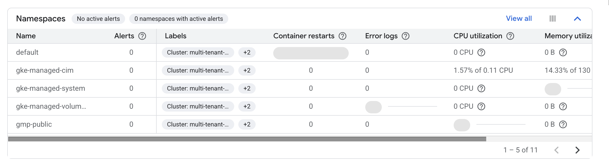
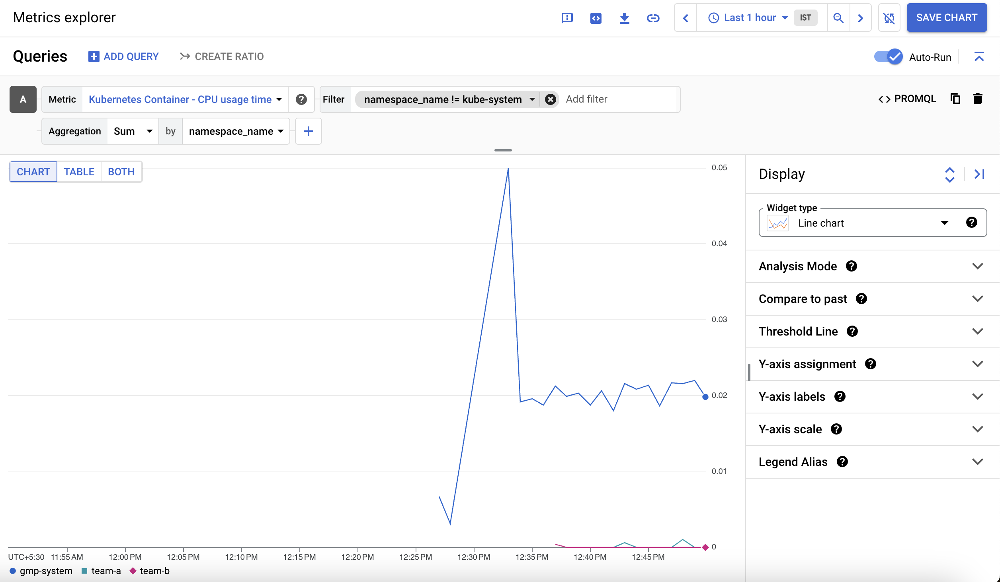
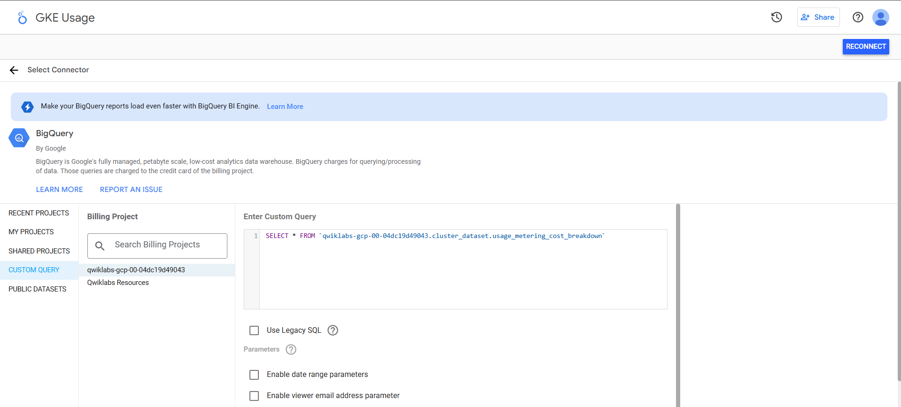
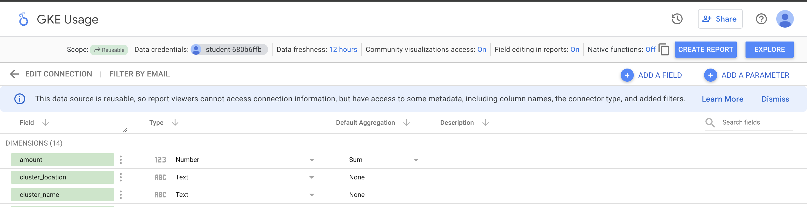
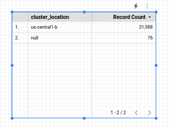

# Managing a GKE Multi-tenant Cluster with Namespaces

https://www.skills.google/course_templates/655/labs/598636

## Overview

When considering cost optimization solutions for any Google Cloud infrastructure built around Google Kubernetes Engine (GKE) clusters, it's important to ensure that you're making effective use of the resources that are being billed. A common misstep is assigning a one to one ratio of users or teams to clusters, resulting in cluster proliferation.

A `multi-tenancy cluster` allows for multiple users or teams to share one cluster for their workloads while maintaining isolation and fair resource sharing. This is achieved by creating `namespaces`. Namespaces allow multiple virtual clusters to exist on the same physical cluster.

In this lab you will learn how to set up a multi-tenant cluster using multiple namespaces to optimize resource utilization and, in effect, optimize costs.

## Objectives

In this lab, you will learn how to:

- Create multiple namespaces in a GKE cluster.
- Configure role-based access control for namespace access.
- Configure Kubernetes resource quotas for fair sharing resources across multiple namespaces.
- View and configure monitoring dashboards to view resource usage by namespace.
- Generate a GKE metering report in Looker Studio for fine grained metrics on resource utilization by namespace.
- Setup and requirements

## Task 1. Download required files

1. In this lab, some steps will use `yaml` files to configure your Kubernetes cluster. In your Cloud Shell, download these files from a Cloud Storage bucket:

```
gsutil -m cp -r gs://spls/gsp766/gke-qwiklab ~
```

2. Change your current working directory to `gke-qwiklab`:

> cd ~/gke-qwiklab

## Task 2. View and create namespaces

- Run the following to set a default compute zone and authenticate the provided cluster `multi-tenant-cluster`:

```
export ZONE=placeholder
gcloud config set compute/zone ${ZONE} && gcloud container clusters get-credentials multi-tenant-cluster
```

### Default namespaces

By default, Kubernetes clusters have 4 system namespaces.

1. You can get a full list of the current cluster's namespaces with:

> kubectl get namespace

2. The output should be similar to:

```
NAME              STATUS   AGE
default           Active   5m
kube-node-lease   Active   5m
kube-public       Active   5m
kube-system       Active   5m
```

`default` - the default namespace used when no other namespace is specified
`kube-node-lease` - manages the lease objects associated with the heartbeats of each of the cluster's nodes
`kube-public` - to be used for resources that may need to be visible or readable by all users throughout the whole cluster
`kube-system` - used for components created by the Kubernetes system

Not everything belongs to a namespace. For example, nodes, persistent volumes, and namespaces themselves do not belong to a namespace.

2. For a complete list of namespaced resources:

> kubectl api-resources --namespaced=true

When they are created, namespaced resources must be associated with a namespace. This is done by including the `--namespace` flag or indicating a namespace in the yaml's metadata field.

3. The namespace can also be specified with any `kubectl get` subcommand to display a namespace's resources. For example:

> kubectl get services --namespace=kube-system

This will output all services in the `kube-system` namespace.

### Creating new namespaces

> Note: When creating additional namespaces, avoid prefixing the names with `‘kube'` as this is reserved for system namespaces.

1. Create 2 namespaces for `team-a` and `team-b`:

```
kubectl create namespace team-a && \
kubectl create namespace team-b
```

The output for `kubectl get namespace` should now include your 2 new namespaces:

```
namespace/team-a created
namespace/team-b created
```

By specifying the `--namespace` tag, you can create cluster resources in the provided namespace. Names for resources, such as deployments or pods, only need to be unique within their respective namespaces.

2. As an example, run the following to deploy a pod in the team-a namespace and in the team-b namespace using the same name:

```
kubectl run app-server --image=quay.io/centos/centos:9 --namespace=team-a -- sleep infinity && \
kubectl run app-server --image=quay.io/centos/centos:9 --namespace=team-b -- sleep infinity
```

3. Use `kubectl get pods -A` to see there are 2 pods named `app-server`, one for each team namespace:

> kubectl get pods -A

Output:

```
NAMESPACE     NAME                                                        READY   STATUS    RESTARTS   AGE
kube-system   event-exporter-gke-8489df9489-k2blq                         2/2     Running   0          3m41s
kube-system   fluentd-gke-fmt4v                                           2/2     Running   0          113s
kube-system   fluentd-gke-n9dvn                                           2/2     Running   0          79s
kube-system   fluentd-gke-scaler-cd4d654d7-xj78p                          1/1     Running   0          3m37s
kube-system   gke-metrics-agent-4jvn8                                     1/1     Running   0          3m33s
kube-system   gke-metrics-agent-b4vvw                                     1/1     Running   0          3m27s
kube-system   kube-dns-7c976ddbdb-gtrct                                   4/4     Running   0          3m41s
kube-system   kube-dns-7c976ddbdb-k9bgk                                   4/4     Running   0          3m
kube-system   kube-dns-autoscaler-645f7d66cf-jwqh5                        1/1     Running   0          3m36s
kube-system   kube-proxy-gke-new-cluster-default-pool-eb9986d5-tpql       1/1     Running   0          3m26s
kube-system   kube-proxy-gke-new-cluster-default-pool-eb9986d5-znm6       1/1     Running   0          3m33s
kube-system   l7-default-backend-678889f899-xvt5t                         1/1     Running   0          3m41s
kube-system   metrics-server-v0.3.6-64655c969-jtl57                       2/2     Running   0          3m
kube-system   prometheus-to-sd-d6dpf                                      1/1     Running   0          3m27s
kube-system   prometheus-to-sd-rfdlv                                      1/1     Running   0          3m33s
kube-system   stackdriver-metadata-agent-cluster-level-79f9ddf6d6-7ck2w   2/2     Running   0          2m56s
team-a        app-server                                                  1/1     Running   0          33s
team-b        app-server                                                  1/1     Running   0          33s
```

4. Use `kubectl describe` to see additional details for each of the newly created pods by specifying the namespace with the --namespace tag:

> kubectl describe pod app-server --namespace=team-a

5. To work exclusively with resources in one namespace, you can set it once in the `kubectl` context instead of using the `--namespace` flag for every command:

> kubectl config set-context --current --namespace=team-a

6. After this, any subsequent commands will be run against the indicated namespace without specifying the `--namespace` flag:

> kubectl describe pod app-server

In the next section, you will configure role-based access control for your namespaces to help organize the cluster.

## Task 3. Access Control in namespaces

Provisioning access to namespaced resources in a cluster is accomplished by granting a combination of IAM roles and Kubernetes' built-in role-based access control (RBAC). An IAM role will give an account initial access to the project while the RBAC permissions will grant granular access to a cluster's namespaced resources (pods, deployments, services, etc).

### IAM Roles

> Note: To grant IAM roles in a project, you'll need the Project IAM Admin role assigned. This is already set up in your Qwiklabs temporary account.

When managing access control for Kubernetes, Identity and Access Management (IAM) is used to manage access and permissions on a higher organization and project levels.

There are several roles that can be assigned to users and service accounts in IAM that govern their level of access with GKE. RBAC's granular permissions build on the access already provided by IAM and cannot restrict access granted by it. As a result, for multi-tenant namespaced clusters, the assigned IAM role should grant minimal access.

Here's a table of common GKE IAM roles you can assign:

- Kubernetes Engine Admin

Provides access to full management of clusters and their Kubernetes API objects. A user with this role will be able to create, edit and delete any resource in any cluster and subsequent namespaces.

- Kubernetes Engine Developer

Provides access to Kubernetes API objects inside clusters. A user with this role will be able to create, edit, and delete resources in any cluster and subsequent namespaces.

- Kubernetes Engine Cluster Admin

Provides access to management of clusters. A user with this role will not have access to create or edit resources within any cluster or subsequent namespaces directly, but will be able to create, modify, and delete any cluster.

- Kubernetes Engine Viewer

Provides read-only access to GKE resources. A user with this role will have read-only access to namespaces and their resources.

- Kubernetes Engine Cluster Viewer

Get and list access to GKE Clusters. This is the minimal role required for anyone who needs to access resources within a cluster's namespaces.

While most of these roles grant too much access to restrict with RBAC, the IAM role `Kubernetes Engine Cluster Viewer` gives users just enough permissions to access the cluster and namespaced resources.

Your lab project has a service account that will represent a developer that will use the `team-a` namespace.

- Grant the account the Kubernetes Engine Cluster Viewer role by running the following:

```
gcloud projects add-iam-policy-binding ${GOOGLE_CLOUD_PROJECT} \
--member=serviceAccount:team-a-dev@${GOOGLE_CLOUD_PROJECT}.iam.gserviceaccount.com  \
--role=roles/container.clusterViewer
```

### Kubernetes RBAC

Within a cluster, access to any resource type (pods, services, deployments, etc) is defined by either a `role` or a `cluster role`. Only `roles` are allowed to be scoped to a namespace. While a role will indicate the resources and the action allowed for each resource, a `role binding` will indicate to what user accounts or groups to assign that access to.

To create a role in the current namespace, specify the resource type as well as the `verbs` that will indicate what type of action that will be allowed.

1. Roles with single rules can be created with `kubectl create`:

```
kubectl create role pod-reader \
--resource=pods --verb=watch --verb=get --verb=list
```

Roles with multiple rules can be created using a `yaml` file. An example file is provided within the files you downloaded earlier in the lab.

2. Inspect the yaml file:

> cat developer-role.yaml

Sample output:
```
apiVersion: rbac.authorization.k8s.io/v1
kind: Role
metadata:
  namespace: team-a
  name: developer
rules:
- apiGroups: [""]
  resources: ["pods", "services", "serviceaccounts"]
  verbs: ["update", "create", "delete", "get", "watch", "list"]
- apiGroups:["apps"]
  resources: ["deployments"]
  verbs: ["update", "create", "delete", "get", "watch", "list"]
```

3. Apply the role above:

> kubectl create -f developer-role.yaml

4. Create a role binding between the team-a-developers serviceaccount and the developer-role:

```
kubectl create rolebinding team-a-developers \
--role=developer --user=team-a-dev@${GOOGLE_CLOUD_PROJECT}.iam.gserviceaccount.com
```

### Test the rolebinding

1. Download the service account keys used to impersonate the service account:

```
gcloud iam service-accounts keys create /tmp/key.json --iam-account team-a-dev@${GOOGLE_CLOUD_PROJECT}.iam.gserviceaccount.com
```

2. In Cloud Shell click the + to open a new tab in your terminal.

3. Here, run the following to activate the service account. This will allow you to run the commands as the account:

> gcloud auth activate-service-account  --key-file=/tmp/key.json

4. Get the credentials for your cluster, as the service account:

```
export ZONE=placeholder
gcloud container clusters get-credentials multi-tenant-cluster --zone ${ZONE} --project ${GOOGLE_CLOUD_PROJECT}
```

5. You'll see now that as team-a-dev you're able to list pods in the team-a namespace:

> kubectl get pods --namespace=team-a

Output:
```
NAME           READY   STATUS    RESTARTS   AGE
app-server     1/1     Running   0          6d
```

6. But listing pods in the team-b namespace is restricted:

> kubectl get pods --namespace=team-b

Output:
```
Error from server (Forbidden): pods is forbidden: User "team-a-dev@a-gke-project.iam.gserviceaccount.com" cannot list resource "pods" in API group "" in the namespace "team-b": requires one of ["container.pods.list"] permission(s).
```

7. Return to your first Cloud Shell tab or open a new one.

8. Renew the cluster credentials and reset your context to the team-a namespace:

```
export ZONE=placeholder
gcloud container clusters get-credentials multi-tenant-cluster --zone ${ZONE} --project ${GOOGLE_CLOUD_PROJECT}
```

## Task 4. Resource quotas

When a cluster is shared in a multi-tenant set up, it's important to make sure that users are not able to use more than their fair share of the cluster resources. A resource quota object (ResourceQuota) will define constraints that will limit resource consumption in a namespace. A resource quota can specify a limit to object counts (pods, services, stateful sets, etc), total sum of storage resources (persistent volume claims, ephemeral storage, storage classes ), or total sum of compute resources. (cpu and memory).

1. For example, the following will set a limit to the number of pods allowed in the namespace `team-a` to 2, and the number of loadbalancers to 1:

```
kubectl create quota test-quota \
--hard=count/pods=2,count/services.loadbalancers=1 --namespace=team-a
```

2. Create a second pod in the namespace team-a:

```
kubectl run app-server-2 --image=quay.io/centos/centos:9 --namespace=team-a -- sleep infinity
```

3. Now try to create a third pod:

```
kubectl run app-server-3 --image=quay.io/centos/centos:9 --namespace=team-a -- sleep infinity
```

You should receive the following error:
```
Error from server (Forbidden): pods "app-server-3" is forbidden: exceeded quota: test-quota, requested: count/pods=1, used: count/pods=2, limited: count/pods=2
```

4. You can check details about your resource quota using `kubectl describe`:

> kubectl describe quota test-quota --namespace=team-a

Output:
```
Name:                         test-quota
Namespace:                    team-a
Resource                      Used  Hard
--------                      ----  ----
count/pods                    2     2
count/services.loadbalancers  0     1
```

Here you can see a list of resources restricted by the resource quota, along with the hard limit configured and the quantity currently used.

5. Update `test-quota` to have a limit of 6 pods by running:

```
export KUBE_EDITOR="nano"
kubectl edit quota test-quota --namespace=team-a
```

You'll be able to edit a `yaml` file that `kubectl` will use to update the quota. The hard quota is the value for `count/pods` under `spec`.

6. Change the value of `count/pods` under spec to 6:

```
apiVersion: v1
kind: ResourceQuota
metadata:
  creationTimestamp: "2020-10-21T14:12:07Z"
  name: test-quota
  namespace: team-a
  resourceVersion: "5325601"
  selfLink: /api/v1/namespaces/team-a/resourcequotas/test-quota
  uid: a4766300-29c4-4433-ba24-ad10ebda3e9c
spec:
  hard:
    count/pods: "6"
    count/services.loadbalancers: "1"
status:
  hard:
    count/pods: "5"
    count/services.loadbalancers: "1"
  used:
    count/pods: "2"
```

7. Press CTRL+X, Y, and ENTER to save and exit.

The updated quota should now be reflected in the output:

> kubectl describe quota test-quota --namespace=team-a

``` Output:
Name:                         test-quota
Namespace:                    team-a
Resource                      Used  Hard
--------                      ----  ----
count/pods                    2     6
count/services.loadbalancers  0     1
```

*CPU and memory quotas*

When setting quotas for CPU and memory, you can indicate a quota for the sum of requests (a value that a container is guaranteed to get) or the sum of limits (a value that a container will never be allowed to pass).

In this lab, your cluster has 4 e2-standard-2 machines, with 2 core and 8GB memory each. You have been provided with a sample resource quota yaml file for your cluster:

[cpu-mem-quota.yaml]

```
apiVersion: v1
kind: ResourceQuota
metadata:
  name: cpu-mem-quota
  namespace: team-a
spec:
  hard:
    limits.cpu: "4"
    limits.memory: "12Gi"
    requests.cpu: "2"
    requests.memory: "8Gi"
```

1. Apply the file configuration:

> Note: Make sure you're still in the gke-qwiklab directory.

> kubectl create -f cpu-mem-quota.yaml

With this quota in place, the sum of all pods' CPU and memory requests will be capped at 2cpu and 8GiB, and their limits at 4cpu and 12GiB, respectively.

> Note: When a resource quota for CPU or memory exists in a namespace, every container that is created in that namespace thereafter must have its own CPU and memory limit defined on creation or by having a default value assigned in the namespace as a LimitRange.

2. To demonstrate the CPU and memory quota, create a new pod using `cpu-mem-demo-pod.yaml`:

[cpu-mem-demo-pod.yaml:]

```
apiVersion: v1
kind: Pod
metadata:
  name: cpu-mem-demo
  namespace: team-a
spec:
  containers:
  - name: cpu-mem-demo-ctr
    image: nginx
    resources:
      requests:
        cpu: "100m"
        memory: "128Mi"
      limits:
        cpu: "400m"
        memory: "512Mi"
```

3. Apply the file configuration:

> kubectl create -f cpu-mem-demo-pod.yaml --namespace=team-a

4. Once this pod has been created, run the following to see its CPU and memory requests and limits reflected in the quota:

> kubectl describe quota cpu-mem-quota --namespace=team-a

``` Output:
Name:            cpu-mem-quota
Namespace:       team-a
Resource         Used   Hard
--------         ----   ----
limits.cpu       400m   4
limits.memory    512Mi  12Gi
requests.cpu     100m   2
requests.memory  128Mi  8Gi
```

## Task 5. Monitoring GKE and GKE usage metering

For most multi-tenant clusters, it's likely that the workloads and resource requirements of each of the tenants will change and resource quotas might need to be adjusted. By using Monitoring you can get a general view of the resources each namespace is using.

With GKE usage metering, you're able to get a more granular view of that resource usage and subsequently a better idea of costs associated with each tenant.

### Monitoring Dashboard

1. In the Cloud Console, click *Navigation menu* (Navigation menu icon) > *View All Products*. Under *Observability* section, click *Monitoring*.

Wait a minute while your workspace for your project is constructed.

2. Once you're on the Overview page, select *Dashboards* from the left menu:

3. Select *GKE* from the *Dashboards Overview* page.

The GKE Dashboard presents you with a collection of tables detailing CPU, memory, and disk utilization aggregated by several resources.

For example, the Namespaces table will show you utilization for each of your clusters' namespaces:



You can also get a look at the utilization data for the workloads running on your cluster in the Workloads table.

4. Click *View All*.

5. In the `ADD FILTER` box select *Namespaces* > *team-a*.

6. Then click *Apply*.

This will filter workloads to include only those running on the team-a namespace:

### Metrics Explorer

1. From the left-side pane select Metrics Explorer.

2. In the Select a metric field, click on `Metric` dropdown.

3. Type `Kubernetes Container` in filter by resource and metric name.

4. Click on `Kubernetes Container > Container`.

5. Select `CPU usage time`.

6. Click Apply.

> Note: Type `cp` into the metric field and you should see CPU usage time appear as an option in a dropdown menu.

7. To exclude the kube-system namespace, click *Add filter* in the filter section.

8. Select `namespace_name` as a Label.

9. Select `!= (does not equal)` as the comparison and `kube-system` as the value.

10. Next, for the `Aggregation` dropdown select `Sum` and for by dropdown select `namespace_name` and click OK.

What you'll see is a graph showing container CPU usage time by namespace:



### GKE usage metering

GKE usage metering allows you to export your GKE cluster resource utilization and consumption to a `BigQuery` dataset where you can visualize it using `Looker Studio`. It allows for a more granular view of resource usage. By using usage metering, you are able to make more informed decisions on resource quotas and efficient cluster configuration.

> Note: Because it can take _several hours_ for GKE metric data to populate BigQuery, your lab project includes BigQuery datasets with simulated resource usage and billing data for demonstrative purposes.

The following two datasets have been added to your project:

`cluster_dataset` - this is a dataset manually created before enabling GKE usage metering on the cluster. This dataset contains 2 tables generated by GKE (gke_cluster_resource_consumption and gke_cluster_resource_usage) and is continuously updated with cluster usage metrics.

`billing_dataset` - this is a dataset manually created before enabling BigQuery export for billing. This dataset contains 1 table (gcp_billing_export_v1_xxxx) and is updated each day with daily costs of a project.

- Run the following to enable GKE usage metering on the cluster and specify the dataset `cluster_dataset`:

```
export ZONE=placeholder
gcloud container clusters \
  update multi-tenant-cluster --zone ${ZONE} \
  --resource-usage-bigquery-dataset cluster_dataset
```

### Create the GKE cost breakdown table

A cost_breakdown table can be generated from the billing and resource usage tables in your project. You'll generate this table in the cluster dataset using the file `usage_metering_query_template.sql`. This template is available through [Understanding cluster resource usage](https://cloud.google.com/kubernetes-engine/docs/how-to/cluster-usage-metering#create_the_cost_breakdown_table).

First, in Cloud Shell, set some environment variables.

1. Set the path of the provided billing table, the provided usage metering dataset, and a name for the new cost breakdown table:

```
export GCP_BILLING_EXPORT_TABLE_FULL_PATH=${GOOGLE_CLOUD_PROJECT}.billing_dataset.gcp_billing_export_v1_xxxx
export USAGE_METERING_DATASET_ID=cluster_dataset
export COST_BREAKDOWN_TABLE_ID=usage_metering_cost_breakdown
```

2. Next, specify the path of the usage metering query template downloaded at the start of this lab, an output file for the usage metering query that will be generated, and a start date for the data (the earliest date in the data is 2020-10-26):

```
export USAGE_METERING_QUERY_TEMPLATE=~/gke-qwiklab/usage_metering_query_template.sql
export USAGE_METERING_QUERY=cost_breakdown_query.sql
export USAGE_METERING_START_DATE=2020-10-26
```

3. Now, using these environment variables and the query template, generate the usage metering query:

```
sed \
-e "s/\${fullGCPBillingExportTableID}/$GCP_BILLING_EXPORT_TABLE_FULL_PATH/" \
-e "s/\${projectID}/$GOOGLE_CLOUD_PROJECT/" \
-e "s/\${datasetID}/$USAGE_METERING_DATASET_ID/" \
-e "s/\${startDate}/$USAGE_METERING_START_DATE/" \
"$USAGE_METERING_QUERY_TEMPLATE" \
> "$USAGE_METERING_QUERY"
```

4. Run the following command to set up your cost breakdown table using the query you rendered in the previous step:

```
bq query \
--project_id=$GOOGLE_CLOUD_PROJECT \
--use_legacy_sql=false \
--destination_table=$USAGE_METERING_DATASET_ID.$COST_BREAKDOWN_TABLE_ID \
--schedule='every 24 hours' \
--display_name="GKE Usage Metering Cost Breakdown Scheduled Query" \
--replace=true \
"$(cat $USAGE_METERING_QUERY)"
```

5. Data Transfer should provide a link for authorization. Click it, log in with your student account, follow the instructions, and paste the `version_info` back in your Cloud Shell.

Afterwards, this should return a message indicating that the transfer configuration has been successfully created.

### Create the data source in Looker Studio

1. Open the [Looker Studio Data Sources page](https://lookerstudio.google.com/c/navigation/datasources).

2. On the top left click *Create* > *Data Source* to add a new data source.

You'll first be presented with the To get started, let's complete your account setup window.

3. Select country, enter the company name and check the acknowledgement box and then click *Continue*.

4. Select *No* for each *Set up your email preferences*, as this is a temporary lab/account.

5. Click Continue.

You'll be presented with a list of Google Connectors that are supported by Looker Studio.

6. Select BigQuery from the list.

7. Click the *Authorize* button to allow Looker Studio to access your BigQuery project.

8. At the top left of the page, rename your data source from `Untitled Data Source` to `GKE Usage`.

9. From the first column, select `CUSTOM QUERY`.

10. Select your `project ID` from the projects column.

11. Enter the following query in the custom query box and replace [PROJECT-ID] with your Qwiklabs project id:

```
 SELECT * FROM `[PROJECT-ID].cluster_dataset.usage_metering_cost_breakdown`
```

12. Click CONNECT.



13. Next, click at the top right.

Now that the data source has been added, it's time to use it to create a report.

1. At the top of your data source page, click *CREATE REPORT*.



> Note: If you get an error at this point, your Data Transfer job may not have completed yet. Wait a minute and try again.

When creating a new report from a data source, you'll be prompted to add data to your report.

2. Click *ADD TO REPORT*.

### Create a Looker Studio Report

The report will be where you'll be able to visualize the usage metrics from the data source based on your BigQuery table.

You'll start out with a simple table:



## Next steps / learn more

- [Cluster Multi-tenancy Docs](https://cloud.google.com/kubernetes-engine/docs/concepts/multitenancy-overview)
- [Best practices for running cost-optimized Kubernetes applications on GKE](https://cloud.google.com/solutions/best-practices-for-running-cost-effective-kubernetes-applications-on-gke)
