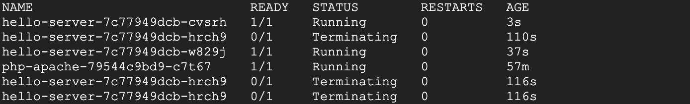
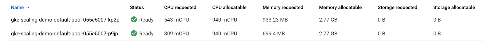
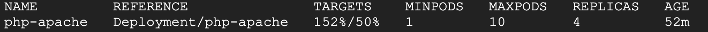
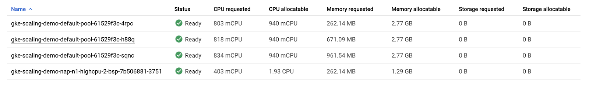
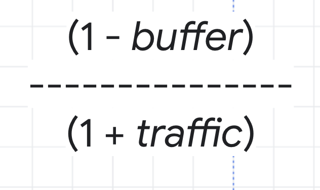
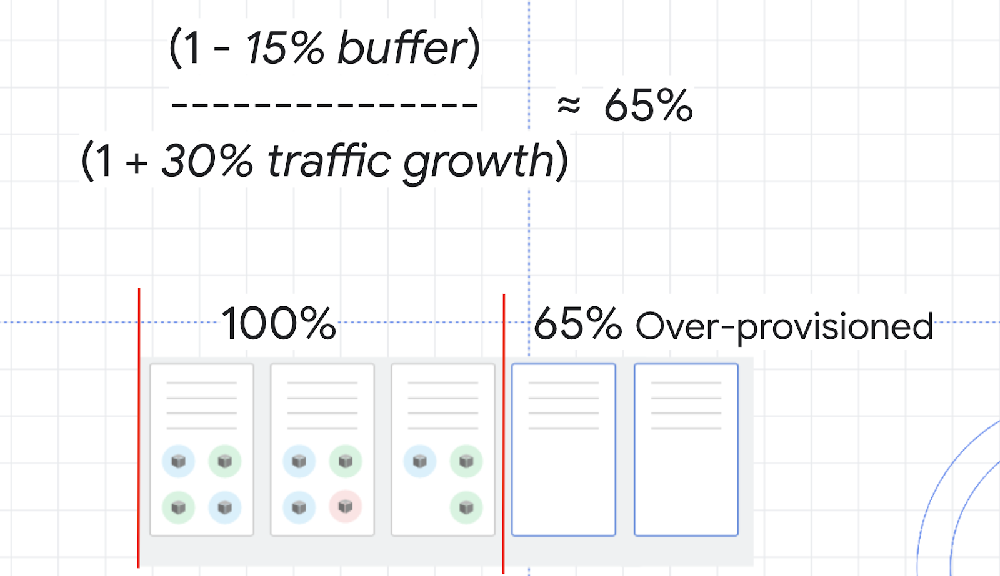

# Understanding and Combining GKE Autoscaling Strategies（理解並整合 GKE 自動調整策略）
https://www.skills.google/course_templates/655/labs/598641

## Overview（總覽）
Google Kubernetes Engine has horizontal and vertical solutions for automatically scaling your pods as well as your infrastructure. When it comes to cost-optimization, these tools become extremely useful in ensuring that your workloads are being run as efficiently as possible and that you're only paying for what you're using.（Google Kubernetes Engine 提供用於自動調整 Pod 與基礎架構的水平與垂直解決方案。談到成本最佳化時，這些工具可確保工作負載以最高效率執行，並讓你只為實際使用到的資源付費。）
In this lab, will set up and observe Horizontal Pod Autoscaling and Vertical Pod Autoscaling for pod-level scaling and Cluster Autoscaler (horizontal infrastructure solution) and Node Auto Provisioning (vertical infrastructure solution) for node-level scaling. First you'll use these autoscaling tools to save as many resources as possible and shrink your cluster's size during a period of low demand. Then you will increase the demands of your cluster and observe how autoscaling maintains availability.（本實作將為 Pod 層級設定並觀察 Horizontal Pod Autoscaling（HPA）與 Vertical Pod Autoscaling（VPA），以及在節點層級觀察 Cluster Autoscaler（水平基礎架構方案）與 Node Auto Provisioning（垂直基礎架構方案）。你會先在低需求時段利用這些機制節省資源並縮小叢集規模，接著提升需求以觀察自動調整如何維持可用性。）

## Objectives（目標）
In this lab, you will learn how to:（在本實作中，你將學會：）
- Decrease number of replicas for a Deployment with *Horizontal Pod Autoscaler*（使用 *Horizontal Pod Autoscaler* 降低 Deployment 的副本數。）
- Decrease CPU request of a Deployment with *Vertical Pod Autoscaler*（使用 *Vertical Pod Autoscaler* 降低 Deployment 的 CPU 要求。）
- Decrease number of nodes used in cluster with *Cluster Autoscaler*（使用 *Cluster Autoscaler* 降低叢集使用的節點數。）
- Automatically create an optimized node pool for workload with *Node Auto Provisioning*（使用 *Node Auto Provisioning* 自動建立針對工作負載最佳化的節點池。）
- Test the autoscaling behavior against a spike in demand（在需求尖峰時測試自動調整行為。）
- Overprovision your cluster with *Pause Pods*（使用 *Pause Pods* 為叢集預留（過度佈建）資源。）

## Setup and requirements（環境設定與需求）

### Provision testing environment（佈建測試環境）
1. Set your default zone to `us-east1-b`:（將預設區域設為 `us-east1-b`：）
> gcloud config set compute/zone us-east1-b
2. Run the following command to create a three node cluster in the us-east1-b zone:（在 us-east1-b 建立 3 節點叢集：）
> gcloud container clusters create scaling-demo --num-nodes=3 --enable-vertical-pod-autoscaling
To help demonstrate horizontal pod autoscaling, this lab uses a custom docker image based on the php-apache image. It defines an `index.php` page which performs some CPU intensive computations. You will monitor a deployment of this image.（為示範 HPA，本實作使用基於 php-apache 的自訂映像；其 `index.php` 會執行 CPU 密集計算，你將監控其部署。）
3. Create a manifest for the php-apache deployment:（建立 php-apache 部署的 manifest：）
```
cat << EOF > php-apache.yaml
apiVersion: apps/v1
kind: Deployment
metadata:
  name: php-apache
spec:
  selector:
    matchLabels:
      run: php-apache
  replicas: 3
  template:
    metadata:
      labels:
        run: php-apache
    spec:
      containers:
      - name: php-apache
        image: k8s.gcr.io/hpa-example
        ports:
        - containerPort: 80
        resources:
          limits:
            cpu: 500m
          requests:
            cpu: 200m
---
apiVersion: v1
kind: Service
metadata:
  name: php-apache
  labels:
    run: php-apache
spec:
  ports:
  - port: 80
  selector:
    run: php-apache
EOF
```
4. Apply the newly created manifest to your cluster:（將剛建立的檔案套用到叢集：）
> kubectl apply -f php-apache.yaml

## Task 1. Scale pods with Horizontal Pod Autoscaling（任務 1：使用 HPA 進行 Pod 水平調整）
Horizontal Pod Autoscaling changes the shape of your Kubernetes workload by automatically increasing or decreasing the number of pods in response to the workload's CPU or memory consumption, or in response to custom metrics reported from within Kubernetes or external metrics from sources outside of your cluster.（HPA 會依據 CPU/記憶體用量，或來自叢集內外的自訂/外部指標，自動增加或減少 Pod 數，改變工作負載的「寬度」。）
1. In Cloud Shell, run this command to inspect your cluster's deployments:（在 Cloud Shell 檢視叢集的 Deployments：）
> kubectl get deployment
You should see the `php-apache` deployment with 3/3 pods running:（應看到 `php-apache` 部署 3/3 個 Pod 正在運行：）
```
NAME         READY   UP-TO-DATE   AVAILABLE   AGE
php-apache   3/3     3            3           91s
```
> Note: If you don't see 3 available pods, wait a minute for the pods to be created and try the previous command again. If you see 1/1 available pods, then it's likely enough time has passed for your deployment to scale down.（注意：若未見 3 個可用 Pod，稍候再試；若見 1/1，可能是部署已縮減。）
2. Apply horizontal autoscaling to the php-apache deployment:（為 php-apache 套用 HPA：）
> kubectl autoscale deployment php-apache --cpu-percent=50 --min=1 --max=10
This `autoscale` command will configure a Horizontal Pod Autoscaler that will maintain between 1 and 10 replicas of the pods controlled by the php-apache deployment. The `cpu-percent` flag specifies 50% as the target average CPU utilization of requested CPU over all the pods. HPA will adjust the number of replicas (via the deployment) to maintain an average CPU utilization of 50% across all pods.（上述指令建立 HPA，將 pod 副本維持在 1～10 之間，並以全體 Pod 的「已請求 CPU」為基準將平均 CPU 使用率目標設為 50%；HPA 會透過 Deployment 調整副本數以維持該目標。）
3. Check the current status of your Horizontal Pod Autoscaler:（查看 HPA 狀態：）
> kubectl get hpa
Under the *Targets* column you should see *1%/50%*.（在 *Targets* 欄應見 *1%/50%*。）
This means that the pods within your deployment are currently at 1% of their target average CPU utilization. This is to be expected as the php-apache app is receiving no traffic right now.（表示目前使用率僅達目標的 1%，因為此時無流量屬正常。）
> Note: If you see <unknown>/50%, wait a minute and run the kubectl get hpa command again. Your HPA hasn't created an assessment yet.（注意：若顯示 <unknown>/50%，稍候再查詢，HPA 尚未完成評估。）
Also, take note of the *Replicas* column. To start with, the value will be 3. This number will be changed by the autoscaler as the number of required pods changes.（另留意 *Replicas* 欄，起初為 3；之後會隨需求改變而被 HPA 調整。）
In this case, the autoscaler will scale the deployment down to the minimum number of pods indicated when you run the `autoscale` command. Horizontal Pod Autoscaling takes 5-10 minutes and will require shutting down or starting new pods depending on which way it's scaling.（在此情境中，HPA 將縮減至設定的最小副本數。HPA 調整通常需 5～10 分鐘，會視方向停止或啟動 Pods。）
Continue to the next step of the lab. You will inspect the results of the autoscaler later on.（先繼續下一步，稍後再檢視 HPA 成果。）
> Note: While you use cpu-percent as the target metric for your autoscaler in this lab, HPA allows custom metrics to be defined so that you can scale your pods based on other useful metrics captured in the logs.（注意：本實作使用 CPU 百分比作為目標；實務上亦可使用自訂指標或外部指標進行擴縮。）

## Task 2. Scale size of pods with Vertical Pod Autoscaling（任務 2：使用 VPA 調整 Pod 規模）
Vertical Pod Autoscaling frees you from having to think about what values to specify for a container's CPU and memory requests. The autoscaler can recommend values for CPU and memory requests and limits, or it can automatically update the values.（VPA 讓你不必手動估算容器的 CPU/記憶體需求；可提供建議或自動更新 Requests/Limits。）
> Note: Vertical Pod Autoscaling should not be used alongside Horizontal Pod Autoscaling on CPU or memory. Both autoscalers will try to respond to changes in demand on the same metrics and conflict. However, VPA on CPU or memory can be used with HPA on custom metrics to avoid overlap.（注意：VPA 不應與以 CPU/記憶體為目標的 HPA 同時使用，以免衝突；但可搭配以自訂指標為目標的 HPA。）
Vertical Pod Autoscaling has already been enabled on the _scaling-demo_ cluster.（本實作建立的 _scaling-demo_ 已啟用 VPA。）
1. To verify run:（驗證：）
> gcloud container clusters describe scaling-demo \
  grep ^verticalPodAutoscaling -A 1
The output should read enabled: *true*（輸出應顯示 enabled: *true*。）
> Note: Vertical Pod Autoscaling can be enabled on an existing cluster with gcloud container clusters update scaling-demo --enable-vertical-pod-autoscaling（注意：也可對既有叢集透過 `gcloud container clusters update --enable-vertical-pod-autoscaling` 啟用。）
To demonstrate VPA, you will deploy the hello-server app.（為示範 VPA，接著部署 hello-server 應用。）
2. Apply the `hello-server` deployment to your cluster:（部署 hello-server：）
> kubectl create deployment hello-server --image=gcr.io/google-samples/hello-app:1.0
3. Ensure the deployment was successfully created:（確認部署建立成功：）
> kubectl get deployment hello-server
4. Assign a CPU resource request of 450m to the deployment:（為部署設定 450m CPU 要求：）
> kubectl set resources deployment hello-server --requests=cpu=450m
5. Next, run this command to inspect the container specifics of the hello-server pods:（檢視 hello-server Pods 的容器細節：）
> kubectl describe pod hello-server \
  sed -n "/Containers:$/,/Conditions:/p"
- In the output, find *Requests*. Note that this pod is currently requesting the 450m CPU you assigned.（在輸出中找到 *Requests*，可見目前 CPU 要求為 450m。）
6. Now, create a manifest for you *Vertical Pod Autoscaler*:（建立 VPA manifest：）
```
cat << EOF > hello-vpa.yaml
apiVersion: autoscaling.k8s.io/v1
kind: VerticalPodAutoscaler
metadata:
  name: hello-server-vpa
spec:
  targetRef:
    apiVersion: "apps/v1"
    kind: Deployment
    name: hello-server
  updatePolicy:
    updateMode: "Off"
EOF
```
The above generates a manifest for a Vertical Pod Autoscaler targeting the hello-server deployment with an Update Policy of *Off*. A VPA can have one of three different update policies which can be useful depending on your application:（上述 manifest 建立一個目標為 hello-server 的 VPA，更新策略為 *Off*。VPA 有三種更新策略，依應用情境選用：）
- Off: this policy means VPA will generate recommendations based on historical data which you can manually apply.（Off：僅產生建議，需手動套用。）
- Initial: VPA recommendations will be used to create new pods once and then won't change the pod size after.（Initial：僅在新建 Pod 時套用建議，之後不再改變。）
- Auto: pods will regularly be deleted and recreated to match the size of the recommendations.（Auto：會定期刪除並重建 Pod 以符合建議大小。）
7. Apply the manifest for hello-vpa:（套用 VPA：）
> kubectl apply -f hello-vpa.yaml
8. Wait a minute, and then view the *VerticalPodAutoscaler*:（稍候後檢視 VPA：）
> kubectl describe vpa hello-server-vpa
Locate the "Container Recommendations" at the end of the output. If you don't see it, wait a little longer and try the previous command again. When it appears, you'll see several different recommendation types, each with values for CPU and memory:（在輸出末端尋找「Container Recommendations」。若尚未出現，稍候再試；顯示後可見多種推薦值，包含 CPU 與記憶體：）
- *Lower Bound*: this is the lower bound number VPA looks at for triggering a resize. If your pod utilization goes below this, VPA will delete the pod and scale it down.（*Lower Bound*：觸發縮小的下限閾值。）
- *Target*: this is the value VPA will use when resizing the pod.（*Target*：VPA 進行調整時採用的目標值。）
- *Uncapped Target*: if no minimum or maximum capacity is assigned to the VPA, this will be the target utilization for VPA.（*Uncapped Target*：若未設定最小/最大容量時採用的目標值。）
- *Upper Bound*: this is the upper bound number VPA looks at for triggering a resize. If your pod utilization goes above this, VPA will delete the pod and scale it up.（*Upper Bound*：觸發放大的上限閾值。）
You'll notice VPA is recommending the CPU request for this container be set to 25m instead of the previous 100m as well as giving you a suggested number for how much memory should be requested. At this point, these recommendations can be manually applied to the hello-server deployment.（你可能會看到 VPA 建議將 CPU 要求調整為 25m（而非先前的較高值），並提供建議的記憶體需求；此時可手動將建議套用至 hello-server 部署。）
> Note: Vertical Pod Autoscaling bases its recommendations on historical data from the container. In practice, it's recommended to wait at least 24 hours to collect recommendation data before applying any changes.（注意：VPA 依據歷史資料生成建議；實務上建議至少等待 24 小時再套用。）
9. In order to observe VPA and its effects within this lab, you will change the `hello-vpa` update policy to *Auto* and observe the scaling.（為觀察自動調整效果，將 `hello-vpa` 更新策略改為 *Auto*。）
10. Update the manifest to set the policy to *Auto* and apply the configuration:（修改並套用：）
```
sed -i 's/Off/Auto/g' hello-vpa.yaml
kubectl apply -f hello-vpa.yaml
```
In order to resize a pod, Vertical Pod Autoscaler will need to delete that pod and recreate it with the new size. By default, to avoid downtime, VPA will not delete and resize the last active pod. Because of this, you will need at least 2 replicas to see VPA make any changes.（VPA 調整大小需要刪除並重建 Pod；為避免停機，預設不會刪除最後一個作用中 Pod，因此需至少 2 個副本才會看到變更。）
11. Scale hello-server deployment to 2 replicas:（將 hello-server 調整為 2 副本：）
> kubectl scale deployment hello-server --replicas=2
12. Now, watch your pods:（即時觀察 Pods：）
> kubectl get pods -w
13. Wait until you see your hello-server-xxx pods in the `terminating` or `pending` status (or navigate to Kubernetes Engine > *Workloads*):（等到 hello-server-xxx 出現 `terminating` 或 `pending` 狀態（或至 Console 的 *Workloads* 檢視）：）

This is a sign that your VPA is deleting and resizing your pods. Once you see this, press Ctrl + c to quit the command.（這表示 VPA 正在刪除並調整 Pod；看到後可按 Ctrl + C 離開。）

## Task 3. HPA results（任務 3：HPA 結果）
By this point, your Horizontal Pod Autoscaler will have most likely scaled your php-apache deployment down.（此時 HPA 多半已將 php-apache 縮減。）
1. Run this command to check your HPA:（檢查 HPA：）
> kubectl get hpa
- Look at the *Replicas* column. You'll see that your php-apache deployment has been scaled down to 1 pod.（查看 *Replicas* 欄，應見已縮至 1。）
> Note: If you still see 3 replicas for your php-apache deployment, you need to wait a few more minutes for the autoscaler to take action.（注意：若仍為 3，請再等幾分鐘。）
- The HPA takes advantage of the fact that the app is inactive right now and removes all the unused resources. Furthermore, if more demand were placed on the php-apache app, it would scale back up to account for the load.（因應應用目前無流量，HPA 移除未用資源；若之後負載上升，會自動擴增。）
> Note: If availability of your application is a main concern, it's considered best practice to leave a slightly higher buffer as the minimum pod number for your Horizontal Pod Autoscaler to account for the time it takes to scale.（注意：若非常重視可用性，HPA 的最小副本數可設定較高，以緩衝擴增所需時間。）
This is extremely useful when thinking about cost optimization. A well-tuned autoscaler means that you are maintaining high availability of your application while only paying for the resources that are required to maintain that availability, regardless of the demand.（就成本最佳化而言，調校良好的自動調整能在維持高可用的同時，只為必要資源付費。）

## Task 4. VPA results（任務 4：VPA 結果）
Now, the VPA should have resized your pods in the hello-server deployment.（此時 VPA 應已調整 hello-server 的 Pods 尺寸。）
1. Inspect your pods:（檢視 Pods：）
> kubectl describe pod hello-server \
  sed -n "/Containers:$/,/Conditions:/p"
2. Find the *Requests*: field.（找到 *Requests* 欄位。）
- Your *Vertical Pod Autoscaler* recreated the pods with their target utilizations. Now it should be requesting a lower amount of CPU and also be requesting a certain amount of memory:（*VPA* 會依目標使用率重建 Pods；此時 CPU 要求應較低，並包含記憶體要求：）
```
Requests:
  cpu: 25m
  memory: 262144k
```
> Note: If you still see a CPU request of 450m for either of the pods, manually set your CPU resource to the target with this command: `kubectl set resources deployment hello-server --requests=cpu=25m` Sometimes VPA in auto mode may take a long time or set inaccurate upper or lower bound values without the time to collect accurate data. In order to not lose time in the lab, using the recommendation as if it were in "Off" mode is a simple solution.（注意：若仍見 450m，可先手動設為 25m；有時 Auto 模式未累積足夠資料，建議暫以 Off 模式的建議值處理以節省時間。）
In this case, VPA becomes an excellent tool for optimizing resource utilization and, in effect, saving on costs. The original request of 400m of CPU was higher than what this container needed. By adjusting the request to the recommended 25m, you're able to use less CPU from the node pool, potentially to the point of requiring less nodes to be provisioned in the cluster.（VPA 在此可大幅優化資源利用並節省成本：原先 400m 的 CPU 要求高於實際需求；調整至 25m 後可減少節點池 CPU 佔用，甚至減少叢集所需節點數。）
With the Auto update policy, your VPA would continue to delete and resize the pods of the hello-server deployment throughout its lifetime. It could scale pods up with larger requests to handle heavy traffic and then scale back down during a downtime. This can be great for accounting for steady increases of demand for your application, but it does risk losing availability during heavy spikes.（在 Auto 策略下，VPA 會持續依需求刪除並重建 Pods；流量高時提高 Requests、低時再降。可應對需求穩健成長，但面對突發尖峰可能有短暫可用性風險。）
Depending on your application, it's generally safest to use VPA with the Off update policy and take the recommendations as needed in order to both optimize resource usage and maximize your cluster's availability.（視應用而定，通常以 Off 策略採納建議值較安全，可兼顧資源最佳化與可用性。）
In the next sections, you will look at how to further optimize your resource utilization with the Cluster Autoscaler and Node Auto Provisioning.（接下來將透過 Cluster Autoscaler 與 Node Auto Provisioning 進一步優化資源。）

## Task 5. Cluster autoscaler（任務 5：Cluster Autoscaler）
The *Cluster Autoscaler* is designed to add or remove nodes based on demand. When demand is high, cluster autoscaler will add nodes to the node pool to accommodate that demand. When demand is low, cluster autoscaler will scale your cluster back down by removing nodes. This allows you to maintain high availability of your cluster while minimizing superfluous costs associated with additional machines.（*Cluster Autoscaler* 會依需求新增或移除節點；高需求時擴增節點以承載，低需求時縮減節點以節省成本，同時維持叢集可用性。）
1. Enable autoscaling for your cluster:（啟用叢集自動調整：）
> gcloud beta container clusters update scaling-demo --enable-autoscaling --min-nodes 1 --max-nodes 5
This will take a few minutes to complete.（此操作需數分鐘完成。）
When scaling a cluster, the decision of when to remove a node is a trade-off between optimizing for utilization or the availability of resources. Removing underutilized nodes improves cluster utilization, but new workloads might have to wait for resources to be provisioned again before they can run.（縮減節點時需在資源利用率與可用性間權衡：移除低使用率節點可提升整體利用率，但新工作可能需等待資源再次佈建。）
You can specify which autoscaling profile to use when making such decisions. The currently available profiles are:（可透過自動調整設定檔（profile）影響行為，目前有：）
- *Balanced*: The default profile.（*Balanced*：預設設定。）
- *Optimize-utilization*: Prioritize optimizing utilization over keeping spare resources in the cluster. When selected, the cluster autoscaler scales down the cluster more aggressively. It can remove more nodes, and remove nodes faster. This profile has been optimized for use with batch workloads that are not sensitive to start-up latency.（*Optimize-utilization*：優先提高利用率、較積極縮減節點；適合對啟動延遲不敏感的批次工作。）
2. Switch to the optimize-utilization autoscaling profile so that the full effects of scaling can be observed:（切換為 Optimize-utilization 以便觀察縮減效果：）
```
gcloud beta container clusters update scaling-demo \
  --autoscaling-profile optimize-utilization
```
3. With autoscaling enabled, observe your cluster in the Cloud Console. Click the three bars at the top left to open the Navigation menu.（啟用後，於 Console 觀察叢集：點選左上角選單。）
4. From the Navigation menu, select Kubernetes Engine > Clusters.（選擇 Kubernetes Engine > Clusters。）
5. On the Clusters page, select the scaling-demo cluster.（在 Clusters 頁面選取 scaling-demo。）
6. In the scaling-demo's cluster page, select the Nodes tab.（進入叢集頁後切換至 Nodes 分頁。）
7. Take a look at the overview of your three nodes' resource utilization.（查看三個節點的資源使用摘要。）
> Note: Your numbers may be different from the ones pictured. Kubernetes does not provision and assign resources in the same way every time.（注意：你的數字可能不同；Kubernetes 的佈建與配置每次未必相同。）
If you combine the values of `CPU requested` and `CPU allocatable` for the 3 nodes, the totals would be 1555m and 2820m, respectively. This means that there's a total of 1265m CPU available across the entire cluster. This is greater than what could be provided by one node.（若彙總三節點的 `CPU requested` 與 `CPU allocatable`，假設總計為 1555m 與 2820m，表示叢集中尚有 1265m CPU 可用；此數已超過單一節點可提供量。）
To optimize utilization, the current workload at its current demand could be consolidated into two nodes instead of three. However, your cluster hasn't automatically scaled down yet. This is because of the system pods distributed across the cluster.（為最佳化利用率，現有工作負載可集中到兩個節點；但叢集尚未自動縮減，原因在於系統 Pods 分散於各節點。）
Your cluster runs a number of deployments under the kube-system namespace which allow the different GKE services like logging, monitoring, autoscaling, etc. to work.（叢集在 kube-system 命名空間運行多個 Deployment，提供日誌、監控、自動調整等服務。）
8. This can be verified by running this command in Cloud Shell:（可用以下指令驗證：）
> kubectl get deployment -n kube-system
By default, most of the system pods from these deployments will prevent cluster autoscaler from taking them completely offline to reschedule them. Generally, this is desired because many of these pods collect data used in other deployments and services. For example, metrics-agent being temporarily down would cause a gap in data collected for VPA and HPA, or the fluentd pod being down could create a gap in your cloud logs.（預設情況下，許多系統 Pods 會讓 CA 不會將其完全下線再重排，以免服務中斷（如 metrics-agent、fluentd 造成指標或日誌缺口）。）
For the purpose of this lab, you will apply Pod Disruption Budgets to your kube-system pods which will allow cluster autoscaler to safely reschedule them on another node. This will give enough room to scale your cluster down.（在本實作中，將為 kube-system Pods 設定 Pod Disruption Budget（PDB），允許 CA 安全地於其他節點重排，進而釋放空間以便縮減節點。）
*Pod Disruption Budgets (PDB)* define how Kubernetes should handle disruptions like upgrades, pod removals, running out of resources, etc. In PDBs, you can specify the `max-unavailable` and/or the `min-available` number of pods a deployment should have.（*PDB* 用於定義升級、移除、資源不足等中斷時應維持的 Pod 數（可透過 `max-unavailable`/`min-available` 設定）。）
9. Run these commands to create the Pod Disruption Budgets for each of your kube-system pods:（為各 kube-system Pods 建立 PDB：）
```
kubectl create poddisruptionbudget kube-dns-pdb --namespace=kube-system --selector k8s-app=kube-dns --max-unavailable 1
kubectl create poddisruptionbudget prometheus-pdb --namespace=kube-system --selector k8s-app=prometheus-to-sd --max-unavailable 1
kubectl create poddisruptionbudget kube-proxy-pdb --namespace=kube-system --selector component=kube-proxy --max-unavailable 1
kubectl create poddisruptionbudget metrics-agent-pdb --namespace=kube-system --selector k8s-app=gke-metrics-agent --max-unavailable 1
kubectl create poddisruptionbudget metrics-server-pdb --namespace=kube-system --selector k8s-app=metrics-server --max-unavailable 1
kubectl create poddisruptionbudget fluentd-pdb --namespace=kube-system --selector k8s-app=fluentd-gke --max-unavailable 1
kubectl create poddisruptionbudget backend-pdb --namespace=kube-system --selector k8s-app=glbc --max-unavailable 1
kubectl create poddisruptionbudget kube-dns-autoscaler-pdb --namespace=kube-system --selector k8s-app=kube-dns-autoscaler --max-unavailable 1
kubectl create poddisruptionbudget stackdriver-pdb --namespace=kube-system --selector app=stackdriver-metadata-agent --max-unavailable 1
kubectl create poddisruptionbudget event-pdb --namespace=kube-system --selector k8s-app=event-exporter --max-unavailable 1
```
In each of these commands, you are selecting a different kube-system deployment pod based on a label defined in its creation and specifying that there can be 1 unavailable pod for each of these deployments. This will allow the autoscaler to reschedule the system pods.（以上每條指令都依標籤選取不同的系統 Deployment，並允許最多 1 個 Pod 不可用，以便 CA 能重排。）
With the PDBs in place, your cluster should scale down from three nodes to two nodes in a minute or two.（設定完成後，叢集應在 1～2 分鐘內由 3 節點縮至 2 節點。）
10. Rerun this command in Cloud Shell until you see only two nodes total:（重複查詢直到僅剩兩個節點：）
> kubectl get nodes
In the Cloud Console, refresh the *Nodes* tab of your *scaling-demo* to inspect how your resources were packed:（在 Console 的 *Nodes* 分頁觀察資源如何被重新打包：）

You set up automation that scaled your cluster down from three nodes to two nodes!（你已自動將叢集從 3 節點縮至 2 節點！）
Thinking about the costs, as a result of scaling down your nodepool, you will be billed for less machines during periods of low demand on your cluster. This scaling could be even more dramatic if you were fluctuating from high demand to low demand periods during the day.（就成本而言，縮減節點池使低需求時段的可計費機器更少；若全天需求波動，節省更顯著。）
It’s important to note that, while `Cluster Autoscaler` removed an unnecessary node, `Vertical Pod Autoscaling` and `Horizontal Pod Autoscaling` helped reduce enough CPU demand so that the node was no longer needed. Combining these tools is a great way to optimize your overall costs and resource usage.（需注意移除節點之所以可能，亦仰賴 VPA/HPA 先降低 CPU 需求；將三者結合可整體最佳化成本與資源。）
So, the cluster autoscaler helps add and remove nodes in response to pods needing to be scheduled. However, GKE specifically has another feature to scale vertically, called `node auto-provisioning`.（除了 CA，GKE 另有垂直擴展功能 `Node Auto Provisioning`（NAP）。）

## Task 6. Node Auto Provisioning（任務 6：節點自動佈建）
*Node Auto Provisioning (NAP)* actually adds new node pools that are sized to meet demand. Without node auto provisioning, the cluster autoscaler will only be creating new nodes in the node pools you've specified, meaning the new nodes will be the same machine type as the other nodes in that pool. This is perfect for helping optimize resource usage for batch workloads and other apps that don't need extreme scaling, since creating a node pool that is specifically optimized for your use case might take more time than just adding more nodes to an existing pool.（*NAP* 會新增「新的節點池」來符合需求；若未啟用，CA 只會在既有池中加節點（機型相同）。對批次或不需極端彈性的工作而言，直接增節點常比新建最佳化池更快。）
- Enable Node Auto Provisioning:（啟用 NAP：）
```
gcloud container clusters update scaling-demo \
  --enable-autoprovisioning \
  --min-cpu 1 \
  --min-memory 2 \
  --max-cpu 45 \
  --max-memory 160
```
In the command, you specify a minimum and maximum number for your CPU and memory resources. This is for the entire cluster.（以上為整個叢集設定 CPU/記憶體的最小與最大總量。）
`NAP` can take a little bit of time and it's also highly likely it won't create a new node pool for the scaling-demo cluster at its current state.（NAP 可能需要時間，且在目前狀態下未必會立即建立新的節點池。）
In the next sections, you will increase the demand to your cluster and observe the actions of your autoscalers as well as NAP.（下一節將提升負載並觀察 CA/HPA/VPA 與 NAP 的反應。）

## Task 7. Test with larger demand（任務 7：以較大需求進行測試）
So far, you've analyzed how HPA, VPA, and cluster autoscaler can help save resources and costs while your application has low demand. Now, you'll look at how these tools handle availability for increased demand.（目前你已了解在低需求下如何節省資源；接下來觀察它們面對升高需求時對可用性的影響。）
1. Open a new tab in Cloud Shell by pressing the + icon:（在 Cloud Shell 開新分頁：）
2. In the new tab, run this command to send an infinite loop of queries to the php-apache service:（在新分頁中執行連續查詢 php-apache 的負載測試：）
> kubectl run -i --tty load-generator --rm --image=busybox --restart=Never -- /bin/sh -c "while sleep 0.01; do wget -q -O- http://php-apache; done"
3. Return to your original Cloud Shell tab.（回到原分頁。）
4. Within a minute or so, you should see the higher CPU load on your HPA by executing:（約一分鐘內執行以下將見到 HPA 的 CPU 負載升高：）
> kubectl get hpa
Wait and rerun the command until you see your target above 100%.（等待並重試直到目標值超過 100%。）

5. Now, monitor how your cluster handles the increased load by periodically running this command:（定期執行以下指令觀察叢集因應：）
> kubectl get deployment php-apache
You can also monitor your cluster by refreshing the [nodes] tab in your Cloud Console.（也可於 Console 的 [nodes] 分頁監控。）
After a few minutes, you will see a few things happen.（幾分鐘後你會看到：）
- First, your php-apache deployment will automatically be scaled up by HPA to handle the increased load.（首先，HPA 自動擴增 php-apache 副本以處理負載。）
- Then, `cluster autoscaler` will need to provision new nodes to handle the increased demand.（接著，CA 會佈建新節點以承載增加的需求。）
- Finally, `node auto provisioning` will create a node pool optimized for the CPU and memory requests of your cluster’s workloads. In this case, it should be a high cpu, low memory node pool because the load test is pushing the cpu limits.（最後，NAP 可能建立針對 CPU/記憶體請求最佳化的新節點池；在本測試中，傾向高 CPU、低記憶體的池。）
Wait until your php-apache deployment is scaled up to 7 replicas and your nodes tab looks similar to this:（等待至 php-apache 擴至 7 副本，且 Nodes 分頁顯示類似如下：）

6. Return to the Cloud Shell tab you ran the load test in and cancel it by pressing Ctrl + c. Your cluster will now eventually scale back down as the demand decreases again.（回到執行測試的分頁按 Ctrl + C 停止；隨需求降低，叢集將逐步縮回。）
Your cluster efficiently scaled up to meet a higher demand! However, take note of the amount of time it took to handle this spike in demand. For many applications, losing availability while provisioning new resources can be an issue.（叢集成功擴增以承載高需求！但請留意處理尖峰所需時間；對許多應用而言，擴容期間暫時可用性下降是風險。）

## Task 8. Optimize larger loads（任務 8：最佳化大負載擴容）
When scaling up for larger loads, horizontal pod autoscaling will add new pods while vertical pod autoscaling will resize them depending on your settings. If there's room on an existing node, it might be able to skip pulling the image and immediately start running the application on a new pod. If you're working with a node that hasn't deployed your application before, a bit of time might be added if it needs to download the container images before running it.（擴容時，HPA 會加 Pod、VPA 會調整大小；若現有節點有空間，可能可跳過拉取映像而快速啟動；若節點未曾部署該映像，需先拉取會增加延遲。）
So, if you don't have enough room on your existing nodes and you're using the cluster autoscaler, it could take even longer. Now it needs to provision a new node, set it up, then download the image and start up pods. If the node auto-provisioner is going to create a new node pool like it did in your cluster, there will be even more time as you provision the new node pool first, and then go through all the same steps for the new node.（若現有節點無空間且需啟用 CA，新節點的佈建、初始化與拉取映像都會增加時間；若還需由 NAP 建立新節點池，時間更長。）
> Note: In practice, it’s important to ensure your app is using the smallest container images that it can. Smaller images improve the cold start time of a pod because the smaller the image is the faster the node can download it when the Cluster Autoscaler provisions a new node for your cluster. Additionally, larger images could cause longer pod startup times, resulting in poor performance when provisioning new nodes during spikes in traffic.（注意：實務上應盡量縮小映像大小，以縮短冷啟動時間；映像越小，CA 佈建新節點時下載越快；大型映像會拉長啟動時間，尖峰時影響更大。）
In order to handle these different latencies for autoscaling, you'll probably want to `over-provision` a little bit so there's less pressure on your apps when autoscaling-up. This is really important for cost-optimization, because you don't want to pay for more resources than you need, but you also don't want your apps' performance to suffer.（為應對上述延遲，通常會做少量「過度佈建（over-provision）」以減少擴容壓力；這在成本最佳化上同樣重要：既不能浪費資源，也不希望效能受損。）
To figure out how much to overprovision, you can use this formula:（估算過度佈建量可用以下公式：）

As an example, think about the CPU utilization for your cluster. You don't want it to hit 100%, so you could choose a buffer of 15% to keep a safe distance. Then, the traffic variable in the formula would be the percentage of traffic growth estimated in the next 2 to 3 minutes. In the load test you ran earlier, 0% to 150% was a bit of an extreme growth example, so instead imagine a more average traffic growth of 30%.（以 CPU 使用率為例：不希望觸及 100%，可先留 15% 緩衝；再以未來 2～3 分鐘的預估流量成長（例如 30%）代入公式，而非先前極端的 150%。）

With these numbers, you can calculate a safety buffer of about 65%. That means you might want to over provision your resources by about 65% in order to handle scale ups while minimizing any issues.（以此估算，安全緩衝約 65%，表示可考慮預留約 65% 的資源以平衡擴容時的風險與延遲。）
An efficient strategy to overprovision a cluster with Cluster Autoscaling is to use Pause Pods.（在啟用 CA 的情境下，使用 Pause Pods 是有效的過度佈建策略。）
`Pause Pods` are low priority deployments which are able to be removed and replaced by high priority deployments. This means you can create low priority pods which don't actually do anything except reserve buffer space. When the higher-priority pod needs room, the pause pods will be removed and rescheduled to another node, or a new node, and the higher-priority pod has the room it needs to be scheduled quickly.（`Pause Pods` 是低優先權的保留性部署，不執行實際工作、僅占用資源；當高優先權工作需要空間時，它們會被驅逐並重排到其他（或新）節點，讓實際工作能快速排程。）
1. Create a manifest for a pause pod:（建立 Pause Pod 的 manifest：）
```
cat << EOF > pause-pod.yaml
---
apiVersion: scheduling.k8s.io/v1
kind: PriorityClass
metadata:
  name: overprovisioning
value: -1
globalDefault: false
description: "Priority class used by overprovisioning."
---
apiVersion: apps/v1
kind: Deployment
metadata:
  name: overprovisioning
  namespace: kube-system
spec:
  replicas: 1
  selector:
    matchLabels:
      run: overprovisioning
  template:
    metadata:
      labels:
        run: overprovisioning
    spec:
      priorityClassName: overprovisioning
      containers:
      - name: reserve-resources
        image: k8s.gcr.io/pause
        resources:
          requests:
            cpu: 1
            memory: 4Gi
EOF
```
2. Apply it to your cluster:（套用到叢集：）
> kubectl apply -f pause-pod.yaml
3. Now, wait a minute and then refresh the nodes tab of your scaling-demo cluster.（稍候並重新整理 scaling-demo 的 Nodes 分頁。）
Observe how a new node is created, most likely in a new node pool, to fit your newly created pause pod. Now, if you were to run the load test again, when you needed an extra node for your php-apache deployment, it could be scheduled on the node with your pause pod while your pause pod is instead put on a new node. This is excellent because your dummy pause pods allow your cluster to provision a new node in advance so that your actual application can scale up much faster. If you were expecting higher amounts of traffic, you could add more pause pods, but it's considered best practice to not add more than one pause pod per node.（你會看到為容納 Pause Pod 可能建立新節點（與新節點池）；下次負載升高時，真實工作可直接使用該節點，而 Pause Pod 會被移走。此策略可提前佈建節點，讓實際應用更快擴容；若預期更高流量，可增加 Pause Pod，但最佳實務是不超過每節點一個。）

## Next steps / Learn more（後續步驟／延伸閱讀）
Check out these resources to learn more about the topics covered in this lab:（延伸閱讀：）
[Best practices for running cost-optimized Kubernetes applications on GKE: Fine Tune GKE Autoscaling](https://cloud.google.com/solutions/best-practices-for-running-cost-effective-kubernetes-applications-on-gke#fine-tune_gke_autoscaling)（在 GKE 執行成本最佳化 Kubernetes 應用的最佳實務：微調 GKE 自動調整）
[Cluster Autoscaler Docs](https://cloud.google.com/kubernetes-engine/docs/concepts/cluster-autoscaler)（Cluster Autoscaler 文件）
[Horizontal Pod Autoscaler Docs](https://cloud.google.com/kubernetes-engine/docs/concepts/horizontalpodautoscaler)（Horizontal Pod Autoscaler 文件）
[Vertical Pod Autoscaler Docs](https://cloud.google.com/kubernetes-engine/docs/concepts/verticalpodautoscaler)（Vertical Pod Autoscaler 文件）
