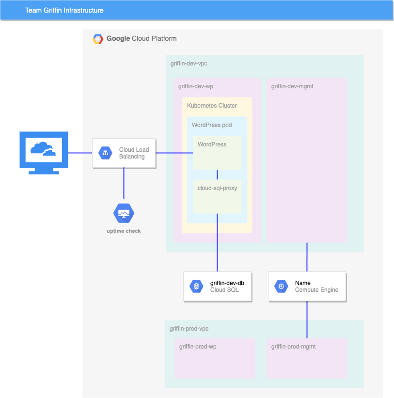

# Challenge Lab - Develop your Google Cloud Network

https://www.skills.google/course_templates/625/labs/592706

## Challenge scenario
As a cloud engineer at Jooli Inc. and recently trained with Google Cloud and Kubernetes, you have been asked to help a new team (Griffin) set up their environment. The team has asked for your help and has done some work, but needs you to complete the work.

You are expected to have the skills and knowledge for these tasks so don’t expect step-by-step guides.

You need to complete the following tasks:

- Create a development VPC with three subnets manually
- Create a production VPC with three subnets manually
- Create a bastion that is connected to both VPCs
- Create a development Cloud SQL Instance and connect and prepare the WordPress environment
- Create a Kubernetes cluster in the development VPC for WordPress
- Prepare the Kubernetes cluster for the WordPress environment
- Create a WordPress deployment using the supplied configuration
- Enable monitoring of the cluster
- Provide access for an additional engineer

Some Jooli Inc. standards you should follow:

- Create all resources in the `us-central1` region and `us-central1-c` zone, unless otherwise directed.
- Use the project VPCs.
- Naming is normally team-resource, e.g. an instance could be named `kraken-webserver1`.
- Allocate cost effective resource sizes. Projects are monitored and excessive resource use will result in the containing - project's termination (and possibly yours), so beware. This is the guidance the monitoring team is willing to share: unless - directed, use e2-medium.

### Your challenge
You need to help the team with some of their initial work on a new project. They plan to use WordPress and need you to set up a development environment. Some of the work was already done for you, but other parts require your expert skills.

As soon as you sit down at your desk and open your new laptop you receive the following request to complete these tasks. Good luck!

#### Environment



## Task 1. Create development VPC manually
- Create a VPC called griffin-dev-vpc with the following subnets only:
    - griffin-dev-wp
        - IP address block: 192.168.16.0/20
    - griffin-dev-mgmt
        - IP address block: 192.168.32.0/20

## Task 2. Create production VPC manually
- Create a VPC called griffin-prod-vpc with the following subnets only:
    - griffin-prod-wp
        - IP address block: 192.168.48.0/20
    - griffin-prod-mgmt
        - IP address block: 192.168.64.0/20

## Task 3. Create bastion host
- Create a bastion host with two network interfaces, one connected to `griffin-dev-mgmt` and the other connected to `griffin-prod-mgmt`. Make sure you can SSH to the host.

## Task 4. Create and configure Cloud SQL Instance
1. Create a MySQL Cloud SQL Instance called `griffin-dev-db` in `europe-west1`.
2. Connect to the instance and run the following SQL commands to prepare the `WordPress` environment:
```
CREATE DATABASE wordpress;
CREATE USER "wp_user"@"%" IDENTIFIED BY "stormwind_rules";
GRANT ALL PRIVILEGES ON wordpress.* TO "wp_user"@"%";
FLUSH PRIVILEGES;
```
These SQL statements create the worpdress database and create a user with access to the wordpress database.

You will use the username and password in task 6.

## Task 5. Create Kubernetes cluster
- Create a 2 node cluster (e2-standard-4) called `griffin-dev`, in the `griffin-dev-wp` subnet, and in zone `europe-west1-c`.

## Task 6. Prepare the Kubernetes cluster
1. From Cloud Shell copy all files from `gs://spls/gsp321/wp-k8s`.

The `WordPress` server needs to access the MySQL database using the username and password you created in task 4.

2. You do this by setting the values as secrets. WordPress also needs to store its working files outside the container, so you need to create a volume.

3. Add the following secrets and volume to the cluster using `wp-env.yaml`.

4. Make sure you configure the username to `wp_user` and password to `stormwind_rules` before creating the configuration.

You also need to provide a key for a service account that was already set up. This service account provides access to the database for a sidecar container.

5. Use the command below to create the key, and then add the key to the Kubernetes environment:

```
gcloud iam service-accounts keys create key.json \
    --iam-account=cloud-sql-proxy@$GOOGLE_CLOUD_PROJECT.iam.gserviceaccount.com
kubectl create secret generic cloudsql-instance-credentials \
    --from-file key.json
```

## Task 7. Create a WordPress deployment

Now that you have provisioned the MySQL database, and set up the secrets and volume, you can create the deployment using `wp-deployment.yaml`.

1. Before you create the deployment you need to edit `wp-deployment.yaml`.

2. Replace `YOUR_SQL_INSTANCE` with griffin-dev-db's *Instance connection name*.

3. Get the Instance connection name from your Cloud SQL instance.

4. After you create your WordPress deployment, create the service with `wp-service.yaml`.

5. Once the Load Balancer is created, you can visit the site and ensure you see the WordPress site installer.
At this point the dev team will take over and complete the install and you move on to the next task.

## Task 8. Enable monitoring
- Create an uptime check for your WordPress development site.

## Task 9. Provide access for an additional engineer
- You have an additional engineer starting and you want to ensure they have access to the project. Grant them the editor role to the project.

The second user account is student-01-24b5fa1c4e10@qwiklabs.net