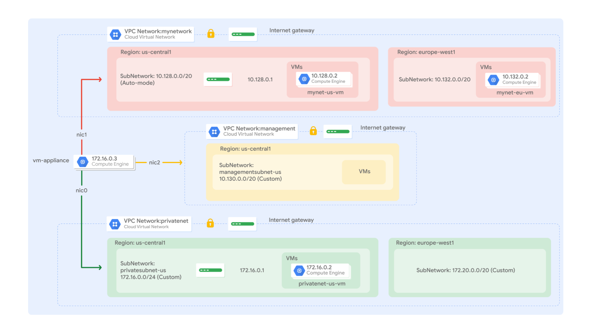

# Multiple VPC Networks

https://www.skills.google/course_templates/625/labs/592703

## Overview
Virtual Private Cloud (VPC) networks allow you to maintain isolated environments within a larger cloud structure, giving you granular control over data protection, network access, and application security.

In this lab you create several VPC networks and VM instances, then test connectivity across networks. Specifically, you create two custom mode networks (*managementnet* and *privatenet*) with firewall rules and VM instances as shown in this network diagram:



The *mynetwork* network with its firewall rules and two VM instances (`mynet-vm-1` and `mynet-vm-2`) have already been created for you for this lab.

## Objectives
In this lab, you will learn how to perform the following tasks:

- Create custom mode VPC networks with firewall rules
- Create VM instances using Compute Engine
- Explore the connectivity for VM instances across VPC networks
- Create a VM instance with multiple network interfaces

## Task 1. Create custom mode VPC networks with firewall rules

Create two custom networks `managementnet` and `privatenet`, along with firewall rules to allow `SSH`, `ICMP`, and `RDP` ingress traffic.

### Create the managementnet network

Create the managementnet network using the Cloud console.

1. In the Cloud console, navigate to Navigation menu (Navigation menu icon) > VPC network > `VPC networks`.

2. Notice the `default` and `mynetwork` networks with their subnets.

Each Google Cloud project starts with the `default` network. In addition, the `mynetwork` network has been premade as part of your network diagram.

3. Click `Create VPC Network`.

4. Set the Name to `managementnet`.

5. For [Subnet creation mode], click Custom.

6. Set the following values, leave all other values at their defaults:

```
Property	Value (type value or select option as specified)
Name	managementsubnet-1
Region	us-west1
IPv4 range	10.130.0.0/20
```

7. Click Done.

8. Click `EQUIVALENT COMMAND LINE`.

These commands illustrate that networks and subnets can be created using the Cloud Shell command line. You will create the privatenet network using these commands with similar parameters.

```
gcloud compute networks create managementnet --project=qwiklabs-gcp-01-d5edd10b2c91 --subnet-mode=custom --mtu=1460 --bgp-routing-mode=regional --bgp-best-path-selection-mode=legacy

gcloud compute networks subnets create managementsubnet-1 --project=qwiklabs-gcp-01-d5edd10b2c91 --range=10.130.0.0/20 --stack-type=IPV4_ONLY --network=managementnet --region=us-west1
```

9. Click Close.

10. Click Create.

### Create the privatenet network

Create the `privatenet` network using the Cloud Shell command line.

1. Run the following command to create the `privatenet` network:

> gcloud compute networks create privatenet --subnet-mode=custom

2. Run the following command to create the `privatesubnet-1` subnet:

> gcloud compute networks subnets create privatesubnet-1 --network=privatenet --region=us-west1 --range=172.16.0.0/24

3. Run the following command to create the `privatesubnet-2` subnet:

> gcloud compute networks subnets create privatesubnet-2 --network=privatenet --region=europe-west4 --range=172.20.0.0/20

4. Run the following command to list the available VPC networks:

> gcloud compute networks list

The output should look like this:

```
NAME: default
SUBNET_MODE: AUTO
BGP_ROUTING_MODE: REGIONAL
IPV4_RANGE:
GATEWAY_IPV4:

NAME: managementnet
SUBNET_MODE: CUSTOM
BGP_ROUTING_MODE: REGIONAL
IPV4_RANGE:
GATEWAY_IPV4:

...
```

> Note: default and mynetwork are auto mode networks, whereas, managementnet and privatenet are custom mode networks. Auto mode networks create subnets in each region automatically, while custom mode networks start with no subnets, giving you full control over subnet creation

5. Run the following command to list the available VPC subnets (sorted by VPC network):

> gcloud compute networks subnets list --sort-by=NETWORK

The output should look like this:

```
NAME: default
REGION: us-west1
NETWORK: default
RANGE: 10.128.0.0/20
STACK_TYPE: IPV4_ONLY
IPV6_ACCESS_TYPE:
INTERNAL_IPV6_PREFIX:
EXTERNAL_IPV6_PREFIX:

...
```

> Note: As expected, the `default` and `mynetwork` networks have subnets in [each region (zones/regions may changes as per lab's requirements)](https://cloud.google.com/compute/docs/regions-zones/#available) as they are auto mode networks. The managementnet and privatenet networks only have the subnets that you created as they are custom mode networks .

6. In the Cloud console, navigate to Navigation menu > VPC network > VPC networks.

7. You see that the same networks and subnets are listed in the Cloud console.

### Create the firewall rules for managementnet

Create firewall rules to allow SSH, ICMP, and RDP ingress traffic to VM instances on the managementnet network.

1. In the Cloud console, navigate to Navigation menu (Navigation menu icon) > VPC network > Firewall.

2. Click + Create Firewall Rule.

3. Set the following values, leave all other values at their defaults:

```
Property	Value (type value or select option as specified)
Name	managementnet-allow-icmp-ssh-rdp
Network	managementnet
Targets	All instances in the network
Source filter	IPv4 Ranges
Source IPv4 ranges	0.0.0.0/0
Protocols and ports	Specified protocols and ports, and then check tcp, type: 22, 3389; and check Other protocols, type: icmp.
```

> Note: Make sure to include the /0 in the Source IPv4 ranges to specify all networks.

4. Click `EQUIVALENT COMMAND LINE`.

These commands illustrate that firewall rules can also be created using the Cloud Shell command line. You will create the privatenet's firewall rules using these commands with similar parameters.

```
gcloud compute --project=qwiklabs-gcp-01-d5edd10b2c91 firewall-rules create managementnet-allow-icmp-ssh-rdp --direction=INGRESS --priority=1000 --network=managementnet --action=ALLOW --rules=tcp:22,tcp:3389 --source-ranges=0.0.0.0/0
```

5. Click Close.

6. Click Create.

### Create the firewall rules for privatenet

Create the firewall rules for `privatenet` network using the Cloud Shell command line.

1. In Cloud Shell, run the following command to create the `privatenet-allow-icmp-ssh-rdp` firewall rule:

```
gcloud compute firewall-rules create privatenet-allow-icmp-ssh-rdp --direction=INGRESS --priority=1000 --network=privatenet --action=ALLOW --rules=icmp,tcp:22,tcp:3389 --source-ranges=0.0.0.0/0
```

The output should look like this:

```
Creating firewall...done.
NAME: privatenet-allow-icmp-ssh-rdp
NETWORK: privatenet
DIRECTION: INGRESS
PRIORITY: 1000
ALLOW: icmp,tcp:22,tcp:3389
DENY:
DISABLED: False
```

2. Run the following command to list all the firewall rules (sorted by VPC network):

> gcloud compute firewall-rules list --sort-by=NETWORK

The output should look like this:

```
NAME: default-allow-icmp
NETWORK: default
DIRECTION: INGRESS
PRIORITY: 65534
ALLOW: icmp
DENY:
DISABLED: False

NAME: default-allow-internal
NETWORK: default
DIRECTION: INGRESS
PRIORITY: 65534
ALLOW: tcp:0-65535,udp:0-65535,icmp
DENY:
DISABLED: False

...
```

The firewall rules for `mynetwork` network have been created for you. You can define multiple protocols and ports in one firewall rule (privatenet and managementnet), or spread them across multiple rules (`default` and `mynetwork`).

3. In the Cloud console, navigate to Navigation menu > VPC network > Firewall.
4. You see that the same firewall rules are listed in the Cloud console.

## Task 2. Create VM instances

Create two VM instances:

- `managementnet-vm-1` in `managementsubnet-1`
- `privatenet-vm-1` in `privatesubnet-1`

### Create the managementnet-vm-1 instance

Create the `managementnet-vm-1` instance using the Cloud console.

1. In the Cloud console, navigate to Navigation menu > Compute Engine > VM instances.

The `mynet-vm-2` and `mynet-vm-1` has been created for you, as part of your network diagram.

2. Click Create Instance.

3. In the Machine configuration:

Set the following values, leave all other values at their defaults:

```
Property	Value (type value or select option as specified)
Name	managementnet-vm-1
Region	us-west1
Zone	us-west1-a
Series	E2
Machine Type	e2-micro
```

4. Click Networking.

For `Network interfaces`, click the dropdown to edit. Set the following values, leave all other values at their defaults:

```
Property	Value (type value or select option as specified)
Network	managementnet
Subnetwork	managementsubnet-1
```

5. Click Done.

6. Click EQUIVALENT CODE.

```
gcloud compute instances create managementnet-vm-1 --project=qwiklabs-gcp-01-d5edd10b2c91 --zone=us-west1-a --machine-type=e2-micro --network-interface=network-tier=PREMIUM,stack-type=IPV4_ONLY,subnet=managementsubnet-1 --metadata=enable-osconfig=TRUE,enable-oslogin=true --maintenance-policy=MIGRATE --provisioning-model=STANDARD --service-account=989355501800-compute@developer.gserviceaccount.com --scopes=https://www.googleapis.com/auth/devstorage.read_only,https://www.googleapis.com/auth/logging.write,https://www.googleapis.com/auth/monitoring.write,https://www.googleapis.com/auth/service.management.readonly,https://www.googleapis.com/auth/servicecontrol,https://www.googleapis.com/auth/trace.append --create-disk=auto-delete=yes,boot=yes,device-name=managementnet-vm-1,image=projects/debian-cloud/global/images/debian-12-bookworm-v20251209,mode=rw,size=10,type=pd-balanced --no-shielded-secure-boot --shielded-vtpm --shielded-integrity-monitoring --labels=goog-ops-agent-policy=v2-x86-template-1-4-0,goog-ec-src=vm_add-gcloud --reservation-affinity=any && printf 'agentsRule:\n  packageState: installed\n  version: latest\ninstanceFilter:\n  inclusionLabels:\n  - labels:\n      goog-ops-agent-policy: v2-x86-template-1-4-0\n' > config.yaml && gcloud compute instances ops-agents policies create goog-ops-agent-v2-x86-template-1-4-0-us-west1-a --project=qwiklabs-gcp-01-d5edd10b2c91 --zone=us-west1-a --file=config.yaml && gcloud compute resource-policies create snapshot-schedule default-schedule-1 --project=qwiklabs-gcp-01-d5edd10b2c91 --region=us-west1 --max-retention-days=14 --on-source-disk-delete=keep-auto-snapshots --daily-schedule --start-time=20:00 && gcloud compute disks add-resource-policies managementnet-vm-1 --project=qwiklabs-gcp-01-d5edd10b2c91 --zone=us-west1-a --resource-policies=projects/qwiklabs-gcp-01-d5edd10b2c91/regions/us-west1/resourcePolicies/default-schedule-1
```

7. Click Create.

### Create the privatenet-vm-1 instance

Create the privatenet-vm-1 instance using the Cloud Shell command line.

1. In Cloud Shell, run the following command to create the `privatenet-vm-1` instance:

> gcloud compute instances create privatenet-vm-1 --zone=us-west1-a --machine-type=e2-micro --subnet=privatesubnet-1

The output should look like this:

```
Created [https://www.googleapis.com/compute/v1/projects/qwiklabs-gcp-04-972c7275ce91/zones/"us-west1-a"/instances/privatenet-vm-1].
NAME: privatenet-vm-1
ZONE: us-west1-a
MACHINE_TYPE: e2-micro
PREEMPTIBLE:
INTERNAL_IP: 172.16.0.2
EXTERNAL_IP: 34.135.195.199
STATUS: RUNNING
```

2. Run the following command to list all the VM instances (sorted by zone):

> gcloud compute instances list --sort-by=ZONE

The output should look like this:

```
NAME: mynet-vm-2
ZONE: europe-west4-c
MACHINE_TYPE: e2-micro
PREEMPTIBLE:
INTERNAL_IP: 10.164.0.2
EXTERNAL_IP: 34.147.23.235
STATUS: RUNNING

NAME: mynet-vm-1
ZONE: us-west1-a
MACHINE_TYPE: e2-micro
PREEMPTIBLE:
INTERNAL_IP: 10.128.0.2
EXTERNAL_IP: 35.232.221.58
STATUS: RUNNING
...
```

3. In the Cloud console, navigate to Navigation menu (Navigation menu icon) > Compute Engine > VM instances.

4. You see that the VM instances are listed in the Cloud console.

5. Click on Column display options, then select Network. Click Ok.

There are three instances in `us-west1` and one instance in `europe-west4`. However, these instances are spread across three VPC networks (`managementnet`, `mynetwork` and `privatenet`), with no instance in the same zone and network as another. In the next section, you explore the effect this has on internal connectivity.

## Task 3. Explore the connectivity between VM instances

Explore the connectivity between the VM instances. Specifically, determine the effect of having VM instances in the same zone versus having instances in the same VPC network.

### Ping the external IP addresses
Ping the external IP addresses of the VM instances to determine if you can reach the instances from the public internet.

1. In the Cloud console, navigate to Navigation menu > Compute Engine > VM instances.

2. Note the external IP addresses for mynet-vm-2, managementnet-vm-1, and privatenet-vm-1.

3. For mynet-vm-1, click SSH to launch a terminal and connect.

4. To test connectivity to mynet-vm-2's external IP, run the following command, replacing mynet-vm-2's external IP:

>  ping -c 3 'Enter mynet-vm-2 external IP here'
This should work!

5. To test connectivity to managementnet-vm-1's external IP, run the following command, replacing managementnet-vm-1's external IP:

>  ping -c 3 'Enter managementnet-vm-1 external IP here'
This should work!

6. To test connectivity to privatenet-vm-1's external IP, run the following command, replacing privatenet-vm-1's external IP:

> ping -c 3 'Enter privatenet-vm-1 external IP here'
This should work!

> Note: You are able to ping the external IP address of all VM instances, even though they are either in a different zone or VPC network. This confirms public access to those instances is only controlled by the `ICMP` firewall rules that you established earlier.

### Ping the internal IP addresses

Ping the internal IP addresses of the VM instances to determine if you can reach the instances from within a VPC network.

1. In the Cloud console, navigate to Navigation menu > Compute Engine > VM instances.
2. Note the internal IP addresses for mynet-vm-2, managementnet-vm-1, and privatenet-vm-1.
3. Return to the SSH terminal for mynet-vm-1.
4. To test connectivity to mynet-vm-2's internal IP, run the following command, replacing mynet-vm-2's internal IP:

> ping -c 3 'Enter mynet-vm-2 internal IP here'

> Note: You are able to ping the internal IP address of mynet-vm-2 because it is on the same VPC network as the source of the ping (mynet-vm-1), even though both VM instances are in separate zones, regions and continents!

5. To test connectivity to managementnet-vm-1's internal IP, run the following command, replacing managementnet-vm-1's internal IP:

> ping -c 3 'Enter managementnet-vm-1 internal IP here'

> Note: This should not work as indicated by a 100% packet loss!

6. To test connectivity to privatenet-vm-1's internal IP, run the following command, replacing privatenet-vm-1's internal IP:

> ping -c 3 'Enter privatenet-vm-1 internal IP here'

> Note: This should not work either as indicated by a 100% packet loss! You are unable to ping the internal IP address of managementnet-vm-1 and privatenet-vm-1 because they are in separate VPC networks from the source of the ping (mynet-vm-1), even though they are all in the same region `us-west1`.

VPC networks are by default isolated private networking domains. However, no internal IP address communication is allowed between networks, unless you set up mechanisms such as VPC peering or VPN.

> Note: For the below task consider region_1 = us-west1 and region_2 = europe-west4

Q: Which instance(s) should you be able to ping from mynet-region-1-vm using internal IP addresses?
A: mynet-region-2-vm

## Task 4. Create a VM instance with multiple network interfaces

Every instance in a VPC network has a default network interface. You can create additional network interfaces attached to your VMs. Multiple network interfaces enable you to create configurations in which an instance connects directly to several VPC networks (up to 8 interfaces, depending on the instance's type).

### Create the VM instance with multiple network interfaces

Create the `vm-appliance` instance with network interfaces in `privatesubnet-1`, `managementsubnet-1` and `mynetwork`. The CIDR ranges of these subnets do not overlap, which is a requirement for creating a VM with multiple network interface controllers (NICs).

1. In the Cloud console, navigate to Navigation menu > Compute Engine > VM instances.

2. Click Create Instance.

3. In the Machine configuration:

Set the following values, leave all other values at their defaults:

```
Property	Value (type value or select option as specified)
Name	vm-appliance
Region	us-west1
Zone	us-west1-a
Series	E2
Machine Type	e2-standard-4
```

> Note: The number of interfaces allowed in an instance is dependent on the instance's machine type and the number of vCPUs. The e2-standard-4 allows up to 4 network interfaces. Refer to the [Maximum number of network interfaces section of the Google Cloud Guide](https://cloud.google.com/vpc/docs/multiple-interfaces-concepts#max-interfaces) for more information.

4. Click Networking.

For Network interfaces, click the dropdown to edit. Set the following values, leave all other values at their defaults:

```
Property	Value (type value or select option as specified)
Network	privatenet
Subnetwork	privatesubnet-1
```

Click Done.

Click `Add a network interface`.

Set the following values, leave all other values at their defaults:

```
Property	Value (type value or select option as specified)
Network	managementnet
Subnetwork	managementsubnet-1
```

Click Done.

Click `Add a network interface`.

Set the following values, leave all other values at their defaults:

```
Property	Value (type value or select option as specified)
Network	mynetwork
Subnetwork	mynetwork
```

Click Done.

Click Create.

### Explore the network interface details

Explore the network interface details of vm-appliance within the Cloud console and within the VM's terminal.

1. In the Cloud console, navigate to Navigation menu (Navigation menu icon) > Compute Engine > VM instances.
2. Click nic0 within the Internal IP address of vm-appliance to open the Network interface details page.
3. Verify that nic0 is attached to privatesubnet-1, is assigned an internal IP address within that subnet (172.16.0.0/24), and has applicable firewall rules.
4. Click nic0 and select nic1.
5. Verify that nic1 is attached to managementsubnet-1, is assigned an internal IP address within that subnet (10.130.0.0/20), and has applicable firewall rules.
6. Click nic1 and select nic2.
7. Verify that nic2 is attached to mynetwork, is assigned an internal IP address within that subnet (10.128.0.0/20), and has applicable firewall rules.

> Note: Each network interface has its own internal IP address so that the VM instance can communicate with those networks.

8. In the Cloud console, navigate to Navigation menu > Compute Engine > VM instances.
9. For vm-appliance, click SSH to launch a terminal and connect.
10. Run the following, to list the network interfaces within the VM instance:

> sudo ifconfig

> Note: The sudo ifconfig command lists a Linux VM's network interfaces along with the internal IP addresses for each interface.

### Explore the network interface connectivity

Demonstrate that the vm-appliance instance is connected to privatesubnet-1, managementsubnet-1 and mynetwork by pinging VM instances on those subnets.

1. In the Cloud console, navigate to Navigation menu > Compute Engine > VM instances.
2. Note the internal IP addresses for privatenet-vm-1, managementnet-vm-1, mynet-vm-1, and mynet-vm-2.
3. Return to the SSH terminal for vm-appliance.
4. To test connectivity to privatenet-vm-1's internal IP, run the following command, replacing privatenet-vm-1's internal IP:

> ping -c 3 'Enter privatenet-vm-1's internal IP here'
This works!

Repeat the same test by running the following:
> ping -c 3 privatenet-vm-1

> Note: You are able to ping privatenet-vm-1 by its name because VPC networks have an internal DNS service that allows you to address instances by their DNS names rather than their internal IP addresses. When an internal DNS query is made with the instance hostname, it resolves to the primary interface (nic0) of the instance. Therefore, this only works for privatenet-vm-1 in this case.

6. To test connectivity to managementnet-vm-1's internal IP, run the following command, replacing managementnet-vm-1's internal IP:

> ping -c 3 'Enter managementnet-vm-1's internal IP here'
This works!

7. To test connectivity to mynet-vm-1's internal IP, run the following command, replacing mynet-vm-1's internal IP:
> ping -c 3 'Enter mynet-vm-1's internal IP here'
This works!

8. To test connectivity to mynet-vm-2's internal IP, run the following command, replacing mynet-vm-2's internal IP:
> ping -c 3 'Enter mynet-vm-2's internal IP here'

> Note: This does not work! In a multiple interface instance, every interface gets a route for the subnet that it is in. In addition, the instance gets a single default route that is associated with the primary interface eth0. Unless manually configured otherwise, any traffic leaving an instance for any destination other than a directly connected subnet will leave the instance via the default route on eth0.

9. To list the routes for vm-appliance instance, run the following command:
> ip route

The output should look like this:
```
default via 172.16.0.1 dev eth0
10.128.0.0/20 via 10.128.0.1 dev eth2
10.128.0.1 dev eth2 scope link
10.130.0.0/20 via 10.130.0.1 dev eth1
10.130.0.1 dev eth1 scope link
172.16.0.0/24 via 172.16.0.1 dev eth0
172.16.0.1 dev eth0 scope link
```

> Note: The primary interface eth0 gets the default route (default via 172.16.0.1 dev eth0), and all three interfaces eth0, eth1 and eth2 get routes for their respective subnets. Since, the subnet of mynet-vm-2 (10.132.0.0/20) is not included in this routing table, the ping to that instance leaves vm-appliance on eth0 (which is on a different VPC network). You could change this behavior by configuring policy routing as documented in the Configuring policy routing section of the Google Cloud Guide.