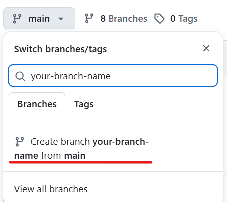

# How to build your own knowledge branch

1. Login github.com with your account

2. Go https://github.com/feelryan/jujuen

3. Create your branch

- Type your branch name

- Click it to create

4. Create a menu-path.json on your branch root

# Examples

- https://github.com/feelryan/jujuen/blob/google-generative-ai-leader/menu-path.json

- https://github.com/feelryan/jujuen/blob/basic-pronunciation/menu-path.json

- https://github.com/feelryan/jujuen/blob/google-professional-cloud-architect/menu-path.json

5. Popularize your content

