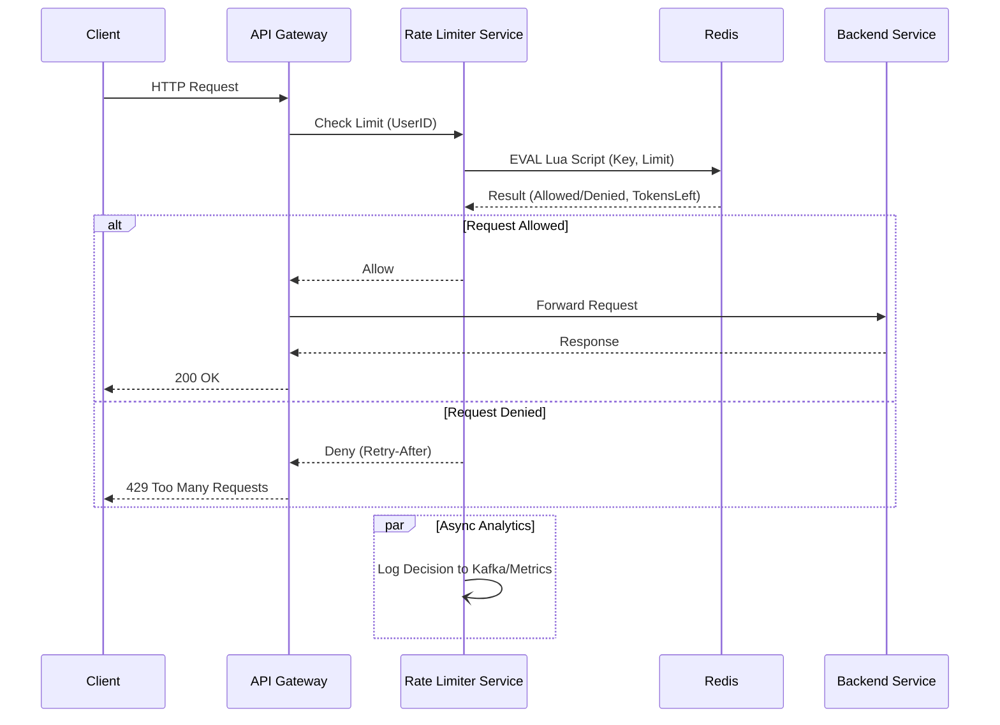

# 1. 前言與學習目標 (Introduction and Learning Objectives)

在資深工程師的職涯中，系統設計（System Design）往往是區分 Senior 與 Staff/Principal 級別的關鍵戰場。傳統上，這需要依賴大量的經驗積累與手繪白板圖。然而，隨著 AI 輔助開發的成熟，我們現在擁有一位隨時待命的「架構師副手」。

本章不教你基礎的 Load Balancer 或 Sharding 概念（假設你已具備），而是專注於**如何利用 AI 加速架構決策過程、視覺化設計與文件化**。

完成本章後，你將能夠：

1.  **利用 AI 進行架構 Brainstorming 與壓力測試**：將 AI 作為 "Sparring Partner"（陪練），快速列舉方案並找出潛在的 Single Point of Failure (SPOF)。
2.  **自動化生成架構圖（Diagram-as-Code）**：不再手動拖拉圖形，而是透過 Prompt 生成 Mermaid 或 PlantUML 程式碼，實現版本控制化的架構圖。
3.  **高效撰寫 ADR (Architecture Decision Records)**：將討論過程轉化為標準化的決策紀錄，清楚記載 Context、Decision 與 Consequences。
4.  **輔助容量規劃（Capacity Planning）**：利用 AI 快速進行數量級估算（Back-of-the-envelope estimation），驗證系統規模假設。

---

# 2. 核心觀念與心智模型 (Core Concepts & Mental Model)

## 2.1 AI as a "Sparring Partner" (AI 作為陪練對象)

**Concept:**
不要期待 AI 直接給你「完美解答」。在系統設計中，AI 的角色更像是**知識淵博但缺乏上下文的圖書館員**。你必須提供業務場景（Context）與限制條件（Constraints），然後要求它提供選項並進行辯論。

**Mental Model:**
想像你在與一位剛加入團隊的資深架構師開會。
- **你**：負責定義問題邊界、業務優先級（例如：Consistency > Availability）。
- **AI**：負責檢索 Design Patterns、列出 Trade-offs、計算預估流量。
- **產出**：不是 AI 的回答，而是你們「對話後的結論」。

**Analogy:**
AI 就像是 **IDE 的 Linter，但是針對架構層面**。它能提醒你「這裡可能有 Race Condition」或「這個 DB 在高寫入下會有延遲」，但它無法決定這對你的業務是否致命。

## 2.2 Diagram-as-Code (以程式碼定義圖表)

**Concept:**
資深工程師應避免依賴不可維護的二進位圖檔（如 `.png`, `.vsdx`）。利用 AI 生成 **Mermaid.js** 或 **PlantUML** 腳本，可以讓架構圖像程式碼一樣被 Review、Diff 和 Version Control。

**Comparison:**
- **Traditional:** Drag-and-drop tools (Draw.io, Visio). Hard to update, hard to version.
- **AI-Assisted:** Text-to-Diagram. Prompt: "Generate a sequence diagram for OAuth2 flow with a retry mechanism." Result: Editable code block.

---

# 3. 實務場景與系統設計視角 (Real-World & System Design View)

在 Production 環境與 System Design 面試中，AI 輔助的流程通常如下：

## 3.1 典型工作流 (Typical Workflow)

1.  **Requirement Clarification & Estimation:**
    - 輸入模糊需求，要求 AI 協助列出 Functional/Non-functional requirements。
    - 要求 AI 進行 QPS、Storage、Bandwidth 的粗略估算（需人工複核數據來源）。

2.  **Component Selection & Trade-offs:**
    - 詢問：「在 AWS 環境下，對比 Kinesis 與 MSK (Managed Kafka) 針對此案例的優缺點。」
    - 重點在於 **Cost**, **Operational Overhead**, 與 **Latency**。

3.  **Drafting the Design (Visual & Text):**
    - 生成 Mermaid Class Diagram 或 Sequence Diagram。
    - 生成 API 介面定義（OpenAPI/Swagger Spec）。

4.  **Writing the ADR:**
    - 將上述對話總結為一份 Markdown 格式的 ADR，存入 Git Repo。

## 3.2 對系統品質的影響 (Impact on System Quality)

- **可維護性 (Maintainability):** 架構決策被完整記錄（ADR），後人接手時能理解 "Why we chose MongoDB over Postgres"。
- **一致性 (Consistency):** AI 可以根據團隊既有的 Tech Stack 建議方案，避免引入過多異質技術（需在 Prompt 中設定 Context）。
- **完整性 (Completeness):** AI 擅長列舉 Edge Cases（例如：DLQ 處理、Thundering Herd 問題），減少設計漏洞。

---

# 4. 逐步示例 (Walkthrough / Example)

**場景 (Scenario):**
我們需要設計一個 **分散式限流器 (Distributed Rate Limiter)**。
- **目標**：限制使用者每分鐘最多發送 100 個請求。
- **規模**：10M DAU，峰值流量可能達到 100k QPS。
- **環境**：Kubernetes, Redis, Go。

## Step 1: Capacity Planning (容量估算)

**Prompt:**
> "I need to design a rate limiter for 10M DAU. Peak traffic is estimated at 100k QPS. Help me do a back-of-the-envelope estimation for the storage required if we use Redis. Assume we use a Sliding Window Log algorithm vs. a Fixed Window Counter. Show the math."

**AI Insight (Summary):**
- **Fixed Window:** 每個 User 僅需一個 Counter (Int) + TTL。
  - Storage: $10M \times (Key + Value) \approx 10M \times 50 bytes \approx 500MB$. (Very low).
- **Sliding Window Log:** 需紀錄每個 Request 的 Timestamp。
  - Storage: $10M \times 100 \text{ (requests)} \times 8 \text{ bytes (timestamp)} \approx 8GB$. (High).
- **Decision:** 為了節省記憶體並保持高效，我們可能選擇 **Token Bucket** 或 **Sliding Window Counter** (Hybrid)，而非純 Log。

## Step 2: Trade-off Analysis (權衡分析)

**Prompt:**
> "Compare implementing the Rate Limiter as a Sidecar (e.g., Envoy filter) vs. a centralized Redis-based middleware in the application code. Focus on latency and race conditions."

**AI Output (Refined):**
- **Sidecar (Envoy/Nginx):**
  - *Pros:* 解耦應用邏輯、語言無關、效能極高（如果是 local limit）。
  - *Cons:* Global rate limiting 需要與 Redis 通訊，增加了 network hop；配置複雜度高。
- **App Middleware + Redis (Lua Script):**
  - *Pros:* 邏輯控制靈活、Lua script 保證原子性（Atomicity）避免 Race Condition。
  - *Cons:* 應用程式與 Redis 強耦合。

**Design Decision:** 採用 **Redis + Lua Script** 模式，因為業務邏輯需要精確的 Global Limit。

## Step 3: Generating Architecture Diagram (生成架構圖)

我們決定架構後，讓 AI 生成 Mermaid 語法。

**Prompt:**
> "Generate a Mermaid sequence diagram for a Rate Limiter.
> Participants: Client, API Gateway, Rate Limiter Service, Redis.
> Flow:
> 1. Client sends request.
> 2. Gateway calls Rate Limiter.
> 3. Rate Limiter runs Lua script on Redis.
> 4. If allowed, Gateway forwards to Backend.
> 5. If denied, return 429 Too Many Requests.
> Include a note about async logging for analytics."

**Output (Mermaid Code):**

*(Copy this code into a Markdown viewer with Mermaid support or the Mermaid Live Editor to visualize.)*

## Step 4: Drafting the ADR (撰寫架構決策紀錄)

**Prompt:**
> "Based on our discussion (Redis + Lua for Rate Limiting, Sliding Window Counter algorithm), draft a formal ADR. Include Status, Context, Decision, and Consequences (Positive/Negative)."

**Output (Snippet):**

> **ADR-005: Use Redis with Lua Scripts for Distributed Rate Limiting**
>
> **Status:** Proposed
>
> **Context:**
> We need to limit traffic to protect backend services. The requirement is high precision global limiting for 10M DAU.
>
> **Decision:**
> We will implement the **Token Bucket** algorithm using **Redis Lua scripts**.
>
> **Consequences:**
> - (+) **Atomicity:** Lua scripts ensure check-and-decrement operations are atomic.
> - (+) **Performance:** Single network round-trip to Redis.
> - (-) **Scalability:** Redis becomes a single point of failure/bottleneck. We must use Redis Cluster or Sharding based on UserID.

---

# 5. 常見錯誤與反模式 (Common Pitfalls & Anti-patterns)

在使用 AI 輔助系統設計時，資深工程師常犯以下錯誤：

## 5.1 Blindly Trusting Capacity Math (盲目相信容量計算)
- **錯誤 (Pitfall):** 直接使用 AI 輸出的 "8GB RAM" 或 "50ms Latency" 而不檢查其假設基礎（例如：AI 可能假設了錯誤的 Object size）。
- **修正 (Fix):** 要求 AI 列出計算公式（Show your work），並手動驗證關鍵參數（如單筆紀錄大小、壓縮比）。

## 5.2 The "Generic Pattern" Trap (通用模式陷阱)
- **錯誤 (Pitfall):** Prompt 太籠統（"Design a chat app"），導致 AI 給出教科書式的標準答案，忽略了公司現有的基礎設施限制（例如：公司強制使用 GCP，AI 卻推薦 AWS DynamoDB）。
- **修正 (Fix):** 在 Prompt 中注入 "System Context"（"We are a GCP shop using Spanner and GKE..."）。

## 5.3 Over-Engineering by Suggestion (被建議導致的過度設計)
- **錯誤 (Pitfall):** AI 傾向於建議「完整」的微服務架構，包含 Service Mesh、Distributed Tracing 等。對於初期專案或中小型系統，這可能是 Over-kill。
- **修正 (Fix):** 明確要求 "Start with a monolith" 或 "Optimize for development velocity first"。

---

# 6. 面試與實務問答切入點 (Interview & Discussion Hooks)

在面試或技術分享中，這些問題能展現你對 AI-assisted System Design 的深度理解：

## Q1: 如何利用 AI 評估架構的 Single Point of Failure (SPOF)？
- **高分回答要點:**
  - 描述如何將架構圖或文字描述餵給 AI。
  - 使用 "Chaos Engineering" 思維的 Prompt：「如果 Redis Cluster 掛了，這個設計會如何降級（Degrade）？」。
  - 強調 AI 能幫助發現「隱性依賴」（例如：Auth Service 掛了導致所有服務不可用）。

## Q2: 在生成 ADR 時，如何確保 AI 捕捉到 "Why" 而不僅僅是 "What"？
- **高分回答要點:**
  - ADR 的核心價值在於記錄「被捨棄的選項」及其原因。
  - 技巧是提供對話歷史給 AI，並明確指令：「總結我們為何放棄方案 A 而選擇方案 B，重點在於 Consistency 與 Latency 的權衡」。

## Q3: 你如何處理 AI 產生的 Mermaid 圖表的版本控制與維護？
- **高分回答要點:**
  - 強調 **Diagram-as-Code** 的優勢：Mermaid code 存入 Git，隨程式碼變更。
  - 避免將生成的 PNG 視為 Source of Truth。
  - CI/CD 流程可以自動將 Mermaid 渲染為圖片放入 Wiki。

---

# 7. 小結與後續延伸 (Summary & Next Steps)

## Summary (重點回顧)
1.  **AI as Partner:** 把 AI 當作不知疲倦的架構師陪練，用來挑戰你的設計假設。
2.  **Diagram-as-Code:** 使用 AI 生成 Mermaid/PlantUML，讓架構圖具備可維護性與版本控制能力。
3.  **Math Verification:** 讓 AI 處理繁瑣的容量估算公式，但務必人工審查基礎假設。
4.  **ADR Automation:** 利用 AI 將零散的討論收斂為結構化的決策文件，保存上下文。
5.  **Context is King:** Prompt 必須包含現有技術棧與限制，否則只會得到教科書廢話。

## Next Steps (後續延伸)
- **Chapter 06:** 進入 **Coding & Refactoring** 章節。既然架構已定，下一步將學習如何利用 AI 快速生成 Boilerplate code、撰寫單元測試以及進行 Legacy Code 的重構分析。
- **Action Item:** 挑選你目前專案中的一個模組，嘗試用 AI 生成一份包含 Sequence Diagram 的 ADR，並與團隊分享。