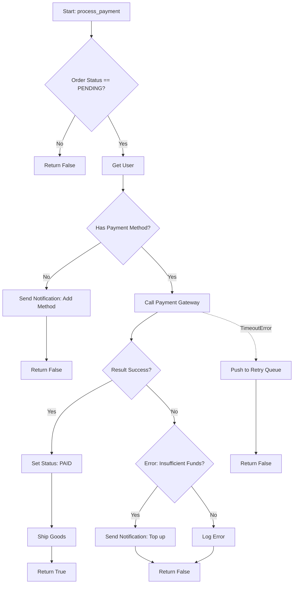

# 1. 前言與學習目標 (Introduction and Learning Objectives)

對於資深工程師而言，撰寫文件與跨部門溝通往往比寫程式更具挑戰性且耗時。然而，這正是區分 Senior 與 Staff/Principal 工程師的關鍵能力。在本章中，我們將探討如何利用 AI 作為「技術翻譯官」與「文件生成引擎」，將原本枯燥的文書工作轉化為高槓桿的產出。

For senior engineers, writing documentation and cross-functional communication is often more challenging and time-consuming than coding. However, this is exactly the key skill that distinguishes Senior from Staff/Principal engineers. In this chapter, we will explore how to leverage AI as a "technical translator" and "documentation engine," transforming tedious administrative work into high-leverage output.

完成本章後，你將能夠：
By the end of this chapter, you will be able to:

1.  **自動化技術文件產出 (Automate Technical Documentation):** 利用 AI 分析程式碼，快速生成高品質的 API 文件 (OpenAPI/Swagger)、README 與架構決策紀錄 (ADR)。
    Leverage AI to analyze code and rapidly generate high-quality API documentation (OpenAPI/Swagger), READMEs, and Architecture Decision Records (ADRs).
2.  **精準的受眾轉譯 (Targeted Audience Translation):** 將複雜的技術細節 (如 Race Condition, Database Locking) 轉譯為 PM 或高層主管能理解的商業語言與風險評估。
    Translate complex technical details (e.g., Race Conditions, Database Locking) into business language and risk assessments understandable by PMs or executives.
3.  **視覺化架構溝通 (Visual Architecture Communication):** 使用 AI 將文字描述轉換為 Mermaid.js 或 PlantUML 圖表，加速系統設計討論。
    Use AI to convert text descriptions into Mermaid.js or PlantUML diagrams to accelerate system design discussions.
4.  **維護「活體文件」 (Maintain "Living Documentation"):** 建立工作流，確保文件與程式碼變更同步，減少文件過期 (Documentation Drift) 的問題。
    Establish workflows to ensure documentation stays in sync with code changes, reducing the problem of documentation drift.

---

# 2. 核心觀念與心智模型 (Core Concepts & Mental Model)

## 2.1 AI 作為「上下文感知的幽靈寫手」 (AI as a Context-Aware Ghostwriter)

傳統的文件撰寫是「從零開始 (From Scratch)」，而 AI 輔助的文件撰寫則是「策展與精煉 (Curation and Refinement)」。你不再是單純的作者，而是**編輯**。

Traditional documentation writing is "from scratch," whereas AI-assisted documentation is about "curation and refinement." You are no longer just the author; you are the **editor**.

-   **Input:** 原始程式碼、Git Diff、雜亂的會議記錄、Slack 討論串。
-   **Processing:** LLM 提取邏輯、摘要重點、轉換語氣。
-   **Output:** 結構化的 Markdown、標準化的 Spec、給非技術人員的摘要。

-   **Input:** Raw code, Git Diffs, messy meeting notes, Slack threads.
-   **Processing:** LLM extracts logic, summarizes key points, and adjusts tone.
-   **Output:** Structured Markdown, standardized Specs, summaries for non-technical stakeholders.

## 2.2 不同層次的溝通模型 (Communication Layers Model)

在使用 AI 進行溝通輔助時，應建立清晰的「層次模型」：

When using AI for communication assistance, establish a clear "layer model":

| Layer | Audience | Goal | AI Prompt Strategy |
| :--- | :--- | :--- | :--- |
| **L1: Code** | Engineers | Implementation Details | "Generate JSDoc/Docstring based on this function logic." |
| **L2: Spec** | Frontend/QA/DevOps | Interface Contract | "Convert this DTO to OpenAPI 3.0 YAML with examples." |
| **L3: Arch** | Architects/Tech Leads | System Design & Trade-offs | "Summarize the trade-offs of using Redis vs Memcached here." |
| **L4: Biz** | PM/Stakeholders | Value & Risk | "Explain why this refactor reduces user latency, use an analogy." |

## 2.3 核心差異 (Key Differences)

-   **Code Comments vs. Documentation:**
    -   Code Comments 解釋「How」。AI 擅長根據程式碼補全。
    -   Documentation 解釋「Why」與「How to use」。AI 需要你提供額外的 Context (如商業邏輯) 才能寫好。
    -   *Code Comments explain "How." AI excels at completing these based on code.*
    -   *Documentation explains "Why" and "How to use." AI requires you to provide extra context (like business logic) to write this well.*

---

# 3. 實務場景與系統設計視角 (Real-World & System Design View)

在大型分散式系統中，溝通成本往往隨著團隊規模呈指數級增長。AI 輔助文件不僅是為了省時，更是為了**一致性 (Consistency)** 與 **可發現性 (Discoverability)**。

In large distributed systems, communication costs often grow exponentially with team size. AI-assisted documentation is not just about saving time; it's about **Consistency** and **Discoverability**.

## 3.1 自動化 API 契約生成 (Automated API Contract Generation)

在微服務架構中，Backend 與 Frontend 或其他 Service 的整合常因文件過期而破裂。

In a microservices architecture, integration between Backend and Frontend (or other services) often breaks due to stale documentation.

-   **Workflow:**
    1.  工程師撰寫/修改 Controller 程式碼。
    2.  IDE 中的 AI Copilot 根據程式碼邏輯，生成詳細的 OpenAPI 註解 (包含 Edge Cases 與 Error Codes)。
    3.  CI Pipeline 自動提取並發布新的 Swagger UI。
-   **Impact:** 確保實作與文件永遠同步，減少 "Tribal Knowledge" (部落知識/口耳相傳)。

## 3.2 事故報告與事後檢討 (Post-Mortem & Incident Reports)

當 Production 發生事故，需要撰寫 RCA (Root Cause Analysis)。

When a production incident occurs, an RCA (Root Cause Analysis) needs to be written.

-   **Scenario:** 資料庫 Deadlock 導致服務中斷。
-   **AI Role:**
    -   輸入：Log 片段、相關程式碼、Slack 上的除錯對話。
    -   輸出：一份結構化的 Incident Report 草稿，包含時間軸 (Timeline)、技術原因、影響範圍，以及給非技術高層的「白話文摘要」。
-   **System View:** 提升組織的「平均修復時間 (MTTR)」並非只靠修扣，更靠快速且清晰的知識分享，避免重複錯誤。

---

# 4. 逐步示例 (Walkthrough / Example)

## 4.1 案例一：將複雜程式碼轉為 Mermaid 流程圖 (Case 1: Converting Complex Code to Mermaid Diagrams)

**情境 (Context):** 你接手了一個遺留的付款處理模組，邏輯錯綜複雜，包含多個 `if-else` 和外部 API 呼叫。你需要向團隊解釋目前的流程以討論重構。

**Context:** You've inherited a legacy payment processing module with convoluted logic, involving multiple `if-else` blocks and external API calls. You need to explain the current flow to the team to discuss refactoring.

**原始程式碼 (Source Code - Simplified):**

```python
def process_payment(order):
    if order.status != 'PENDING':
        return False
    
    user = get_user(order.user_id)
    if not user.has_payment_method():
        send_notification(user, "Add payment method")
        return False

    try:
        result = payment_gateway.charge(user.token, order.amount)
        if result.success:
            order.status = 'PAID'
            ship_goods(order)
            return True
        else:
            if result.error_code == 'INSUFFICIENT_FUNDS':
                send_notification(user, "Top up wallet")
            else:
                log_error(result)
            return False
    except TimeoutError:
        retry_queue.push(order)
        return False
```

**AI Prompt 策略 (Prompt Strategy):**

> "Act as a Senior Technical Writer. Analyze the following Python code. Generate a Mermaid.js flowchart that visualizes the logic paths, including success, failure, and retry mechanisms. Use clear labels."

**AI 產出 (AI Output):**



**分析 (Analysis):**
這個圖表可以直接嵌入 Markdown 文件或 GitHub PR description 中。它比閱讀 20 行程式碼更直觀，特別是對於不熟悉 Python 的 PM 或 QA。

This diagram can be directly embedded into Markdown documents or GitHub PR descriptions. It is much more intuitive than reading 20 lines of code, especially for PMs or QAs who may not be familiar with Python.

## 4.2 案例二：為非技術人員撰寫變更摘要 (Case 2: Writing Change Summaries for Non-Tech Stakeholders)

**情境 (Context):** 你剛剛優化了搜尋演算法，引入了 Caching 機制，將延遲從 500ms 降至 50ms，但也導致資料可能有 1 分鐘的延遲。你需要告知 PM 這個 Trade-off。

**Context:** You just optimized the search algorithm by introducing a caching mechanism, reducing latency from 500ms to 50ms, but this introduces a potential 1-minute data staleness. You need to inform the PM about this trade-off.

**工程師的原始筆記 (Engineer's Raw Notes):**
> "Implemented Redis caching layer for search query. TTL set to 60s. Latency dropped P99 500ms -> 50ms. Note: Updates to inventory won't reflect immediately in search, eventual consistency applies."

**AI Prompt 策略 (Prompt Strategy):**

> "Rewrite this technical update for a Product Manager. Focus on user experience benefits and clearly explain the trade-off regarding data freshness using a simple analogy. Keep it professional but accessible."

**AI 產出 (AI Output):**

> **Subject: Search Performance Update - Faster Results with Slight Data Delay**
>
> **The Good News:** We've significantly upgraded our search engine. Users will now see search results almost instantly (10x faster than before). This will make the app feel much snappier and responsive.
>
> **The Trade-off:** To achieve this speed, we are "memorizing" search results for 1 minute.
> *   **Analogy:** Imagine a restaurant menu printed on paper vs. a digital board updated every second. We switched to the printed menu to serve customers faster.
> *   **Impact:** If an item goes out of stock, it might still show up in search results for up to 60 seconds before disappearing. We believe this is an acceptable trade-off for the speed gain, but let's confirm if this fits our business rules.

**分析 (Analysis):**
AI 成功將 `TTL`, `P99`, `Eventual Consistency` 等術語轉換為「菜單」的比喻，並清楚點出商業決策點 (Business Decision Point)。

AI successfully translated terms like `TTL`, `P99`, and `Eventual Consistency` into a "menu" analogy and clearly highlighted the Business Decision Point.

---

# 5. 常見錯誤與反模式 (Common Pitfalls & Anti-patterns)

## 5.1 盲目信任生成的 Spec (Blindly Trusting Generated Specs)

-   **錯誤 (Mistake):** 直接複製 AI 生成的 OpenAPI 定義而不檢查。
-   **後果 (Consequence):** AI 可能會「幻覺 (Hallucinate)」出不存在的欄位，或者錯誤定義資料型態 (例如將 `String` 誤標為 `Integer`)，導致前端整合失敗。
-   **修正 (Correction):** 始終將 AI 生成的 Spec 視為「草稿」，必須經過人工 Review 或使用工具 (如 Swagger Editor) 驗證語法。

-   **Mistake:** Copy-pasting AI-generated OpenAPI definitions without review.
-   **Consequence:** AI might "hallucinate" non-existent fields or mislabel data types (e.g., labeling a `String` as an `Integer`), causing frontend integration failures.
-   **Correction:** Always treat AI-generated specs as "drafts" that must be manually reviewed or validated using tools (like Swagger Editor).

## 5.2 洩露敏感資訊 (Leaking Sensitive Information)

-   **錯誤 (Mistake):** 將包含 API Key、DB Schema 或 PII (個人識別資訊) 的原始 Log 直接貼給公有雲 AI 模型請求解釋。
-   **後果 (Consequence):** 嚴重違反資安合規 (GDPR, SOC2)，可能導致公司機密外洩。
-   **修正 (Correction):** 在 Prompting 之前，務必進行「資料去敏 (Sanitization)」。使用 Placeholder (如 `<API_KEY>`) 替換真實數據，或使用企業私有部署的 LLM。

-   **Mistake:** Pasting raw logs containing API Keys, DB Schemas, or PII directly into public cloud AI models for explanation.
-   **Consequence:** Serious violation of security compliance (GDPR, SOC2), potentially leaking company secrets.
-   **Correction:** Always perform "Sanitization" before prompting. Replace real data with placeholders (e.g., `<API_KEY>`) or use enterprise-deployed private LLMs.

## 5.3 過度簡化導致誤導 (Oversimplification Leading to Misleading Info)

-   **錯誤 (Mistake):** 要求 AI "Explain like I'm 5" (像對五歲小孩解釋) 來描述極其複雜的分散式一致性問題。
-   **後果 (Consequence):** PM 可能誤以為問題很簡單解決，從而承諾了不切實際的時程。
-   **修正 (Correction):** 指定目標受眾為 "Business Stakeholder" 而非 "Child"。要求 AI 保留關鍵的風險描述，而不僅僅是簡化技術原理。

-   **Mistake:** Asking AI to "Explain like I'm 5" for extremely complex distributed consistency issues.
-   **Consequence:** PMs might mistakenly think the problem is simple to solve and commit to unrealistic timelines.
-   **Correction:** Specify the target audience as "Business Stakeholder" rather than "Child." Ask AI to retain key risk descriptions, not just simplify technical principles.

---

# 6. 面試與實務問答切入點 (Interview & Discussion Hooks)

## 6.1 問題：如何處理文件與程式碼脫節的問題？
**Question: How do you handle the issue of documentation drifting from code?**

-   **高分回答要點 (Key Points):**
    -   **Code as Truth:** 強調程式碼是唯一的真理來源 (Source of Truth)。
    -   **Automation:** 描述如何使用工具 (如 Sphinx, Swagger, TypeDoc) 結合 CI/CD，在 Build 階段自動生成文件。
    -   **AI's Role:** 說明利用 AI 來填補「自動生成文件」與「人類可讀文件」之間的鴻溝 (例如自動生成 Summary)。
    -   **Process:** 提到 "Documentation as Code" 的實踐，文件變更應隨 PR 一起 Review。

## 6.2 問題：你會如何利用 AI 來協助新進工程師 Onboarding？
**Question: How would you use AI to assist in onboarding new engineers?**

-   **高分回答要點 (Key Points):**
    -   **Interactive Exploration:** 鼓勵新人在 IDE 中使用 AI 詢問 "Explain this class" 或 "Trace the call stack for this endpoint"。
    -   **Legacy Code Translation:** 利用 AI 將舊的、無文件的程式碼轉換為帶有註解的現代語法 (僅作理解用)。
    -   **Contextual Search:** 建立基於 RAG (Retrieval-Augmented Generation) 的內部知識庫，讓新人可以用自然語言搜尋 "How do I deploy to staging?"。

## 6.3 問題：在向非技術高層匯報技術債 (Tech Debt) 時，你會如何使用 AI？
**Question: How would you use AI when reporting technical debt to non-technical executives?**

-   **高分回答要點 (Key Points):**
    -   **Translation:** 將 "Refactoring" 轉譯為 "Risk Reduction" 或 "Velocity Improvement"。
    -   **Quantification:** 請 AI 協助估算如果不修復可能帶來的潛在停機成本 (基於過去的 Incident Reports)。
    -   **Analogy:** 使用 AI 生成合適的商業類比 (例如「高利貸」或「地基不穩」)，讓高層對風險有感。

---

# 7. 小結與後續延伸 (Summary & Next Steps)

## 7.1 重點回顧 (Key Takeaways)

1.  **AI 是編輯，不是作者:** 你的輸入品質決定了文件的品質。提供足夠的 Context (Diffs, Logs, Constraints) 至關重要。
    *AI is the editor, not the author:* The quality of your input determines the quality of the documentation. Providing sufficient Context is crucial.
2.  **分層溝通:** 針對不同受眾 (Dev, QA, PM, Exec) 使用不同的 Prompt 策略，調整術語密度與關注點。
    *Layered Communication:* Use different prompting strategies for different audiences, adjusting jargon density and focus.
3.  **視覺化是捷徑:** 利用 AI 生成 Mermaid/PlantUML 圖表，能大幅降低複雜系統的溝通門檻。
    *Visualization is a shortcut:* Using AI to generate Mermaid/PlantUML diagrams significantly lowers the barrier to communicating complex systems.
4.  **安全第一:** 絕不在 Public LLM 中貼上未經處理的敏感數據。
    *Security First:* Never paste unsanitized sensitive data into public LLMs.
5.  **文件即程式碼:** 將 AI 文件生成整合進 CI/CD 流程，確保文件是活的。
    *Docs as Code:* Integrate AI documentation generation into CI/CD pipelines to ensure documentation remains alive.

## 7.2 後續延伸 (Next Steps)

-   **實作 (Action):** 挑選一個你負責的 API，嘗試使用 AI 生成一份完整的 OpenAPI Spec，並為其撰寫一份給 PM 的 Release Note。
-   **進階 (Advanced):** 研究如何使用 **RAG (Retrieval-Augmented Generation)** 技術，將團隊的 Confluence/Wiki 與 GitHub Repo 結合，打造一個專屬的「團隊技術問答 Bot」。
-   **預告 (Next Chapter):** 在下一章，我們將探討 **AI-Assisted Testing & QA**，學習如何利用 AI 自動生成單元測試與端對端測試案例。