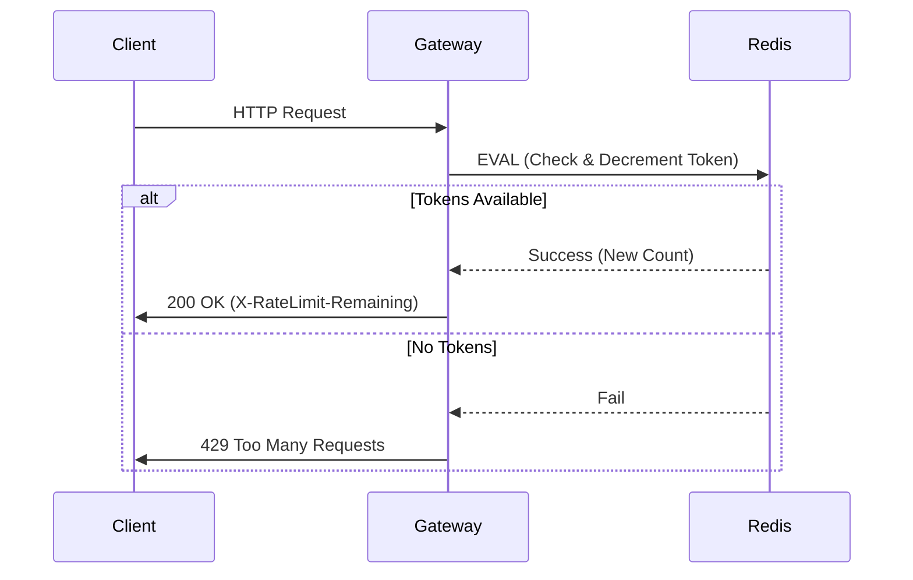

# 系統設計輔助與架構權衡 / System Design Assistance & Architectural Trade-offs

在 AI 輔助開發的領域中，系統設計（System Design）往往比單純的程式碼生成更具槓桿效應。AI 不僅是 Coding Assistant，更是你的 **Staff Engineer 級別的討論夥伴**。本章節將探討如何利用 AI 進行架構發想、技術選型比較、以及視覺化設計，並協助你做出更明智的權衡（Trade-offs）。

## Mental model｜心智模型

### 1. The "Sounding Board" & "Devil's Advocate" (壁球夥伴與魔鬼代言人)
不要期待 AI 直接給你一個完美的架構圖。將 AI 視為一個**知識淵博但缺乏上下文（Context）的資深顧問**。
- **你的角色**：首席架構師（Chief Architect）。你掌握業務限制、團隊技能樹、預算與時程。
- **AI 的角色**：負責廣度搜尋、列舉方案、並挑戰你的設計。
- **核心互動**：你提出初步構想，要求 AI 找出漏洞（"What could go wrong?"），或要求它扮演反方角色進行辯論。

### 2. Diverge then Converge (發散而後收斂)
系統設計的本質是權衡。
- **發散階段**：利用 AI 快速生成 3-5 種不同的架構方案（例如：Monolith vs. Microservices vs. Serverless）。
- **收斂階段**：利用 AI 針對特定指標（成本、延遲、一致性）進行比較，最後由人類根據實際情況拍板定案。

---

## Patterns & best practices｜常見模式與最佳實務

### 1. The Comparative Matrix Pattern (技術選型矩陣模式)
當你在猶豫技術選型時（例如：PostgreSQL vs. MongoDB，或 RabbitMQ vs. Kafka），不要只問「哪個好？」。
- **做法**：要求 AI 建立一個比較表格，並指定評估維度。
- **Prompt 範例**：
  > "Compare **Redis** and **Memcached** for a high-throughput session store. Create a markdown table comparing them on: Persistence, Clustering capabilities, Data types, and Operational complexity."

### 2. The "Pre-mortem" Analysis (事前驗屍分析)
在寫下任何一行程式碼之前，利用 AI 預測系統崩潰點。
- **做法**：描述你的架構，然後要求 AI 找出單點故障（SPOF）或瓶頸。
- **Prompt 範例**：
  > "Here is my proposed architecture for a ticket booking system: [Describe architecture]. Act as a Site Reliability Engineer (SRE). Identify the top 3 potential bottlenecks during a traffic spike and suggest mitigation strategies."

### 3. Text-to-Diagram Generation (文字轉圖表)
AI 模型通常無法直接畫出完美的圖片，但它們非常擅長生成 **Diagram-as-Code**。
- **做法**：要求 AI 生成 Mermaid.js、PlantUML 或 Graphviz 語法，然後在支援的編輯器（如 Notion, GitHub, VS Code）中渲染。
- **支援類型**：Sequence Diagrams（時序圖）、ER Diagrams（實體關係圖）、Flowcharts（流程圖）。
- **Prompt 範例**：
  > "Generate a **Mermaid.js sequence diagram** showing the OAuth2 authorization code flow, including the User, Browser, Client App, Auth Server, and Resource Server."

### 4. NFR Extraction (非功能性需求提取)
開發者常專注於功能（Functional），而忽略非功能性需求（Non-Functional Requirements）。
- **做法**：輸入 User Story，要求 AI 列出相關的 NFRs（安全性、可擴展性、可觀測性）。
- **Prompt 範例**：
  > "We are building a healthcare patient portal. Apart from the core features, what are the critical Security and Compliance (HIPAA/GDPR) requirements we must consider in the system design?"

---

## Anti-patterns & pitfalls｜反模式與踩雷點

### 1. Context-Free Architecture (缺乏上下文的架構)
- **陷阱**：直接問 AI「如何設計一個電商系統？」，然後照單全收。
- **後果**：AI 會傾向給出過度工程化（Over-engineered）的方案（例如一開始就建議 Kubernetes + Microservices），忽略了你可能只有 3 個工程師且只需服務 1000 個用戶的事實。
- **修正**：在 Prompt 中明確注入約束條件（Constraints）：團隊規模、預算、現有技術棧、預期流量。

### 2. Hallucinated Features & Limits (幻覺功能與限制)
- **陷阱**：相信 AI 對於特定雲端服務（AWS/Azure/GCP）的配額（Quotas）或特定參數的描述。
- **後果**：設計依賴了不存在的 API 功能或錯誤的定價模型。
- **修正**：對於具體的硬體限制、價格或 API 參數，務必查閱官方文件進行二次確認（Double-check）。

### 3. The "Resume Driven Development" Proxy (代理型履歷驅動開發)
- **陷阱**：AI 喜歡推薦最新、最潮的技術（因為訓練資料中有很多熱門文章討論這些技術）。
- **後果**：引入了團隊無法維護的複雜技術棧。
- **修正**：要求 AI 優先考慮「成熟度」和「維護成本」，或限制技術選項在團隊熟悉的範圍內。

---

## Checklists & workflows｜檢查清單與流程

### Workflow: AI-Assisted Design Review (AI 輔助設計審查流程)

1.  **Context Injection**: 描述業務目標、預期負載 (RPS)、資料量與團隊限制。
2.  **Option Generation**: 要求 AI 提供 2-3 種架構選項。
3.  **Trade-off Analysis**: 針對選定方案，要求 AI 列出 Pros & Cons。
4.  **Diagramming**: 生成 Mermaid 語法以視覺化流程。
5.  **Stress Test**: 詢問 "How does this break?"。

### Checklist: Before Finalizing Design

- [ ] **約束條件檢查**：我是否告知 AI 我的團隊規模與技術偏好？
- [ ] **成本估算**：是否要求 AI 粗估此架構在雲端上的潛在成本結構（Cost Drivers）？
- [ ] **數據一致性**：對於分散式系統，是否利用 AI 確認了 CAP 定理中的權衡（CP vs AP）？
- [ ] **遷移策略**：如果是重構，是否詢問了從舊系統遷移到新架構的策略？
- [ ] **圖表驗證**：生成的 Mermaid/PlantUML 圖表邏輯是否與文字描述一致？

---

## Real-world examples｜實戰案例

### Case: Designing a Rate Limiter (設計限流器)

**情境**：你需要為 API Gateway 設計一個限流器，但不確定該用哪種演算法（Token Bucket vs. Fixed Window）。

**Step 1: 比較演算法 (Trade-off Analysis)**
> **User**: "I need to implement a rate limiter for a public API. Compare **Token Bucket**, **Leaky Bucket**, and **Fixed Window Counter** algorithms. Focus on: 1. Handling burst traffic, 2. Memory usage, 3. Implementation complexity in Redis."

**Step 2: 實作細節與邊緣案例 (Implementation Details)**
> **User**: "I choose **Token Bucket** with Redis Lua script. What are the potential race conditions if I have multiple instances of the rate limiter service? How do I handle clock skew?"

**Step 3: 視覺化 (Visualization)**
> **User**: "Create a **Mermaid sequence diagram** showing a client request, the API Gateway checking Redis, the decision logic (Allow/Deny), and the response headers (X-RateLimit-Remaining)."

**Output (Mermaid Snippet)**:


### Case: Database Schema Review (資料庫綱要審查)

**情境**：你有一個初步的 SQL Schema，想確認是否符合正規化原則或有效能隱憂。

> **User**: "Here is my PostgreSQL schema for an E-commerce order system:
> ```sql
> CREATE TABLE orders (id serial, user_id int, items jsonb, total_price decimal);
> ```
> Critique this design. Specifically, discuss the trade-offs of storing `items` as **JSONB** versus a separate `order_items` table. Consider query performance for 'finding all orders containing product X'."

**AI Insight**: AI 可能會指出 JSONB 雖然開發方便，但在做複雜統計查詢時無法利用標準 Index 的缺點，並建議如果需要頻繁對商品進行 Analytics，應使用正規化的關聯表。