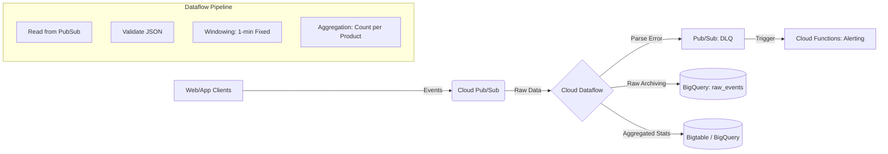

# 大數據與事件驅動架構模式 / Big Data & Event-Driven Architecture Patterns

## Mental model｜心智模型

在 GCP 上構建現代化數據管道（Data Pipeline），核心思維不再是將「批次（Batch）」與「串流（Streaming）」視為兩種截然不同的架構，而是採納 **Apache Beam 的哲學：批次是串流的一種特例（Batch is a special case of Streaming）**。

想像數據是一條持續流動的河流：
1.  **Ingestion (Buffer)**: **Cloud Pub/Sub** 是你的水庫或緩衝區。它負責解耦生產者與消費者，吸收流量尖峰（Shock Absorber），確保下游不會被瞬間的大量數據沖垮。
2.  **Processing (Transformation)**: **Cloud Dataflow** 是淨水廠或分流站。它處理數據的清洗、轉換、聚合（Aggregation）。重點在於處理 **Event Time**（事件發生時間）與 **Processing Time**（系統處理時間）的差異，以及如何處理遲到數據（Late Data）。
3.  **Storage & Analytics (Sink)**: **BigQuery** 是最終的數據湖倉。它既能儲存原始數據（Raw Data），也能透過 SQL 進行高效的分析。

**關鍵心智模型轉變：**
- **From ETL to ELT**: 過去常強調在進入倉儲前先轉換（ETL）；現在因 BigQuery 運算能力強大且儲存便宜，更傾向先將原始數據載入（EL），再利用 BigQuery SQL 或 dbt 進行轉換（T）。
- **Kappa Architecture**: 盡量使用單一程式碼庫（Codebase）同時處理即時與歷史數據，避免維護兩套邏輯（Lambda Architecture）。

---

## Patterns & best practices｜常見模式與最佳實務

### 1. The "Zero-Ops" Ingestion: Pub/Sub to BigQuery Subscription
最簡單的串流模式，不需要寫任何一行 Dataflow 程式碼。
- **Pattern**: 直接設定 Pub/Sub Subscription 類型為 **"Write to BigQuery"**。
- **Use Case**: 當你只需要將原始 JSON/Avro 數據原封不動地存入 BigQuery 進行後續 SQL 分析時。
- **Benefit**: 極低的維運成本，無 Server 需要管理，且自動處理 Schema 變更（若開啟設定）。

### 2. The Standard Streaming Pipeline (Enrichment & Windowing)
當數據需要即時清洗、與外部資料庫 Join（Enrichment）或進行時間視窗聚合（Windowing）時。
- **Pattern**: `Pub/Sub` -> `Dataflow` -> `BigQuery` (or `Bigtable`).
- **Best Practice**:
    - **Dead Letter Queue (DLQ)**: 務必在 Dataflow 中設計分流機制。無法解析或錯誤的數據**不應導致 Pipeline 崩潰**，而是寫入一個獨立的 Pub/Sub topic 或 GCS bucket (DLQ)，供後續除錯與重放（Replay）。
    - **Side Inputs**: 若需 Join 靜態資料（如 User Profile），將其放入 Side Input（通常來自 BigQuery 或 GCS），並設定適當的更新頻率。

### 3. Handling Late Data & Watermarks
- **Pattern**: 使用 Apache Beam 的 Windowing 與 Trigger 機制。
- **Best Practice**: 明確定義 **Watermark**（浮水印）。例如，允許數據遲到 10 分鐘。超過 10 分鐘的數據，根據業務需求選擇「丟棄」或「寫入另一個 Pane 進行修正」。
- **Tip**: 在 BigQuery 中，盡量使用 **Partitioned Tables**（通常按 Ingestion Time 或 Event Time），這對效能與成本至關重要。

### 4. High-Throughput Writing: Storage Write API
- **Pattern**: 在 Dataflow 寫入 BigQuery 時，放棄舊版的 Streaming Insert API。
- **Best Practice**: 使用 **BigQuery Storage Write API**。它提供更高的吞吐量、Exactly-once 語意，且成本通常比舊版 API 低（舊版 API 每一筆 Insert 都要收費，Storage Write API 在某些模式下更省）。

---

## Anti-patterns & pitfalls｜反模式與踩雷點

### 1. The "Hot Key" Problem (熱點問題)
- **Anti-pattern**: 在 Dataflow 中對某個 Key 進行 `GroupByKey`，但該 Key 的數據量遠大於其他 Keys（例如：Key 是 "Unknown" 或 "Null"）。
- **Consequence**: 導致單一 Worker 負載過重，拖慢整個 Pipeline，甚至 OOM (Out of Memory)。
- **Fix**: 在 Grouping 之前加入隨機後綴打散 Key（Salting），或啟用 Dataflow Shuffle Service。

### 2. Misunderstanding Cost Models (成本陷阱)
- **Anti-pattern**: 在 BigQuery 中頻繁使用 `UPDATE` 或 `DELETE` 語句處理串流數據的去重（Deduplication）。
- **Consequence**: BigQuery 的 DML 操作昂貴且有配額限制。
- **Fix**: 串流寫入時允許重複（Append-only），在讀取（Query）時使用 `QUALIFY ROW_NUMBER()` 去重，或定期執行批次整併（Merge）。

### 3. Ignoring Serialization Overhead
- **Anti-pattern**: 在 Dataflow 的 `DoFn` 裡面建立重型物件（如 DB Connection、API Client）。
- **Consequence**: 每個 Element 都要重新建立連線，效能極差。
- **Fix**: 在 `start_bundle` 或 `setup` 方法中初始化物件，讓同一個 Bundle 的數據共用連線。

### 4. Treating Pub/Sub as a Database
- **Anti-pattern**: 依賴 Pub/Sub 長期保存數據。
- **Consequence**: Pub/Sub 預設保留 7 天（可設定），且不具備查詢功能。
- **Fix**: Pub/Sub 僅作為傳輸通道。務必開啟 **Pub/Sub Topic Schema** 驗證，並盡快將數據落地到 GCS 或 BigQuery。

---

## Checklists & workflows｜檢查清單與流程

### Pipeline Production Readiness Checklist
在將 Dataflow Pipeline 部署到生產環境前，請檢查：

- [ ] **IAM & Permissions**: Worker Service Account 是否具有最小權限（讀取 Pub/Sub, 寫入 BQ/GCS）？避免使用預設 Compute Engine SA。
- [ ] **Network**: 是否配置了 **Private IP** 以避免 Worker 暴露在公網？（需搭配 Cloud NAT）。
- [ ] **Resource Handling**: 是否啟用了 **Dataflow Prime** 或 **Vertical Autoscaling** 以應對記憶體需求？
- [ ] **Data Handling**: 是否實作了 **Dead Letter Queue (DLQ)** 處理壞資料？
- [ ] **Infrastructure as Code**: 是否使用 **Dataflow Flex Templates** 封裝程式碼？（避免手動 `python main.py` 部署）。
- [ ] **Update Strategy**: 更新 Pipeline 時，是使用 `Update`（替換 Job）還是 `Drain`（排空舊 Job 後啟動新 Job）？確保不掉資料。

### Debugging Workflow (當 Pipeline 卡住時)
1.  **Check Dataflow Monitoring Interface**: 查看 "System Lag" 和 "Data Freshness"。
2.  **Identify Bottleneck**: 觀察各個 Step 的 Wall Time。是否有某個 Step 特別慢？
3.  **Look for Hot Keys**: Dataflow UI 會提示 "Hot Key Detected"，找出該 Key 並處理。
4.  **Check Worker Logs**: 搜尋 `OOM` 或 `User Code Exception`。
5.  **Verify Quotas**: 檢查 Compute Engine CPU/IP 配額，或 Streaming Engine 的吞吐量限制。

---

## Real-world examples｜實戰案例

### Scenario: E-commerce Real-time User Behavior Analytics
**場景**：電商平台需要即時分析使用者點擊流（Clickstream），即時計算熱門商品排行，並將原始數據存檔。

**Architecture Diagram (Conceptual):**



**Implementation Details:**

1.  **Ingestion**: 前端透過 Google Analytics 4 (GA4) 匯出至 BigQuery，或自建 Tracking Pixel 發送至 Pub/Sub。
2.  **Processing (Dataflow/Beam Python)**:
    ```python
    # Pseudo-code for the pipeline
    with beam.Pipeline(options=pipeline_options) as p:
        # 1. Read & Parse
        messages = (
            p | 'ReadPubSub' >> beam.io.ReadFromPubSub(topic=input_topic)
              | 'ParseJson' >> beam.ParDo(ParseAndValidateFn())
        )
        
        # 2. Handle Good vs. Bad Data (TaggedOutput)
        good_data = messages.good_data
        bad_data = messages.bad_data
        
        # 3. Branch A: Raw Storage (ELT pattern)
        good_data | 'WriteRawToBQ' >> beam.io.WriteToBigQuery(
            table='proj:dataset.raw_events',
            method=beam.io.WriteToBigQuery.Method.STORAGE_WRITE_API
        )
        
        # 4. Branch B: Real-time Aggregation
        (
            good_data 
            | 'Window' >> beam.WindowInto(window.FixedWindows(60)) # 1分鐘視窗
            | 'PairWithProduct' >> beam.Map(lambda x: (x['product_id'], 1))
            | 'Count' >> beam.CombinePerKey(sum)
            | 'WriteStats' >> beam.io.WriteToBigQuery(...) # 寫入統計表
        )
        
        # 5. Handle Errors
        bad_data | 'WriteDLQ' >> beam.io.WriteToPubSub(topic=dlq_topic)
    ```
3.  **Analytics**: 數據分析師直接 query `raw_events` 表；營運 Dashboard 讀取聚合後的統計表。