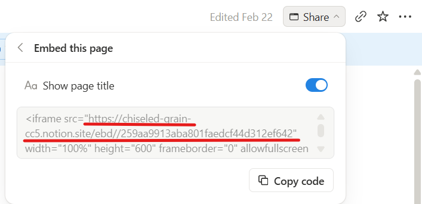

# 支援檔案與元件 (Supported Files and Components)

本站的學習內容是由三個核心概念交織而成：

- **MenuPath（學習路徑地圖）**：用一個個節點組成的路線圖，常用來代表「章節導覽」或「學習進度」。
- **Category（主題清單）**：以清單方式呈現主題分類，每一列都是一個主題。
- **Document（內容文件）**：實際看到的內容頁，例如：說明文、題目、講義 PDF、影片、網頁、Notion 頁面等。

每一個節點或清單項目，都可以用一個共同的設定欄位 **`pointTo`** 來「指向」下一個目標（另一個 MenuPath、Category，或是 Document）。

> 只要新增或修改 JSON 設定檔，就可以讓學習路徑不斷延伸。

---

## 1. pointTo：如何指定下一步要去哪裡？

在所有的 JSON 檔裡，只要有 `pointTo`，就代表這個項目可以被點擊，並且「連到」下一個內容。`pointTo` 主要有三個重點欄位：

- `type`：要前往的目標類型
  - `document`：前往一個實際的內容文件
  - `category`：前往一份主題清單（Category）
  - `menupath`：前往另一張學習路徑地圖（MenuPath）
- `data`：內容的檔案形式
	- `github/json`：放在 GitHub 的 JSON 資料檔
	- `github/md`：放在 GitHub 的 Markdown 文字檔
	- `github/image`：放在 GitHub 的圖片檔
	- `github/pdf`：放在 GitHub 的 PDF 檔
	- `web/page`：一般網站頁面
	- `youtube`：YouTube 影片
	- `notion`：公開的 Notion 可內嵌頁面(an embedabble url)
- `dataLocation`：實際的網址
	- GitHub / 一般網頁 / YouTube：請填入瀏覽器可以直接開啟的完整網址
	- Notion：請填入「已開啟公開分享」且支援嵌入顯示的網址（通常是你在 Notion 按下 Share 後複製的內嵌連結(需含有ebd字串的連結), ex: https://chiseled-grain-cc5.notion.site/ebd//xxxxxxxxxxxxxxxxxx ）

只要會填這三個欄位，就可以讓任何一個節點或清單項目，連到你想要的下一步。

---

## 2. MenuPath：學習路徑地圖 JSON 格式

MenuPath 可以想成一張「地圖」，上面有很多節點（小卡片）。

- `id`：這張地圖本身的代號。
- `title`：地圖標題（顯示在畫面上）。
- `items`：地圖上的所有節點，每一個節點都是一個學習步驟。

每一個節點（item）常見欄位：

- `id`：節點自己的代號。
- `parent`：上一層節點的 `id`，用來決定節點之間的連線與層級；如果是第一層節點就填 `null`。
- `t` / `c` / `p` / `z` / `en`：分別對應繁體、簡體、拼音、注音、英文說明。(僅有`t`是必填)
- `pointTo`：可選；如果有填，就會變成可點擊，並連到下一個內容。

### 2.1 基本 MenuPath JSON 範例

建議做法：

- 在[JuJuEn](https://github.com/feelryan/jujuen)的 GitHub 儲存庫中建立一個分支(BRANCE)並建立一個 JSON 檔，內容如下範例。
- 將下面的 `https://github.com/feelryan/jujuen/blob/{YOUR_BRANCH}/menu-path.json` 改成你自己的 GitHub 路徑。

```json
{
	"id": "ch1-intro-menupath",
	"title": "第 1 章：入門導覽",
	"items": [
		{
			"id": "ch1-root",
			"parent": null,
			"t": "入門導覽",
			"c": "入门导览",
			"p": "rù mén dǎo lǎn",
			"z": "ㄖㄨˋ ㄇㄣˊ ㄉㄠˇ ㄌㄢˇ",
			"en": "Chapter 1 overview",
			"pointTo": {
				"type": "document",
				"data": "github/md",
				"dataLocation": "https://github.com/feelryan/jujuen/blob/{YOUR_BRANCH}/overview.md"
			}
		},
		{
			"id": "ch1-basic-category",
			"parent": "ch1-root",
			"t": "常用字分類",
			"c": "常用字分类",
			"p": "cháng yòng zì fēn lèi",
			"z": "ㄔㄤˊ ㄩㄥˋ ㄗˋ ㄈㄣ ㄌㄟˋ",
			"en": "Common characters categories",
			"pointTo": {
				"type": "category",
				"data": "github/json",
				"dataLocation": "https://github.com/feelryan/jujuen/blob/{YOUR_BRANCH}/common-chars-category.json"
			}
		},
		{
			"id": "ch1-next-menupath",
			"parent": "ch1-root",
			"t": "進入第 2 章",
			"c": "进入第 2 章",
			"p": "jìn rù dì èr zhāng",
			"z": "ㄐㄧㄣˋ ㄖㄨˋ ㄉㄧˋ ㄦˋ ㄓㄤ",
			"en": "Go to chapter 2 menu",
			"pointTo": {
				"type": "menupath",
				"data": "github/json",
				"dataLocation": "https://github.com/feelryan/jujuen/blob/{YOUR_BRANCH}/ch2-menupath.json"
			}
		}
	]
}
```

說明：

- `parent` 用來決定節點的層級與連線線條的上下關係。
- 第一個 item 連到一篇 Markdown 說明文件 (`type=document`, `data=github/md`)。
- 第二個 item 連到一個 CategoryList JSON (`type=category`)。
- 第三個 item 連到**另一個 MenuPath JSON** (`type=menupath`)，讓路徑可以接續往下延伸。

---

## 3. Category：主題清單 JSON 格式

Category 是「主題列表」，例如「日常生活」、「旅行用語」等，每一列都可以再連到更細的內容。

常見欄位：

- `id`：這份主題清單本身的代號。
- `title`：清單標題。
- `items`：清單裡的每一個主題項目。

清單裡每一列（item）常見欄位：

- `id`：該主題項目的代號。
- `t` / `c` / `p` / `z` / `en`：與 MenuPath 節點相同，顯示這一列的文字。(僅有`t`是必填)
- `pointTo`：可選；如果有填，就會把這一列變成一個入口，連到文件或其他路徑。

### 3.1 Category JSON 範例

建議做法：

- 在同一個 GitHub 儲存庫中，放一個 Category 用的 JSON 檔，內容如下範例。
- 將 `https://github.com/feelryan/jujuen/blob/{YOUR_BRANCH}/category.json` 改成你的實際路徑。

```json
{
	"id": "common-chars-category",
	"title": "常用字主題分類",
	"items": [
		{
			"id": "daily-life",
			"t": "日常生活",
			"c": "日常生活",
			"p": "rì cháng shēng huó",
			"z": "ㄖˋ ㄔㄤˊ ㄕㄥ ㄏㄨㄛˊ",
			"en": "Daily life",
			"pointTo": {
				"type": "document",
				"data": "github/json",
				"dataLocation": "https://github.com/feelryan/jujuen/blob/{YOUR_BRANCH}/daily-life-words.json",
				"renderObject": "Words"
			}
		},
		{
			"id": "travel-basic",
			"t": "旅行用語",
			"c": "旅行用语",
			"p": "lǚ xíng yòng yǔ",
			"z": "ㄌㄩˇ ㄒㄧㄥˊ ㄩㄥˋ ㄩˇ",
			"en": "Travel basics",
			"pointTo": {
				"type": "menupath",
				"data": "github/json",
				"dataLocation": "https://github.com/feelryan/jujuen/blob/{YOUR_BRANCH}/travel-menupath.json"
			}
		}
	]
}
```

說明：

- Category 每一列依然可以有 `pointTo`，把清單變成下一層入口。
- 可以直接指向 Document (`type=document`) 或是再指向另一個 MenuPath，讓結構變成「MenuPath → Category → MenuPath → Document → …」。

---

## 4. 各類 Document 連結範例

### 4.1 連到 GitHub JSON Document

- 當`type`是"document"而`data`是"github/json", 通常需要搭配"renderObject"來render內容, 目前可使用的renderObject僅有[Words]和[Question]

```json
{
	"pointTo": {
		"type": "document",
		"data": "github/json",
		"dataLocation": "https://github.com/feelryan/jujuen/blob/{YOUR_BRANCH}/ch1-quiz.json",
        "renderObject": "Question"
	}
}
```

說明：

- 適合用來放題目、單字清單等結構化資料。
- 請將網址改成你自己的 GitHub JSON 檔案位置。

### 4.2 連到 GitHub Markdown (.md)

```json
{
	"pointTo": {
		"type": "document",
		"data": "github/md",
		"dataLocation": "https://github.com/feelryan/jujuen/blob/{YOUR_BRANCH}/overview.md"
	}
}
```

規則：

- 請填入一般瀏覽器可以開啟的 GitHub 檔案網址（例如 `https://github.com/.../blob/...`）。
- 如果 Markdown 裡的圖片也放在同一個 GitHub 儲存庫中，系統會盡量幫你一起顯示。

### 4.3 連到 GitHub PDF

```json
{
	"pointTo": {
		"type": "document",
		"data": "github/pdf",
		"dataLocation": "https://github.com/feelryan/jujuen/blob/{YOUR_BRANCH}/ch1-handout.pdf"
	}
}
```

系統會在畫面中直接開啟這份 PDF，方便閱讀講義或投影片。

### 4.4 連到 GitHub 圖片

```json
{
	"pointTo": {
		"type": "document",
		"data": "github/image",
		"dataLocation": "https://github.com/feelryan/jujuen/blob/{YOUR_BRANCH}/example.png"
	}
}
```

適合用來顯示單張圖表、流程圖或示意圖。

### 4.5 連到 YouTube 影片

```json
{
	"pointTo": {
		"type": "document",
		"data": "youtube",
		"dataLocation": "https://www.youtube.com/watch?v=XXXXXXXXXXX"
	}
}
```

系統會自動建立影片播放器，直接在頁面中播放。

### 4.6 連到公開 Notion 頁面

```json
{
	"pointTo": {
		"type": "document",
		"data": "notion",
		"dataLocation": "https://chiseled-grain-cc5.notion.site/ebd//xxxxxxxxxxxxxxxxxx"
	}
}
```

說明：

- 請先在 Notion 對該頁面開啟「公開分享」，再複製分享網址貼到 `dataLocation`。
- 這個網址必須是可被其他網站嵌入的公開內嵌連結，系統才有辦法在頁面中顯示 Notion 內容。


- 公開內嵌連結(需含有ebd字串的連結), ex: https://chiseled-grain-cc5.notion.site/ebd//xxxxxxxxxxxxxxxxxx



### 4.7 連到一般網站頁面 (Web Page)

```json
{
	"pointTo": {
		"type": "document",
		"data": "web/page",
		"dataLocation": "https://example.com/your-article-or-tool"
	}
}
```

說明：

- 適合連到一般網站上的文章、工具頁、互動教材等。
- 請填入瀏覽器可以直接開啟的完整網址，系統會在新視窗或內嵌視圖中協助開啟該頁面。

---

## 5. 如何讓學習路徑無限延伸

透過前述結構，可以用「資料驅動」方式設計路徑：

1. **頂層 MenuPath**：作為章節或主題導覽，每個節點可以：
	 - 直接指向說明文件 (Markdown / PDF / JSON Document)。
	 - 指向一份 CategoryList（例如常用字、題型分類）。
	 - 指向下一個 MenuPath（下一章或進階路線）。
2. **CategoryList 每一列**：同樣可以再往下：
	 - 指向一份題庫 JSON 或單字清單 JSON。
	 - 指向另一個 MenuPath（例如「本主題的學習路徑」）。
3. **Document 內容中**（例如 JSON 題庫）：也可以設計成有「下一題」、「下一步」等按鈕，帶領學習者繼續往下走。

只要遵守：

- MenuPath JSON 以 `id`、`title`、`items` 描述一張路徑地圖；
- Category JSON 以 `id`、`title`、`items` 描述一份主題清單；
- 各項目需要可點擊時，就加上一個正確設定的 `pointTo`（包含 `type` / `data` / `dataLocation`）；

整個站點就能像**知識地圖**一樣不斷延伸，不需要懂程式也可以持續擴充新的學習路徑與內容。
